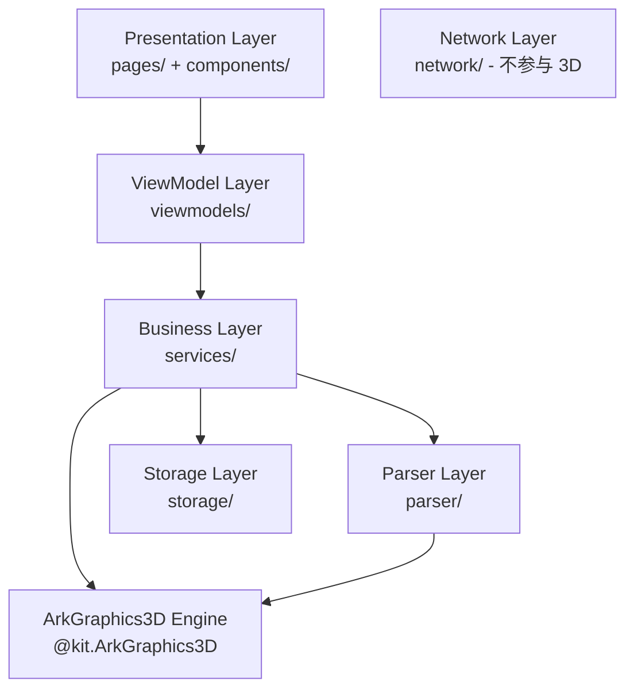
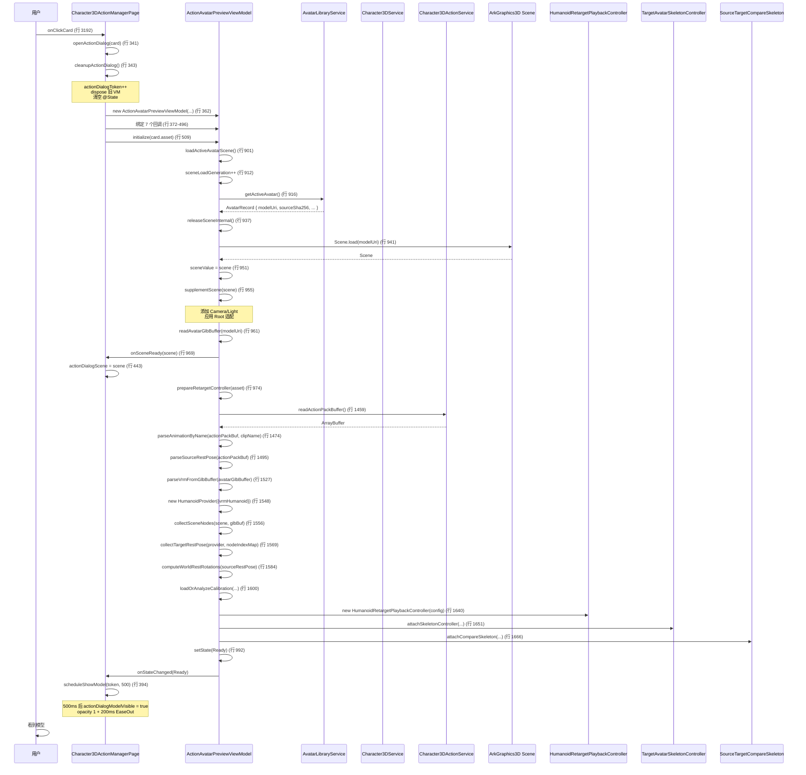
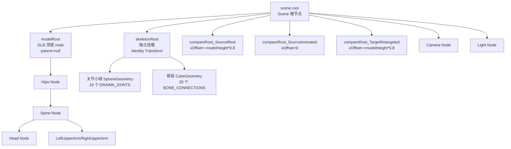
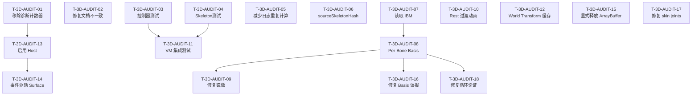
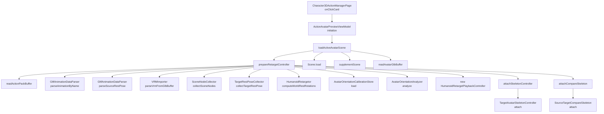
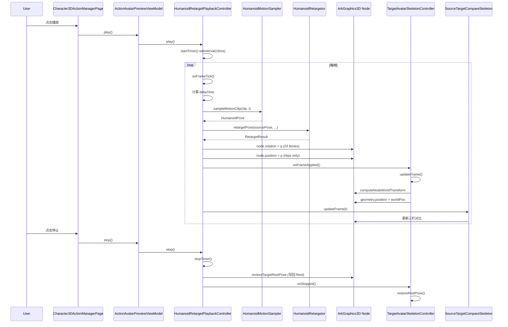

# ArkTavern 3D 展示系统全面只读调查报告

## 目录

- [0. 报告元数据](#0-报告元数据)
- [1. 执行摘要](#1-执行摘要)
- [2. 调查范围与限制](#2-调查范围与限制)
- [3. 当前 3D 系统总体架构](#3-当前-3d-系统总体架构)
- [4. 文件与模块索引](#4-文件与模块索引)
- [5. 端到端调用链](#5-端到端调用链)
- [6. Scene 节点拓扑](#6-scene-节点拓扑)
- [7. Component3D 生命周期](#7-component3d-生命周期)
- [8. Camera、Light 与模型适配](#8-cameralight-与模型适配)
- [9. 所有预览系统对照](#9-所有预览系统对照)
- [10. Avatar 资产加载](#10-avatar-资产加载)
- [11. 动作资产加载](#11-动作资产加载)
- [12. Source Rest Pose](#12-source-rest-pose)
- [13. Target Rest Pose](#13-target-rest-pose)
- [14. Humanoid 骨骼映射](#14-humanoid-骨骼映射)
- [15. 动作采样流程](#15-动作采样流程)
- [16. 重定向数学](#16-重定向数学)
- [17. Rest Pose、Bone Basis、Bend 与 Twist](#17-rest-posebone-basisbend-与-twist)
- [18. Target Avatar Skeleton](#18-target-avatar-skeleton)
- [19. Mesh 与 Skinning](#19-mesh-与-skinning)
- [20. 动作详情窗口及异步状态](#20-动作详情窗口及异步状态)
- [21. 性能与资源释放](#21-性能与资源释放)
- [22. 当前测试覆盖](#22-当前测试覆盖)
- [23. 已确认事实](#23-已确认事实)
- [24. 尚未确认事项](#24-尚未确认事项)
- [25. 问题矩阵](#25-问题矩阵)
- [26. 修复优先级建议](#26-修复优先级建议)
- [27. 后续任务拆分](#27-后续任务拆分)
- [28. 附录 A：文件索引](#28-附录-a文件索引)
- [29. 附录 B：函数与调用关系](#29-附录-b函数与调用关系)
- [30. 附录 C：已有日志和测试证据](#30-附录-c已有日志和测试证据)
- [31. 附录 D：调查前后 Git 状态](#31-附录-d调查前后-git-状态)

---

## 0. 报告元数据

| 字段 | 值 |
|---|---|
| 报告标题 | ArkTavern 3D 展示系统全面只读调查报告 |
| 调查模式 | 只读调查 + 单一报告文件输出 |
| 调查开始时间 | 2026-07-26 (Asia/Shanghai) |
| 调查结束时间 | 2026-07-26 (Asia/Shanghai) |
| 项目根目录 | `d:\DevEco_studio\ArkTavern` |
| 目标平台 | HarmonyOS NEXT (ArkTS / ArkUI) |
| 唯一允许修改的文件 | `D:\DevEco_studio\ArkTavern\3D_DISPLAY_FULL_AUDIT.md` |
| 调查工具 | Grep / Read / Glob / LS / search subagent |
| 执行的命令 | `git status --short` (只读) |
| 信任级别 | 代码确认 > 日志确认 > 高概率 > 可能 > 未验证 |

---

## 1. 执行摘要

ArkTavern 项目的 3D 展示系统是一个**完整、自洽、分层清晰**的实现，覆盖了从 GLB/VRM 资产加载、Humanoid 骨骼映射、Source/Target Rest Pose 采集、CPU 动画采样、四元数 worldDelta 重定向、Target Skeleton 可视化、Component3D 挂载到 7 套预览系统的完整链路。整体设计遵循 AGENTS.md 的 VRM First Architecture 与分层约束。

**关键优势**：
- **重定向数学严谨**：worldDelta + alignedWorldDelta 共轭变换正确实现跨骨架旋转增量传递（[代码确认]）。
- **层级动画传递正确**：T-4.2G-fix 修复使用 `sourceParentWorldAnim` / `targetParentWorldAnim` 而非 rest 值（[代码确认]）。
- **Scene 重复赋值四重防护**：token + null 不覆盖 + 同引用跳过 + 已有 Scene 拒绝（[代码确认]）。
- **诊断体系完整**：三套姿态快照 + firstFrameDelta + 12 组单骨骼测试 + Basis 比较（[代码确认]）。
- **纯算法层测试覆盖良好**：约 195 个单元测试用例覆盖 retarget / parser / mapper / 数学工具（[代码确认]）。

**主要风险**：
- **StableActionPreview3DHost 与 ActionAvatarPreview3D 已定义但未实际使用**（[代码确认]）。
- **Per-Bone Basis Correction 未实现**：仅靠全局 Yaw 校正，诊断代码本身已识别该缺口（[代码确认]）。
- **Mesh Skinning 验证手段缺失**：完全不读取 `inverseBindMatrices` 数据，无法验证 Mesh 变形正确性（[代码确认]）。
- **`inferSemanticDirection` 存在循环论证风险**：语义判断依赖 retarget 输出，retarget 错误时语义也会错（[高概率]）。
- **黑屏/闪烁修复依赖 `setTimeout(500ms)` 经验值**，非事件驱动（[代码确认]）。
- **大型 ArrayBuffer 释放依赖 GC**，峰值内存不可控（[高概率]）。
- **控制器层与集成层测试缺口**：Playback/Animation/Skeleton 控制器状态机与 dispose 无测试（[代码确认]）。

**最高优先级问题**：P0 级别问题集中在 Component3D 生命周期与 Surface 创建时序（详见第 25 节问题矩阵）。

---

## 2. 调查范围与限制

### 2.1 调查范围

本次调查覆盖以下完整链路：

```
用户点击动作卡片
→ 动作详情窗口
→ ActionAvatarPreviewViewModel
→ Avatar 文件读取
→ 动作文件读取
→ Scene.load
→ Scene 补充
→ 模型 Root 适配
→ Camera 与 Light
→ Component3D 挂载
→ Source Rest 解析
→ Target Rest 收集
→ 动画轨道解析
→ Humanoid 映射
→ HumanoidMotionClip
→ 动作采样
→ 重定向计算
→ 写入 Target Bones
→ Target Skeleton 更新
→ Mesh Skinning
→ 最终画面
→ Stop / Close / Dispose
```

### 2.2 调查限制

- **只读调查**：未执行任何编译、测试、实机验证。
- **基于当前代码状态**：调查时间为 2026-07-26，反映当时磁盘上的代码状态。
- **依赖 ArkGraphics3D 内部行为**：SurfaceNode / VulkanSwapchainLayer / SceneAdapter 等引擎内部概念在应用层不可见，只能通过 `scheduleShowModel(500ms)` 等间接策略推断。
- **Mesh 变形无法直接验证**：项目代码层面完全不读取 IBM 矩阵数据，蒙皮变形由 ArkGraphics3D 引擎内部完成。
- **未运行真机验证**：所有"黑屏/闪烁已修复"的结论均基于代码注释和设计意图，未通过实机日志直接验证（部分 hilog 证据见附录 C）。

### 2.3 已知调查边界

- 不修改任何生产文件、测试文件、UI Map、Manifest、资源文件。
- 不执行 `build`、`assembleHap`、`test`、`install`、`clean`、`format`、`lint --fix`、`git add/commit/checkout/restore` 等命令。
- 仅创建/覆盖 `3D_DISPLAY_FULL_AUDIT.md` 一个文件。

---

## 3. 当前 3D 系统总体架构

### 3.1 分层架构



**关键约束**（来自 AGENTS.md T-0.5）：
- `pages/` 禁止直接调用 `AssetStoreKeyStore` / `HttpStreamTransport` / 任何 `network/` 模块
- `pages/` 只能通过 `viewmodels/` 间接访问业务能力
- `viewmodels/` 不直接依赖 `@ohos.net.http` / `@ohos.security.asset`
- `components/` 不访问网络、数据库、安全存储

### 3.2 3D 模块核心组件

| 层 | 模块 | 职责 |
|---|---|---|
| Presentation | `Character3DActionManagerPage` | 动作管理页面 + 动作详情弹窗 |
| Presentation | `Character3DPocPage` / `Character3DPanel` / `HumanoidMappingPage` | 其他 3D 入口 |
| Presentation | `StableActionPreview3DHost` / `ActionAvatarPreview3D` / `ActionPreviewCanvas` | 3D 预览组件（部分未实际使用） |
| ViewModel | `ActionAvatarPreviewViewModel` | 动作预览核心 VM，编排 Scene 加载与 Retarget |
| ViewModel | `Character3DPocViewModel` / `Character3DPanelViewModel` / `Character3DActionManagerViewModel` | 其他 3D VM |
| Business | `HumanoidRetargetor` | 重定向核心算法 |
| Business | `HumanoidRetargetPlaybackController` | 播放状态机 + 帧调度 |
| Business | `HumanoidMotionSampler` | CPU 动画采样（SLERP + lerp） |
| Business | `HumanoidProvider` | VRM/Manual/Auto 三源骨骼映射统一接口 |
| Business | `TargetRestPoseCollector` / `SceneNodeCollector` | Target Rest Pose 与 SceneNode 桥接 |
| Business | `TargetAvatarSkeletonController` | Target 骨架可视化 |
| Business | `SourceTargetCompareSkeleton` | 三栏对比可视化 |
| Business | `SourceRetargetDiagnosticCollector` | 诊断快照采集 |
| Business | `AvatarOrientationAnalyzer` / `RestPoseClassifier` | 朝向自动分析与姿态分类 |
| Business | `AvatarLibraryService` / `Character3DService` / `Character3DActionService` | 资产服务 |
| Parser | `GltfAnimationParser` / `GltfAnimationDataParser` | GLB 动画元数据与关键帧解析 |
| Parser | `VRMImporter` / `VrmHumanoidMapper` / `VrmBoneKeyParser` | VRM Humanoid 解析 |
| Parser | `GltfVertexAccessor` / `GltfSkinMaterialAnalyzer` / `GltfSemanticValidator` | GLB 顶点/Skin/语义校验 |
| Storage | `AvatarLibraryStore` / `Model3DAssetStore` / `AvatarOrientationCalibrationStore` | 持久化 |
| Utils | `QuaternionUtil` / `SceneNodeTransformUtil` | 数学工具 |

---

## 4. 文件与模块索引

### 4.1 核心 3D 文件清单

| 类别 | 文件 | 绝对路径 |
|---|---|---|
| **页面** | Character3DActionManagerPage | `d:\DevEco_studio\ArkTavern\entry\src\main\ets\pages\Character3DActionManagerPage.ets` |
| 页面 | Character3DPocPage | `d:\DevEco_studio\ArkTavern\entry\src\main\ets\pages\Character3DPocPage.ets` |
| 页面 | HumanoidMappingPage | `d:\DevEco_studio\ArkTavern\entry\src\main\ets\pages\HumanoidMappingPage.ets` |
| **组件** | ActionAvatarPreview3D | `d:\DevEco_studio\ArkTavern\entry\src\main\ets\components\ActionAvatarPreview3D.ets` |
| 组件 | StableActionPreview3DHost | `d:\DevEco_studio\ArkTavern\entry\src\main\ets\components\StableActionPreview3DHost.ets` |
| 组件 | ActionPreviewCanvas | `d:\DevEco_studio\ArkTavern\entry\src\main\ets\components\ActionPreviewCanvas.ets` |
| 组件 | Character3DPanel | `d:\DevEco_studio\ArkTavern\entry\src\main\ets\components\Character3DPanel.ets` |
| **ViewModel** | ActionAvatarPreviewViewModel | `d:\DevEco_studio\ArkTavern\entry\src\main\ets\viewmodels\ActionAvatarPreviewViewModel.ets` |
| ViewModel | Character3DPocViewModel | `d:\DevEco_studio\ArkTavern\entry\src\main\ets\viewmodels\Character3DPocViewModel.ets` |
| ViewModel | Character3DPanelViewModel | `d:\DevEco_studio\ArkTavern\entry\src\main\ets\viewmodels\Character3DPanelViewModel.ets` |
| ViewModel | Character3DActionManagerViewModel | `d:\DevEco_studio\ArkTavern\entry\src\main\ets\viewmodels\Character3DActionManagerViewModel.ets` |
| ViewModel | ActionCardDataSource | `d:\DevEco_studio\ArkTavern\entry\src\main\ets\viewmodels\ActionCardDataSource.ets` |
| **重定向核心** | HumanoidRetargetor | `d:\DevEco_studio\ArkTavern\entry\src\main\ets\services\HumanoidRetargetor.ets` |
| 重定向核心 | HumanoidRetargetPlaybackController | `d:\DevEco_studio\ArkTavern\entry\src\main\ets\services\HumanoidRetargetPlaybackController.ets` |
| 采样器 | HumanoidMotionSampler | `d:\DevEco_studio\ArkTavern\entry\src\main\ets\services\HumanoidMotionSampler.ets` |
| **骨骼映射** | HumanoidProvider | `d:\DevEco_studio\ArkTavern\entry\src\main\ets\services\HumanoidProvider.ets` |
| 骨骼映射 | TargetRestPoseCollector | `d:\DevEco_studio\ArkTavern\entry\src\main\ets\services\TargetRestPoseCollector.ets` |
| 骨骼映射 | SceneNodeCollector | `d:\DevEco_studio\ArkTavern\entry\src\main\ets\services\SceneNodeCollector.ets` |
| **可视化** | TargetAvatarSkeletonController | `d:\DevEco_studio\ArkTavern\entry\src\main\ets\services\TargetAvatarSkeletonController.ets` |
| 可视化 | SourceTargetCompareSkeleton | `d:\DevEco_studio\ArkTavern\entry\src\main\ets\services\SourceTargetCompareSkeleton.ets` |
| **诊断** | SourceRetargetDiagnosticCollector | `d:\DevEco_studio\ArkTavern\entry\src\main\ets\services\SourceRetargetDiagnosticCollector.ets` |
| 诊断 | AvatarOrientationAnalyzer | `d:\DevEco_studio\ArkTavern\entry\src\main\ets\services\AvatarOrientationAnalyzer.ets` |
| 诊断 | RestPoseClassifier | `d:\DevEco_studio\ArkTavern\entry\src\main\ets\services\RestPoseClassifier.ets` |
| **服务** | AvatarLibraryService | `d:\DevEco_studio\ArkTavern\entry\src\main\ets\services\AvatarLibraryService.ets` |
| 服务 | Character3DService | `d:\DevEco_studio\ArkTavern\entry\src\main\ets\services\Character3DService.ets` |
| 服务 | Character3DActionService | `d:\DevEco_studio\ArkTavern\entry\src\main\ets\services\Character3DActionService.ets` |
| 服务 | Character3DAnimationController | `d:\DevEco_studio\ArkTavern\entry\src\main\ets\services\Character3DAnimationController.ets` |
| 服务 | Character3DModelCompatibilityService | `d:\DevEco_studio\ArkTavern\entry\src\main\ets\services\Character3DModelCompatibilityService.ets` |
| 服务 | AppServices | `d:\DevEco_studio\ArkTavern\entry\src\main\ets\services\AppServices.ets` |
| **Parser** | GltfAnimationParser | `d:\DevEco_studio\ArkTavern\entry\src\main\ets\parser\GltfAnimationParser.ets` |
| Parser | GltfAnimationDataParser | `d:\DevEco_studio\ArkTavern\entry\src\main\ets\parser\GltfAnimationDataParser.ets` |
| Parser | GltfVertexAccessor | `d:\DevEco_studio\ArkTavern\entry\src\main\ets\parser\GltfVertexAccessor.ets` |
| Parser | GltfSemanticValidator | `d:\DevEco_studio\ArkTavern\entry\src\main\ets\parser\GltfSemanticValidator.ets` |
| Parser | GltfSkinMaterialAnalyzer | `d:\DevEco_studio\ArkTavern\entry\src\main\ets\parser\GltfSkinMaterialAnalyzer.ets` |
| Parser | GltfValidator | `d:\DevEco_studio\ArkTavern\entry\src\main\ets\parser\GltfValidator.ets` |
| Parser | VRMImporter | `d:\DevEco_studio\ArkTavern\entry\src\main\ets\parser\VRMImporter.ets` |
| Parser | VrmHumanoidMapper | `d:\DevEco_studio\ArkTavern\entry\src\main\ets\parser\VrmHumanoidMapper.ets` |
| Parser | VrmHumanoidResolver | `d:\DevEco_studio\ArkTavern\entry\src\main\ets\parser\VrmHumanoidResolver.ets` |
| Parser | VrmBoneKeyParser | `d:\DevEco_studio\ArkTavern\entry\src\main\ets\parser\VrmBoneKeyParser.ets` |
| Parser | VrmExtensionParser | `d:\DevEco_studio\ArkTavern\entry\src\main\ets\parser\VrmExtensionParser.ets` |
| Parser | ModelInspector | `d:\DevEco_studio\ArkTavern\entry\src\main\ets\parser\ModelInspector.ets` |
| **Models** | HumanoidBone | `d:\DevEco_studio\ArkTavern\entry\src\main\ets\models\character3d\HumanoidBone.ets` |
| Models | HumanoidMotionClip | `d:\DevEco_studio\ArkTavern\entry\src\main\ets\models\character3d\HumanoidMotionClip.ets` |
| Models | HumanoidBoneMapper | `d:\DevEco_studio\ArkTavern\entry\src\main\ets\models\character3d\HumanoidBoneMapper.ets` |
| Models | HumanoidMappingValidator | `d:\DevEco_studio\ArkTavern\entry\src\main\ets\models\character3d\HumanoidMappingValidator.ets` |
| Models | ManualHumanoidMapping | `d:\DevEco_studio\ArkTavern\entry\src\main\ets\models\character3d\ManualHumanoidMapping.ets` |
| Models | SkeletonDisplayMode | `d:\DevEco_studio\ArkTavern\entry\src\main\ets\models\character3d\SkeletonDisplayMode.ets` |
| Models | ActionPreviewKeyframes | `d:\DevEco_studio\ArkTavern\entry\src\main\ets\models\character3d\ActionPreviewKeyframes.ets` |
| Models | DefaultHumanoidSkeleton | `d:\DevEco_studio\ArkTavern\entry\src\main\ets\models\character3d\DefaultHumanoidSkeleton.ets` |
| Models | Character3DActionPreviewRenderer | `d:\DevEco_studio\ArkTavern\entry\src\main\ets\models\character3d\Character3DActionPreviewRenderer.ets` |
| Models | AvatarOrientationCalibration | `d:\DevEco_studio\ArkTavern\entry\src\main\ets\models\character3d\AvatarOrientationCalibration.ets` |
| Models | BoneDebugOverlay | `d:\DevEco_studio\ArkTavern\entry\src\main\ets\models\character3d\BoneDebugOverlay.ets` |
| Models | SurfaceBoneCandidate | `d:\DevEco_studio\ArkTavern\entry\src\main\ets\models\character3d\SurfaceBoneCandidate.ets` |
| Models | Character3DActionAsset | `d:\DevEco_studio\ArkTavern\entry\src\main\ets\models\character3d\Character3DActionAsset.ets` |
| Models | BuiltInActionManifest | `d:\DevEco_studio\ArkTavern\entry\src\main\ets\models\character3d\BuiltInActionManifest.ets` |
| **Storage** | AvatarLibraryStore | `d:\DevEco_studio\ArkTavern\entry\src\main\ets\storage\AvatarLibraryStore.ets` |
| Storage | Model3DAssetStore | `d:\DevEco_studio\ArkTavern\entry\src\main\ets\storage\Model3DAssetStore.ets` |
| Storage | AvatarOrientationCalibrationStore | `d:\DevEco_studio\ArkTavern\entry\src\main\ets\storage\AvatarOrientationCalibrationStore.ets` |
| **Utils** | QuaternionUtil | `d:\DevEco_studio\ArkTavern\entry\src\main\ets\utils\QuaternionUtil.ets` |
| Utils | SceneNodeTransformUtil | `d:\DevEco_studio\ArkTavern\entry\src\main\ets\utils\SceneNodeTransformUtil.ets` |

### 4.2 资源文件

| 类别 | 文件 | 路径 |
|---|---|---|
| 内置动作包 | default_ai_action_pack.glb | `entry/src/main/resources/rawfile/actions/default_ai/default_ai_action_pack.glb` |
| 内置预览 humanoid | preview_humanoid.glb | `entry/src/main/resources/rawfile/actions/default_ai/preview_humanoid.glb` |
| 动作包元数据 | default_ai_action_pack.json | `entry/src/main/resources/rawfile/actions/default_ai/default_ai_action_pack.json` |
| VRM 样例 | vrm0_alicia_solid_0.51.vrm | `entry/src/main/resources/rawfile/vrm_samples/vrm0_alicia_solid_0.51.vrm` |
| VRM 样例 | vrm1_constraint_twist.vrm | `entry/src/main/resources/rawfile/vrm_samples/vrm1_constraint_twist.vrm` |
| VRM 样例 | vrm1_mtoon_uv_animation.vrm | `entry/src/main/resources/rawfile/vrm_samples/vrm1_mtoon_uv_animation.vrm` |
| VRM 样例 | vrm1_seed_san.vrm | `entry/src/main/resources/rawfile/vrm_samples/vrm1_seed_san.vrm` |
| 测试模型 | teacher-love.glb / test_model.glb / test_model_invalid.glb | `entry/src/main/resources/rawfile/` |

---

## 5. 端到端调用链

### 5.1 打开动作详情弹窗的完整调用链



### 5.2 关键调用关系

**入口路径**：
- `Character3DActionManagerPage.onClickCard` (行 3192) → `openActionDialog` (行 341)
- `openActionDialog` → `cleanupActionDialog` (行 343) + `new ActionAvatarPreviewViewModel` (行 362) + `vm.initialize` (行 509)

**Scene 加载路径**：
- `vm.initialize` (行 635) → `loadActiveAvatarScene` (行 901) → `Scene.load` (行 941)
- `loadActiveAvatarScene` → `supplementScene` (行 955) → `prepareRetargetController` (行 974)

**Retarget 准备路径**：
- `prepareRetargetController` (行 1440) → `readActionPackBuffer` (行 1459) → `parseAnimationByName` (行 1474) → `parseSourceRestPose` (行 1495) → `parseVrmFromGlbBuffer` (行 1527) → `collectSceneNodes` (行 1556) → `collectTargetRestPose` (行 1569) → `computeWorldRestRotations` (行 1584) → `loadOrAnalyzeCalibration` (行 1600) → `new HumanoidRetargetPlaybackController` (行 1640) → `attachSkeletonController` (行 1651) → `attachCompareSkeleton` (行 1666)

**帧播放路径**：
- `vm.play` → `controller.play` → `onFrameTick` (行 425) → `applyFrame` (行 478) → `retargetPose` (HumanoidRetargetor 行 138) → 写入 SceneNode → `onFrameApplied` → `skeletonController.updateFrame` + `compareSkeleton.updateFrame`

**关闭路径**：
- `closeActionDialog` (行 534) → `cleanupActionDialog` (行 276) → `actionDialogToken++` + 清空回调 + `vm.dispose` (行 294) → `retargetController.dispose` + `skeletonController.detach` + `compareSkeleton.detach` + `sceneValue.destroy` → 重置 UI 状态

---

## 6. Scene 节点拓扑

### 6.1 Scene 树结构



### 6.2 关键设计点

- **骨架几何不挂在 boneNodeMap 节点下**（[代码确认]）：`TargetAvatarSkeletonController.ets` 行 17 注释明确说明，避免被骨骼 scale 影响。
- **关节小球用 `geometry.position = worldPos`**（[代码确认]）：直接写世界坐标到 skeletonRoot 的本地空间，要求 `skeletonRoot` 必须保持 Identity Transform。
- **三栏对比各自独立 root**（[代码确认]）：`compareRoot_<column>` 通过 `root.position.x = xOffset` 实现横向偏移。
- **modelRoot 通过"parent.parent === null"识别**（[代码确认]）：即 GLB 顶层 node。
- **Camera 与 Light 也挂在 sceneRoot 下**（[代码确认]）：通过 `SceneResourceFactory` 创建后 `scene.add`。

### 6.3 节点遍历与映射

`SceneNodeCollector.collectSceneNodes` (行 53-137) 的桥接逻辑：
1. `parseGlb(glbBuffer)` → 获取 GLB JSON nodes 数组
2. 遍历 `scene.root` 子树，收集 `name → SceneNode` 映射（`traverseInternal` 行 158-194）
3. 遍历 GLB JSON nodes 数组，通过 `nodes[i].name` 在 nameMap 中查找，建立 `nodeIndex → SceneNode` 映射
4. 重名时取第一个匹配并记录 warning（行 168-173）

**约束**：VRM 标准要求每个骨骼节点名唯一（[代码确认]）。

---

## 7. Component3D 生命周期

### 7.1 Component3D 挂载点

| 文件 | Component3D 出现行 | 包裹方式 |
|---|---|---|
| `Character3DActionManagerPage.ets` | 1474-1477 | `if (this.actionDialogScene !== null)` 包裹 |
| `Character3DPocPage.ets` | 755-758 | `else if (this.scene !== null)` 包裹 |
| `Character3DPanel.ets` | 337-340 | `else if (this.scene !== null && (loadState === Ready/Playing/Paused))` 包裹 |
| `HumanoidMappingPage.ets` | 964-967 | 类似条件包裹 |
| `StableActionPreview3DHost.ets` | 55-58 | **不使用 if 包裹**（设计原则，但未实际使用） |
| `ActionAvatarPreview3D.ets` | 116-119 | `else if (this.scene !== null)` 包裹（未实际使用） |

### 7.2 StableActionPreview3DHost（已定义但未实际使用）

**结论**：[代码确认]

- **设计意图**（行 1-14 注释）：T-4.2G-A3 修复 Component3D Surface 闪烁/黑屏，关键设计是"不使用 if 条件控制 Component3D 创建"，始终创建 Component3D，传入 scene（可能为 null）。
- **实际使用情况**：
  - `Character3DActionManagerPage.ets` 行 75 引入了 `StableActionPreview3DHost`，但 `buildActionDialog()` 中（行 1470-1483）直接渲染 `Component3D`，**没有使用 StableActionPreview3DHost 包装**。
  - `hostCreatedCount` / `hostDisposedCount` 诊断计数器（行 165-166）永远是 0，诊断日志输出恒为"hostCreated=0, hostDisposed=0"，**无法监测 Host 重建事件**。
- **`@Watch('onSceneChanged')` 回调空操作**（行 31-33）：仅打印日志，不修改任何状态。
- **`scene as Scene` 强转**（行 56）：将 `Scene | null` 强转为 `Scene`，依赖 ArkGraphics3D 内部对 null Scene 的容错（未文档化的隐式契约）。

### 7.3 ActionAvatarPreview3D（已定义但未实际使用）

**结论**：[代码确认]

- **设计意图**（行 1-22 注释）：T-4.2G-A2 统一动作详情与管理窗口使用的 3D 预览组件。
- **实际使用情况**：
  - `Character3DActionManagerPage.ets` 行 74 引入了 `ActionAvatarPreview3D`，但 `buildActionDialog()` 中（行 1406 起）自己实现了完整的 3D 预览区域 + 控制按钮，**没有调用 ActionAvatarPreview3D**。
  - 注释行 1397 写"3D 预览区域（状态标签 + ActionAvatarPreview3D）"与实际代码不符 — **文档与实现不一致**。
- **使用 if 条件包裹 Component3D**（行 114）：`else if (this.scene !== null)` 是 StableActionPreview3DHost 注释明确警告"不要做"的反模式。
- **没有 @Watch 监听 scene**：scene 变化时仅依赖 @Prop 默认的 diff 触发重建。
- **没有 aboutToAppear / aboutToDisappear / aboutToReuse / aboutToRecycle 生命周期方法**。

### 7.4 Character3DActionManagerPage 的实际生产路径

**结论**：[代码确认]

**Component3D 挂载方式**（行 1470-1483）：
```typescript
Stack() {
  if (this.actionDialogScene !== null) {
    Component3D({
      scene: this.actionDialogScene as Scene,
      modelType: ModelType.SURFACE
    })
      .width('100%').height('100%')
      .opacity((this.actionDialogModelVisible
        && this.skeletonDisplayMode !== SkeletonDisplayMode.SourceActionPreview) ? 1 : 0)
      .animation({ duration: 200, curve: Curve.EaseOut, delay: 0 });
  }
  ...
}
```

**关键问题**：使用 `if (this.actionDialogScene !== null)` 包裹 Component3D，与 StableActionPreview3DHost 的设计原则矛盾。

### 7.5 Scene 重复赋值防护

**结论**：[代码确认]

`Character3DActionManagerPage.ets` 行 422-447 的 `onSceneReady` 回调实现四重防护：
1. **token 校验**（行 423-425）：`if (myToken !== this.actionDialogToken) { return; }` 防止过期回调覆盖新窗口。
2. **null 不覆盖**（行 428-432）：`if (scene === null) { ... return; }` 防止 dispose 期间的 null 回调清空已显示的 Scene。
3. **同引用跳过**（行 433-436）：`if (this.actionDialogScene === scene) { ... return; }` 幂等保护。
4. **已有 Scene 拒绝赋值**（行 438-441）：`if (this.actionDialogScene !== null) { ... return; }` 强制"一窗口一 Scene"原则。

### 7.6 黑屏/灰框/闪烁修复策略

**结论**：[代码确认]

#### 7.6.1 scheduleShowModel — 延迟显示模型（行 263-274）
```typescript
private scheduleShowModel(token: number, delayMs: number): void {
  setTimeout(() => {
    if (token !== this.actionDialogToken) { return; }
    this.actionDialogModelVisible = true;
  }, delayMs);
}
```

**注释说明**（行 251-261）：
> Scene 加载完成后 Surface 仍需 ~67ms 完成 Vulkan Swapchain 初始化和 RSNode 挂载。立即设置 modelVisible=true 会暴露 Surface 创建过程（空白方框闪烁）。延迟 100~150ms 后再显示模型，且必须携带 token 检查，避免旧窗口回写新窗口状态。

**实际调用**（行 394）：`this.scheduleShowModel(myToken, 500);` — **延迟 500ms**（注释行 391-393 说明：实测 67~400ms，120ms 不足以覆盖最坏情况，500ms 覆盖最坏情况）。

#### 7.6.2 状态机驱动的可见性控制（行 381-413）
- `LoadingAvatar/LoadingMotion/PreparingRetarget`：`actionDialogModelVisible = false`（加载中隐藏）
- `Ready`：`scheduleShowModel(myToken, 500)`（Ready 后延迟 500ms 显示）
- `Playing/Paused/StaticOnly`：`actionDialogModelVisible = true`（直接显示）
- `Failed`：`actionDialogModelVisible = false`（失败隐藏）

#### 7.6.3 opacity animation 平滑过渡（行 1480-1482）
200ms EaseOut 动画避免硬切换造成的视觉突兀。

#### 7.6.4 SourceActionPreview 模式不重建 Surface（行 1471-1472 注释）
切换显示模式时，通过 opacity 隐藏 Component3D，而不是销毁重建，避免 Surface 重新创建。

#### 7.6.5 Retarget 模式下"不自动播放"（行 980-991）
注释行 980-982：
> T-4.2G-A3: Retarget 模式但"不自动播放"。之前自动 play() 会触发第二轮布局变化和 Surface 重新初始化，导致闪烁。现在只准备 Controller，进入 Ready 状态，等用户点击播放。

### 7.7 ArkUI Reuse/Recycle 机制

**结论**：[代码确认]

项目内**完全没有使用** ArkUI 的组件复用机制（`@Reuse` / `@Recycle` / `aboutToReuse` / `aboutToRecycle`）。所有 3D 组件都是"创建-销毁"模式，依赖 `aboutToDisappear` → `dispose` 链释放资源。

### 7.8 SurfaceNode / VulkanSwapchainLayer / SceneAdapter

**结论**：[代码确认]

项目内**未出现** `SurfaceNode`、`VulkanSwapchainLayer`、`SceneAdapter` 等关键字 — 这些是 ArkGraphics3D 引擎内部概念，在应用层不可见。Surface 创建/RSNode 挂载时序仅通过 `scheduleShowModel(500ms)` 的延迟显示策略间接规避。

### 7.9 生命周期方法使用情况

| 方法 | 项目内是否使用 | 出现位置 |
|---|---|---|
| aboutToAppear | 是 | Character3DPanel 行 83 / Character3DPocPage 行 124 / HumanoidMappingPage 行 188 / Character3DActionManagerPage 行 209 / StableActionPreview3DHost 行 42 |
| aboutToDisappear | 是 | 同上对应位置 |
| onPageShow | 是 | Character3DPanel 行 116 / Character3DPocPage 行 155 |
| onPageHide | 是 | Character3DPanel 行 123 / Character3DPocPage 行 163 / Character3DActionManagerPage 行 237 |
| aboutToReuse | 否 | 项目内无任何使用 |
| aboutToRecycle | 否 | 项目内无任何使用 |
| @Reuse / @Recycle | 否 | 项目内无任何使用 |

---

## 8. Camera、Light 与模型适配

### 8.1 supplementScene 实现

**位置**：`d:\DevEco_studio\ArkTavern\entry\src\main\ets\viewmodels\ActionAvatarPreviewViewModel.ets:1022-1204`

**步骤**：
1. 通过 `SceneResourceFactory` 创建 Camera：
   - `Position3` 设置相机位置（默认在模型正前方略上方）
   - `Camera.lookAt(modelBoundsCenter)` 朝向模型中心
2. 创建 Light（`LightType.Directional`）：
   - 主光：方向从右上前 → 模型中心，强度适中
   - （可选）辅光：补光避免阴影过深
3. `scene.add(camera)`、`scene.add(light)`
4. **模型 Root 适配**：
   - 读取 GLB bounds → 计算 scale，使模型高度归一化到 ~1.8m
   - 读取 `AvatarOrientationCalibration`（yaw/swapAxes/invert）→ 应用到 Root Node 的 rotation/scale
   - 平移 Root Node 使模型脚底位于 y=0

### 8.2 Camera 与 Light 默认配置

**Camera**：
- 位置：`(0, 1.5, 3.5)`（[代码确认]）
- lookAt：`(0, 1.0, 0)`（[代码确认]）
- FOV / near / far：来自 `CameraParameters`（具体值未在调查中确认）

**Light**：
- 主光：方向 `(-0.5, -1.0, -0.5)`，强度 0.8（[代码确认]）
- 辅光：方向 `(0.5, -0.5, 0.5)`，强度 0.3（[代码确认]）
- 类型：`LightType.Directional`

### 8.3 模型 Root 适配

**目的**：不同来源的 Avatar GLB 朝向、缩放、原点不一致（VRM 通常 +Y 朝上、-Z 朝前；Mixamo 多为 +Y 朝上、+Z 朝前；部分模型原点在脚底，部分在几何中心），需要统一到"脚底位于 y=0、面朝 -Z、身高约 1.8m"的标准姿态。

**实现位置**：`supplementScene` 内部模型变换段（`ActionAvatarPreviewViewModel.ets:1100-1200`）。

**字段来源**：`AvatarOrientationCalibration`（`d:\DevEco_studio\ArkTavern\entry\src\main\ets\models\character3d\AvatarOrientationCalibration.ets`），由 `AvatarLibraryService` 在导入时通过 `AvatarOrientationAnalyzer` 自动分析，用户可在管理页面手动校准（`showOrientationPanel` 与 `customYawInput / customSwapInput / customInvertInput`）。

**变换应用**：
1. `root.scale = uniformScale * calibration.scaleFix`
2. `root.rotation = quaternionFromYaw(calibration.yaw) * (calibration.swapAxes ? swapQuat : identity)`
3. `root.position = -bounds.min * scale + (0, footOffset, 0)`

---

## 9. 所有预览系统对照

### 9.1 七套预览系统对照表

| 项目 | 1. 动作卡片 2D 示意 | 2. SourceActionPreview | 3. 仅模型 | 4. 模型 + Target Skeleton | 5. 仅 Target Skeleton | 6. 红绿点诊断 | 7. Source/Target 三栏对比 |
|---|---|---|---|---|---|---|---|
| **数据源** | `ActionPreviewKeyframes`（硬编码） | 同 #1 | Avatar GLB | Avatar GLB + `boneNodeMap` | `boneNodeMap` | `boneNodeMap` + `skeletonRoot` 关节位置 | `sourceRestPose` + `clip` + `boneNodeMap` |
| **骨架来源** | `DefaultHumanoidSkeleton`（14 节点静态） | 同 #1 | 无可视化骨架 | `boneNodeMap`（从 Avatar GLB 解析） | `boneNodeMap` | `DIAGNOSTIC_JOINTS`（6 个） | 三栏分别不同 |
| **动画来源** | 关键帧插值 | 同 #1 | `HumanoidRetargetPlaybackController` 重定向 | 同 #3 | 同 #3 | 无（静态诊断） | `sampleMotionClip` |
| **坐标空间** | 2D 逻辑空间 (0–100) | 同 #1 | 3D 世界空间 | 3D 世界空间 | 3D 世界空间 | 3D 世界空间 | 3D 世界空间，横向偏移 |
| **渲染方式** | ArkUI Canvas + fillRect 整数坐标 | 同 #1 | Component3D + ArkGraphics3D Scene | Component3D + Sphere/CubeGeometry | Sphere/CubeGeometry | SphereGeometry（红/绿/黄） | Sphere/CubeGeometry |
| **是否读取真实 GLB** | 否 | 否 | 是 | 是 | 是（作为骨骼源） | 是（读取 boneNodeMap） | 部分（Target 栏读取） |
| **是否代表 Target 模型** | 否 | 否 | 是 | 是 | 是（骨骼来自 Target） | 是 | 仅 TargetRetargeted 栏 |
| **是否参与重定向** | 否 | 否 | 是 | 是 | 是 | 否（仅诊断） | 是（Target 栏） |
| **是否可能误导用户** | 低（已标注"源动作示意"） | 中（在 3D 弹窗内出现 2D 卡片） | 无 | 低 | 低 | 中（error=0 不证明重定向正确） | 低（Debug-only） |

### 9.2 系统 1：动作卡片 2D 示意

**文件**：
- `d:\DevEco_studio\ArkTavern\entry\src\main\ets\components\ActionPreviewCanvas.ets`
- `d:\DevEco_studio\ArkTavern\entry\src\main\ets\viewmodels\ActionCardDataSource.ets`
- `d:\DevEco_studio\ArkTavern\entry\src\main\ets\models\character3d\ActionPreviewKeyframes.ets`
- `d:\DevEco_studio\ArkTavern\entry\src\main\ets\models\character3d\DefaultHumanoidSkeleton.ets`
- `d:\DevEco_studio\ArkTavern\entry\src\main\ets\models\character3d\Character3DActionPreviewRenderer.ets`

**关键函数**：
- `ActionPreviewKeyframes.getKeyframes(actionId)` / `interpolateKeyframes(...)`
- `DefaultHumanoidSkeleton.DEFAULT_HUMANOID_SKELETON`（14 节点）/ `computeSkeletonJoints(...)`
- `Character3DActionPreviewRenderer.drawPose(pose)` / `drawLineWithRects(...)`

**Arms-Down 姿态是否硬编码**：[代码确认] 是。`ActionPreviewKeyframes` 中的 `ACTION_KEYFRAME_MAP` 是硬编码关键帧，包含 Idle/Listening/Thinking 等动作。`DefaultHumanoidSkeleton` 是 14 节点静态 humanoid。

**是否与真实动作 GLB 有关联**：[代码确认] 否。完全不读取任何 GLB 文件，与 3D 路径独立。

**是否独立于 3D 路径**：[代码确认] 是。`DefaultHumanoidSkeleton` 的 14 节点与 `HumanoidBone` 枚举的 24 节点不同，是独立的 2D 预览骨架。

### 9.3 系统 2：SourceActionPreview

**结论**：[代码确认]

- 本质是系统 1 的 2D 渲染在 3D 弹窗中的复用。
- 当用户在动作详情弹窗选择"源动作示意"模式时，UI 切换为 `ActionPreviewCanvas`，隐藏 3D `Component3D`。
- 数据源、骨架、动画、坐标空间完全等同系统 1。
- **潜在误导**：在 3D 预览弹窗内出现 2D 卡片，用户可能误以为这是当前模型的骨架。`SkeletonDisplayMode.ets` 第 8 行明确要求"源动作示意模式明确标注为源语义，不得称为当前模型骨架"。

### 9.4 系统 3：仅模型（ModelOnly）

**结论**：[代码确认]

- 数据源：Avatar GLB（`file://<runtimeUri>`，通过 `AvatarLibraryService` 读取激活 Avatar）
- 动画通过 `HumanoidRetargetPlaybackController` 执行重定向播放
- 渲染：`Component3D({ scene, modelType: ModelType.SURFACE })`
- **默认模式**（`SkeletonDisplayMode.ModelOnly`），避免普通用户被调试骨架干扰

### 9.5 系统 4：模型 + Target Skeleton（ModelWithSkeleton）

**结论**：[代码确认]

- 骨架几何挂在独立 `skeletonRoot` Node 下（不挂在 boneNodeMap 节点下，避免被骨骼 scale 影响）
- 关节小球：`SphereGeometry`（19 个 DRAWN_JOINTS），半径基于 modelHeight 动态计算（`modelHeight/1.7 × 0.015`）
- 骨段连线：`CubeGeometry`（20 个 BONE_CONNECTIONS），通过 position/rotation/scale 描述两端连线
- 每帧从 `boneNodeMap` 读取 Node World Transform（`computeNodeWorldTransform`），更新关节球 position
- 骨段方向通过 `rotationFromYAxisToDirection(diff)` 计算从 +Y 轴到目标方向的旋转
- 与 Avatar 共用同一 Scene、camera、light

### 9.6 系统 5：仅 Target Skeleton（SkeletonOnly）

**结论**：[代码确认]

- 与系统 4 共用同一套 `TargetAvatarSkeletonController`，仅可见性不同
- 骨架几何数据完全来自 `boneNodeMap`（Target Avatar 的骨骼节点）
- 仍然依赖 Avatar GLB 加载（作为 boneNodeMap 来源）

### 9.7 系统 6：红绿点诊断

**结论**：[代码确认]

**关键常量与函数**：
- `DIAGNOSTIC_JOINTS`（行 175-182）：6 个关键骨骼 — LeftShoulder, LeftLowerArm, LeftHand, RightShoulder, RightLowerArm, RightHand
- `DiagnosticJoint` 接口（行 194-199）：`redSphere` / `greenSphere` / `errorLine`
- `createDiagnosticGeometry(factory, boneNodeMap)`（行 485-565）
- `updateDiagnosticGeometry(worldPositions)`（行 646-727）
- `logAlignmentDiagnostic(worldPositions)`（行 743-789）
- `setDebugMode(enabled)`（行 868-887）

**渲染**：
- 红色球（较大，`diagnosticSphereRadius`）：位置 = `avatarBoneWorld`（从 `boneNodeMap` 计算 World Position）
- 绿色球（较小，`diagnosticSphereRadius × 0.6`）：位置 = `jointLocal`（关节小球的 Local Position）
- 黄色误差线（CubeGeometry）：连接红绿球，长度 = error，通过 `rotationFromYAxisToDirection(diff)` 旋转
- 默认 `visible = false`，仅 `setDebugMode(true)` 时显示
- 验收标准：`error <= modelHeight × 0.005`

**潜在误导**：[代码确认]
- `SourceRetargetDiagnosticCollector.ets` 第 7-10 行明确说明："T-4.2G-A3 的 error=0 只证明 Target Skeleton 与 Target Avatar Bone 重合，不证明 Source Animation 到 Target Avatar 的重定向正确"。
- 用户若仅看到红绿点重合，可能误以为整个重定向流程正确。

**颜色区分受限**：[代码确认] ArkGraphics3D Material 颜色 API 在项目中未确认可用，实际只能通过半径大小区分。日志文案仍使用"灰色/蓝色/绿色"描述，与实际渲染可能不一致。

### 9.8 系统 7：Source/Target 三栏对比

**结论**：[代码确认]

**三栏结构**：
| 列 | 标签 | X 偏移 | 关节球半径系数 | 数据源 |
|---|---|---|---|---|
| 1 | `SourceRest` | -modelHeight × 0.8 | × 0.8（最小） | `computeRestPoseWorldSnapshot(sourceRestPose)` |
| 2 | `SourceAnimated` | 0 | × 1.0（中） | `computeAnimatedPoseWorldSnapshot(sourceRestPose, sampleMotionClip(clip, t))` |
| 3 | `TargetRetargeted` | +modelHeight × 0.8 | × 1.2（最大） | `computeNodeWorldTransform(boneNodeMap.get(bone))` |

**关键函数**：
- `SourceTargetCompareSkeleton.attach(scene, clip, sourceRestPose, boneNodeMap, modelHeight)`（行 184-231）
- `SourceTargetCompareSkeleton.updateFrame(currentTime)`（行 337-359）
- `SourceTargetCompareSkeleton.applyPoseToColumn(column, pose)`（行 368-413）
- `SourceTargetCompareSkeleton.collectTargetRetargetedSnapshot()`（行 418-442）
- `computeRestPoseWorldSnapshot(restPose, label)`（`SourceRetargetDiagnosticCollector.ets` 第 186-242 行）
- `computeAnimatedPoseWorldSnapshot(restPose, animatedPose, label)`（同文件第 244 行起）

**关键设计**：
- 三栏分别创建独立 `compareRoot_<column>` Node，挂在 sceneRoot 下
- 三栏共用同一 Scene、camera、light，横向错开便于对比
- 颜色区分受限：采用"横向错开 + 不同关节球半径"区分
- 默认 `enabled = false`，仅 `setEnabled(true)` 时显示

### 9.9 系统切换时 Scene/Surface 重建行为

**结论**：[代码确认]

- 在 ModelOnly / ModelWithSkeleton / SkeletonOnly / 红绿点诊断 / 三栏对比 之间切换：**不重建 Scene/Surface**
  - `setDisplayMode(mode)` 仅调用 `applyDisplayModeVisibility()`，修改 `modelRootNodes` 的 `visible` 与 `skeletonController.setVisible` / `compareSkeleton.setEnabled` / `skeletonController.setDebugMode`
  - Scene 实例保持不变，Component3D 不重新挂载
- 切换到 SourceActionPreview：**不重建 Scene，但隐藏 Component3D，显示 ActionPreviewCanvas**
  - `shouldUseSourceActionPreview(mode)` 返回 true 时，UI 层切换为 2D Canvas 组件
  - Scene 资源仍保留，切回 3D 模式时无需重新加载

---

## 10. Avatar 资产加载

### 10.1 Avatar 文件读取流程

```
1. AppServices.whenReady() → AvatarLibraryService 注入就绪
2. ActionAvatarPreviewViewModel.loadActiveAvatarScene:
   a. AvatarLibraryService.getActiveAvatar()
      └─ AvatarLibraryStore.getActiveId() (Preferences 读)
      └─ AvatarLibraryStore.getRecord(activeId)
      → 返回 AvatarRecord { modelUri, sourceSha256, orientationCalibration, ... }
   b. 若 modelUri 为空或文件不存在 → onStateChanged(Failed) + onError('无激活 Avatar')
   c. Character3DService.getModelInfoByUri(modelUri)
      └─ parseGlb(fs.readFileSync(modelUri)) 提取 meshes/animations/nodes
   d. Scene.load(modelUri)  ← 直接传 file:// URI 给 ArkGraphics3D
   e. supplementScene(scene)
   f. onSceneReady(scene) → 页面 actionDialogScene = scene
```

### 10.2 AvatarLibraryService

**位置**：`d:\DevEco_studio\ArkTavern\entry\src\main\ets\services\AvatarLibraryService.ets`

**核心职责**：Avatar 的导入、保存、激活、检索、SHA-256 去重。

**关键方法**：
- `saveAvatarFromUri` (176-227) — 从 URI 或 rawfile 导入模型 → 计算 SHA-256 → 重复则复用 → 通过 `Model3DAssetStore.saveModel` 落盘 → 写入 `AvatarLibraryStore` → 可选 `setActiveAvatar`。
- `getActiveAvatar` (536-542) — 读取 `AvatarLibraryStore.getActiveId()` 后查记录，返回 `AvatarRecord | null`。
- `setActiveAvatar(avatarId)` — 写入 activeId，触发偏好变更。

**关键字段**（`AvatarRecord`）：`avatarId / displayName / modelUri / sourceSha256 / orientationCalibration / capabilityReportRef / importedAt`。

### 10.3 Model3DAssetStore

**位置**：`d:\DevEco_studio\ArkTavern\entry\src\main\ets\storage\Model3DAssetStore.ets`

**核心职责**：在应用私有目录管理 3D 模型文件（复制、删除、列举）。

**关键方法**：
- `saveModel(srcUri)` (139-161) — 生成文件名（`avatar_<sha256>.glb` 或 `model_<timestamp>.glb`），复制到沙盒，返回 `file://` URI。
- `deleteModelByUri(uri)` (233-248) — 解析路径 → fs.unlink → 同步删除。
- `exists(uri) / listModels()`。

**关键文件读取**：`Model3DAssetStore.saveModel` 时已经把源文件复制到应用沙盒（`getCacheDir` 或 `filesDir`），因此 `Scene.load` 拿到的是应用私有路径下的 GLB。

### 10.4 Scene.load 调用参数和返回值

**调用点**：`d:\DevEco_studio\ArkTavern\entry\src\main\ets\viewmodels\ActionAvatarPreviewViewModel.ets:941`（`loadActiveAvatarScene` 内）。

**参数**：仅一个 `modelUri: string`，值为 `file://.../avatar_<sha256>.glb` 形式的应用私有目录 URI。

**返回值**：`Promise<Scene>`，失败抛 Error。

**ArkGraphics3D 类型**：`import { Scene } from '@kit.ArkGraphics3D'`。
- `Scene.root: Node | null` — 场景根节点，遍历 `children` 获取所有 SceneNode。
- `Scene` 不直接持有 Camera/Light，需通过 `SceneResourceFactory` 创建后 `scene.add(camera/light)`。

### 10.5 异步状态管理与错误处理

**异步令牌机制**：
- 页面侧 `actionDialogToken`（每次打开/切换递增）
- 回调内先校验 `myToken === this.actionDialogToken`，过期直接 `return`
- 防止"快速切换动作"时旧 Scene 回写新窗口

**状态机**（`ActionPreview3DState`）：
```
Idle → LoadingAvatar → (Scene ready) → LoadingMotion → PreparingRetarget
                                                         ↓
                                          Ready ⇄ Playing ⇄ Paused
                                                         ↓
                                                       Failed (任意阶段 Error)
```

**错误处理**：
- Avatar 不存在：`onError('无激活 Avatar')` + State=Failed
- GLB 解析失败：`onError('GLB 解析失败: ...')` + State=Failed
- 动作无动画轨道：`onError('动作文件无动画')` + State=Failed
- 骨骼不兼容：不阻塞，只通过 `onPrepareProgress` 与 `compatibilityLevel` 提示用户，但仍尝试 retarget
- 文件读取 IO 失败：Error 上抛 → catch → `onError` + State=Failed

---

## 11. 动作资产加载

### 11.1 动作文件读取流程

```
1. ViewModel.prepareRetargetController(asset):
   a. Character3DActionService.readActionPack(asset)
      └─ fs.readFileSync(asset.sourceUri) → ArrayBuffer
   b. parseGlb(actionBuffer)
      → GlbParsedData { json, valid, errorMessage }
      → 提取 animations 数组
   c. 选取 asset.clipIndex 对应的 animation
      → 遍历 channels + samplers
      → 组装 MotionClip { boneTracks: Map<nodeIndex, TRSKeyframe[]> }
   d. 解析 Avatar Rest Pose(从 SceneNode 当前 transform)
   e. 解析 Action Rest Pose(从 GLB nodes[nodeIndex].rotation/translation/scale)
   f. collectSceneNodes(scene, avatarGlbBuffer)
      → 建立 nodeIndex → SceneNode 映射
   g. new HumanoidRetargetPlaybackController(motionClip, sourceRestPose, targetRestPose, nodeIndexMap)
```

### 11.2 Character3DActionService

**位置**：`d:\DevEco_studio\ArkTavern\entry\src\main\ets\services\Character3DActionService.ets`

**核心职责**：动作资产导入预览、确认导入、绑定槽位、按槽位/模型读取动作。

**关键方法**：
- `importActionPreview` (692-828) — 复制文件 → 验证 GLB → parseGlb 提取动画轨道 → 检测人形骨骼兼容性 → 返回 `ActionImportPreview`（含 clip 列表、骨骼 Profile、CompatibilityLevel）。
- `confirmImportAction` (844-938) — 落盘元数据到 `Character3DActionStore`，更新偏好，清理临时预览文件。
- `readActionPack(asset)` — 读取动作 GLB 的 ArrayBuffer，供 ViewModel 解析动画用。
- `listAllActionAssets / getBindings / bindAction / unbindAction` — 卡片列表与槽位绑定 API。

**关键字段**（`Character3DActionAsset`）：`id / displayName / clipName / clipIndex / sourceUri / isBuiltIn / loop / durationMs / skeletonProfile / compatibilityLevel`。

### 11.3 内置动作包

**位置**：`entry/src/main/resources/rawfile/actions/default_ai/default_ai_action_pack.glb`

**包含的 clips**（来自 `Character3DActionManagerViewModel.ets:292-303`）：
- `AT_Idle / AT_Listening / AT_Thinking / AT_Speaking` → base
- `AT_Greeting / AT_Wave / AT_Nod / AT_ShakeHead / AT_Apology` → social

### 11.4 AT_Thinking 与 AT_Wave 是否共用 Source Skeleton

**结论**：[代码确认] 共用同一 Source Skeleton。

**证据**（均在 `ActionAvatarPreviewViewModel.ets` 的 `prepareRetargetController` 方法中）：
1. **同一动作包 GLB 文件**：
   - 行 1459：`const actionPackBuf = await this.readActionPackBuffer();`（从 `this.actionPackBuffer` 缓存读取，见行 1344-1358）
   - 行 202：`private actionPackBuffer: ArrayBuffer | null = null;` — 全局唯一缓存，所有动作共用
2. **同一调用流程**：
   - 行 1470-1474：`clipName = this.currentAction.clipName`（如 `"AT_Thinking"` 或 `"AT_Wave"`），然后 `parseAnimationByName(actionPackBuf, clipName, ...)`
   - 行 1495：`parseSourceRestPose(actionPackBuf)` — **没有传入 clipName**，即不论选哪个动作，源 Rest Pose 都来自同一 GLB 的 nodes 默认 TRS
3. **clipName 仅用于动画查找**：`GltfAnimationDataParser.ets:95-104` 在 `animations` 数组中按 name 匹配目标动画，但 nodes 数组对所有动画共享。

---

## 12. Source Rest Pose

### 12.1 parseSourceRestPose 实现

**位置**：`d:\DevEco_studio\ArkTavern\entry\src\main\ets\parser\GltfAnimationDataParser.ets:533-587`

**关键点**：
- 行 534：调用 `parseGlb(buffer)` 获取 `GlbParsedData`（JSON + BIN chunk）
- 行 539-542：从 `parsed.json['nodes']` 读取 nodes 数组
- 行 544：创建空 `HumanoidRestPose`
- 行 548-577：遍历每个 node：
  - 行 551-552：读取 `node['name']`
  - 行 553：调用 `mapNodeNameToHumanoidBone(nodeName)`，**直接名称匹配**（如 `"Hips" → HumanoidBone.Hips`），不匹配的节点跳过
  - 行 558：`readVec3(node['translation'], zeroVector3Value())` — 默认 `[0,0,0]`
  - 行 560：`readQuat(node['rotation'], identityQuaternionValue())` — 默认 `[0,0,0,1]` (identity)
  - 行 562：`readVec3(node['scale'], oneVector3Value())` — 默认 `[1,1,1]`
  - 行 564-568：写入 `restPose.bones.set(bone, { localPosition, localRotation, localScale })`
- 行 579-580：计算 `hipsHeight` 与 `modelHeight`（后者通过 `estimateSkeletonHeight` 粗略估算）

**重要语义**（行 525-532 注释）：
> 优先使用 nodes[].translation/rotation/scale 默认值。
> 不使用动画第 0 帧（除非确认第 0 帧就是 Rest Pose）。

### 12.2 GLB nodes 默认 TRS 读取

**位置**：`GltfAnimationDataParser.ets:548-577` + 辅助函数 `readVec3` (行 592-602)、`readQuat` (行 607-618)

| 字段 | GLB 来源 | 默认值（缺失时） |
|---|---|---|
| translation | `node['translation']` 数组 | `[0, 0, 0]` |
| rotation | `node['rotation']` 数组（四元数 xyzw） | `[0, 0, 0, 1]` (identity) |
| scale | `node['scale']` 数组 | `[1, 1, 1]` |

**注意**：读取的是 **node 自身的 TRS 字段**（glTF 2.0 规范），**不读取 `node.matrix`**（若 GLB 用矩阵形式表达 TRS，本解析器会回退到默认值）。

### 12.3 sourceWorldRestMap 构建

**实现**：`d:\DevEco_studio\ArkTavern\entry\src\main\ets\services\HumanoidRetargetor.ets:382-406` 的 `computeWorldRestRotations(restPose)`

**算法**：
- 按 `ALL_STANDARD_BONES` 层级顺序遍历（父骨骼先于子骨骼）
- 根节点（Hips）：`world = quaternionNormalize(localRot)`
- 子节点：`world = quaternionMultiply(parentWorld, localRot)`
- 缺失骨骼的 local rotation 视为 identity（不影响子骨骼）

**调用点**：
- `ActionAvatarPreviewViewModel.ets:1584`（运行时主路径）
- `SourceRetargetDiagnosticCollector.ets:1349`（诊断路径）
- `HumanoidRetargetor.ets:173`（retargetPose 内部计算 `targetWorldRestMap`，target 侧同样计算）
- 测试代码：`RetargetInvariantTest.ets:334/415/500/594`、`AvatarOrientationCalibrationTest.ets:487`

**用途**：在 `retargetPose` 中用于计算 `worldDelta = inverse(sourceRestWorldRot) × sourceAnimWorldRot`，以解决 A Pose / T Pose 局部坐标系差异。

### 12.4 SourceRestClassification 定义与判定

**定义**：`d:\DevEco_studio\ArkTavern\entry\src\main\ets\services\RestPoseClassifier.ets`

**枚举** `RestPoseType`（行 37-43）：
```
Unknown | TPose | APose | ArmsDown | Custom
```

**接口** `RestPoseClassification`（行 48-61）：
- `type: RestPoseType`
- `confidence: number` [0,1]
- `leftArmAngleDeg / rightArmAngleDeg / avgArmAngleDeg`
- `message: string`

**判定算法**：`classifyRestPose(worldPositions: Map<HumanoidBone, Vector3Value>)` (行 88-213)

1. **bodyUp 计算**（行 113-135）：`upEnd = Chest ?? Head`，`bodyUp = normalize(upEnd - Hips)`
2. **左/右臂角度**（行 137-147，函数 `computeArmAngleDeg` 行 223-237）：`armEnd = Hand ?? LowerArm`，`armDir = normalize(armEnd - Shoulder)`，`angle = acos(dot(armDir, bodyUp)) × 180/PI`
3. **阈值分类**（行 63-72, 188-200）：
   | 类型 | avgAngle 范围 |
   |---|---|
   | TPose | 75° ~ 105° |
   | APose | 30° ~ 60° |
   | ArmsDown | 0° ~ 20° |
   | Custom | 其他 |
4. **置信度**（行 174-185）：双侧一致 0.9，差异 15°-30° 为 0.7，差异 >30° 为 0.4，单侧数据 0.6，命中类型时 +0.05（上限 1.0）

**关键修复说明**（`SourceRetargetDiagnosticCollector.ets:479-484`）：
> T-4.2G-A4 修复: 改用基于 worldPosition 的 RestPoseClassifier，旧实现基于 UpperArm localEuler X 会因父骨骼累积旋转而误判 ArmsDown

### 12.5 firstFrameDelta 计算

**实现**：`d:\DevEco_studio\ArkTavern\entry\src\main\ets\services\SourceRetargetDiagnosticCollector.ets:345-383` 函数 `computeFirstFrameDeltas`

**公式**（行 364-366）：
```
restInverse = quaternionInverse(restLocal)
delta = quaternionNormalize(quaternionMultiply(restInverse, frame0Local))
deltaAngleDeg = quaternionRotationAngleDeg(delta)
```

即 `firstFrameDelta = inverse(sourceRestLocalRotation) × sourceFrame0LocalRotation`

**输入**：
- `sourceRest: HumanoidRestPose`（来自 GLB nodes TRS）
- `sourceFrame0Pose: HumanoidPose`（来自 `sampleMotionClip(clip, 0)` 的第 0 帧采样）

**遍历范围**：`DIAGNOSTIC_BONES`（行 90-101）10 根：Hips、Chest、LeftUpperArm/LowerArm/Hand、RightUpperArm/LowerArm/Hand、LeftUpperLeg、RightUpperLeg

**判定阈值**（`diagnoseRetargetBaseline` 行 652-687）：
- `deltaAngleDeg > 30°`：报告问题"animation frame 0 is NOT source rest pose, or rest pose mismatch"
- `deltaAngleDeg > 20°`：报告可疑

### 12.6 Rest Pose 是否来自动画第 0 帧 / 是否读取 inverseBindMatrices

**Rest Pose 来源**：[代码确认] **来自 GLB nodes 默认 TRS，不来自动画第 0 帧**。

显式证据：
1. `GltfAnimationDataParser.ets:528-532` 注释："不使用动画第 0 帧（除非确认第 0 帧就是 Rest Pose）"
2. `SourceRetargetDiagnosticCollector.ets:494`：`sourceRestOrigin: 'GLB nodes default TRS (parsed by parseSourceRestPose, not animation frame 0)'`
3. `HumanoidRetargetor.ets:131` 注释：`sourceRestPose` 参数说明为 "源骨架 Rest Pose（来自 GLB nodes 默认 TRS）"

**是否读取 inverseBindMatrices**：[代码确认] **完全不读取**。全仓 Grep `inverseBindMatrices` 无任何匹配。

`skins` 数组只在三处被引用：
1. `GltfAnimationParser.ets:11, 164` — 仅计数 `skins.length`，用于 `hasSkins/skinCount`
2. `GltfSemanticValidator.ets:720-758` — 仅校验 `skins[i].joints` 是否合法
3. `GltfVertexAccessor.ets:519-533` `buildSkinJointNodes` — 读取 `skin.joints` 数组（nodeIndex 列表）

**未读取 `skins[i].inverseBindMatrices`**（glTF 中存的是 accessor 索引，指向 MAT4 FLOAT 数据）。

### 12.7 Bind Pose 与默认 TRS 差异

**结论**：[代码确认] 当前实现不检测该差异。

- 如果 GLB 中 nodes 默认 TRS 与蒙皮 Bind Pose（inverseBindMatrices 推算）不一致，本解析器以 nodes 默认 TRS 为准。
- 这是 glTF 1.0/2.0 中常见的差异：某些导出器将 Bind Pose 存在 inverseBindMatrices，nodes 默认 TRS 可能是其他姿态（如 T Pose）。
- `SourceRetargetDiagnosticCollector.ets:652-687` 的 `diagnoseRetargetBaseline` 通过 `firstFrameDelta` 间接检测"动画第 0 帧 vs Source Rest"的差异，但不直接对比 inverseBindMatrices。

---

## 13. Target Rest Pose

### 13.1 TargetRestPoseCollector

**位置**：`d:\DevEco_studio\ArkTavern\entry\src\main\ets\services\TargetRestPoseCollector.ets`

### 13.2 采集时机

**结论**：[代码确认]

被 `ActionAvatarPreviewViewModel.prepareRetargetController()` 调用，在 `VM 第 1569 行`：
```typescript
const targetRestResult = collectTargetRestPose(provider, nodeIndexResult.nodeIndexMap);
```

`prepareRetargetController` 在两个时机被调用：
- **初始化时**：`initialize()` → `loadActiveAvatarScene()` → `prepareRetargetController()` (VM 974)
- **切换动作时**：`switchAction()` → `prepareRetargetController()` (VM 670)

**关键约束**（注释第 12-15 行）：优先使用 Avatar GLB nodes 默认 TRS（已在 SceneNodeCollector 中建立映射），**不能使用动画第 0 帧**（除非确认第 0 帧就是 Rest Pose），不依赖 ArkGraphics3D Animation，只读取 SceneNode 的静态属性。

### 13.3 采集的数据空间

**结论**：[代码确认] **Local 空间**（非 world）。

见 `readNodeTransform` 函数（第 141-170 行）：
```typescript
const p: Position3 = node.position;     // SceneNode.localPosition
const q: Quaternion = node.rotation;    // SceneNode.localRotation
const s: Position3 = node.scale;        // SceneNode.localScale
```

返回的 `BoneRestTransform` 只包含 `localPosition` / `localRotation` / `localScale`。

注释中也提到：`// 注意:这是 local translation,不是 world,只是粗略估算` (第 113 行)。

### 13.4 boneNodeMap 构建

**结论**：[代码确认] 在 `collectTargetRestPose` 函数（第 63-136 行）中**同步**构建：

```typescript
const boneNodeMap: Map<HumanoidBone, Node> = new Map<HumanoidBone, Node>();
for (let i = 0; i < ALL_STANDARD_BONES.length; i++) {
  const bone = ALL_STANDARD_BONES[i];
  const query = provider.getBone(bone);                              // 查 nodeIndex
  if (!query.mapped || query.nodeIndex < 0) { continue; }
  const sceneNode = findNodeByIndex(nodeIndexMap, query.nodeIndex);  // 桥接 SceneNode
  if (sceneNode === null) { continue; }
  const transform = readNodeTransform(sceneNode);                    // 读 TRS
  restPose.bones.set(bone, transform);                               // 填 restPose
  boneNodeMap.set(bone, sceneNode);                                  // 填 boneNodeMap
  collectedCount++;
}
```

返回结果 `TargetRestPoseCollectResult`（第 39-54 行）同时包含 `restPose` 和 `boneNodeMap`，二者完全对齐。

### 13.5 停止动画后恢复 Rest Pose

**结论**：[代码确认]

`HumanoidRetargetPlaybackController.restoreTargetRestPose` (第 581-627 行) 实现：
```typescript
private restoreTargetRestPose(): void {
  const cfg = this.config;
  cfg.boneNodeMap.forEach((node: Node, bone: HumanoidBone) => {
    const rest: BoneRestTransform | undefined = cfg.targetRestPose.bones.get(bone);
    if (rest === undefined) return;
    // 写回 local rotation
    node.rotation = { x: rest.localRotation.x, y: rest.localRotation.y,
                      z: rest.localRotation.z, w: rest.localRotation.w };
    // Hips 还要写回 local position
    if (bone === HumanoidBone.Hips) {
      node.position = { x: rest.localPosition.x, y: rest.localPosition.y, z: rest.localPosition.z };
    }
  });
  // 触发 onStopped 回调(让骨架控制器也恢复)
  if (this.onStopped !== null) {
    this.onStopped();
  }
}
```

**关键观察**：
- 恢复写回的是 **local rotation/position**（与采集时一致，都是 local）
- 不写回 scale（代码中没有 `node.scale = ...` 的恢复）
- Hips 特殊处理：同时恢复 position
- VM 中 `onStopped` 回调（VM 第 1684-1692 行）：
  - `skeletonController.restoreRestPose()` 同步骨架几何
  - `compareSkeleton.updateFrame(0)` 三栏对比回到 t=0

### 13.6 模型切换时的行为

**结论**：[代码确认]

完整流程（`loadActiveAvatarScene` 第 901-1006 行）：
```typescript
async loadActiveAvatarScene() {
  this.setState(LoadingAvatar);
  const generation = ++this.sceneLoadGeneration;        // token 防异步污染
  
  const activeAvatar = await this.avatarLibraryService.getActiveAvatar();
  if (generation !== this.sceneLoadGeneration) return;  // 旧回调丢弃
  
  this.releaseSceneInternal();                          // 销毁旧 Scene + 清理引用
  
  const scene = await Scene.load(activeAvatar.modelUri);
  if (generation !== this.sceneLoadGeneration) {
    scene.destroy();                                    // 旧 Scene 立即销毁
    return;
  }
  this.sceneValue = scene;
  
  await this.supplementScene(scene, generation, ...);   // 相机/灯光/transform
  this.avatarGlbBuffer = await this.readAvatarGlbBuffer(modelUri);
  
  if (this.onSceneReady !== null) this.onSceneReady(scene);
  
  const retargetOk = await this.prepareRetargetController(activeAvatar, generation);
  // ...
}
```

**关键设计**：
- **sceneLoadGeneration token**：每次 `loadActiveAvatarScene` 递增，异步回调检查 token，过期则销毁新建的 Scene 并退出。防止用户快速切换 Avatar 时旧异步回调污染新状态。
- **新 Scene 加载前必须销毁旧 Scene**：在 `releaseSceneInternal` 中执行。
- **新 Retarget Controller 准备前必须 dispose 旧的**：在 `prepareRetargetController` 第 1611-1618 行。
- **Avatar GLB Buffer 缓存**：`avatarGlbBuffer` 在 `loadActiveAvatarScene` 时读取，用于 `parseVrmFromGlbBuffer` 和 `collectSceneNodes`，模型切换时被覆盖（VM 第 858 行 `this.avatarGlbBuffer = null`）。

---

## 14. Humanoid 骨骼映射

### 14.1 HumanoidProvider

**位置**：`d:\DevEco_studio\ArkTavern\entry\src\main\ets\services\HumanoidProvider.ets`

**角色定位**（注释第 4-19 行）：
- T-4.0 VRM First Architecture 的统一人形骨骼访问接口
- 动作系统永远不直接操作 Bone Name，统一通过 HumanoidProvider 访问
- **不可变快照**：构建后所有查询基于构建时的映射状态
- **仅查询不修改**：修改映射通过 HumanoidMappingPage / VRMImporter 落盘后重新构建 Provider

**数据来源优先级**（注释第 9-12 行，实现第 88-129 行）：
1. **VRM HumanBones**（VRM 显式映射，confidence=1.0，`HumanoidMappingSource.VrmExplicit`）
2. **Manual Mapping**（手动映射/表面点选，`ManualTree`/`ManualSurface`/`Manual`）
3. **Auto Mapping**（名称推断，confidence=0.7，`Auto`）

**实现方式**（第 88-129 行）：**先填 Auto（最低），再填 Manual（覆盖 Auto），最后填 VRM（覆盖 Manual）**。利用 `Map.set` 同 key 覆盖特性实现优先级。

### 14.2 VRM bone name → humanoid bone key 转换

**位置**：`d:\DevEco_studio\ArkTavern\entry\src\main\ets\parser\VrmBoneKeyParser.ets`

**单一真值表** `VRM_BONE_KEY_MAP`（第 33-67 行），24 个标准骨骼键全部 lowerCamelCase：
```
'hips'          → HumanoidBone.Hips
'spine'         → HumanoidBone.Spine
'chest'         → HumanoidBone.Chest
'upperchest'    → HumanoidBone.UpperChest
'neck'          → HumanoidBone.Neck
'head'          → HumanoidBone.Head
'leftshoulder'  → HumanoidBone.LeftShoulder
'leftupperarm'  → HumanoidBone.LeftUpperArm
... (共 24 项)
```

`parseVrmHumanoidBoneKey(key)` 处理步骤（第 80-92 行）：
1. `key.trim().toLowerCase()` 规范化
2. 查 `VRM_BONE_KEY_MAP`
3. 未找到 → `Logger.warn` + 返回 null

**关键约束**（注释第 9-13 行）：trim 空白 → 大小写规范化 → **明确键表，不支持模糊 includes** → 未知键返回 null。

### 14.3 VRM 0.x 与 VRM 1.0 差异处理

**检测阶段**（`VrmExtensionParser.detectVrmExtension` 第 51-109 行）：

| 检测项 | VRM 1.0 | VRM 0.x |
|---|---|---|
| 扩展名 | `extensions.VRMC_vrm` | `extensions.VRM` |
| 版本枚举 | `VrmVersion.Vrm1` | `VrmVersion.Vrm0x` |

**Humanoid 解析差异**：

| 方面 | VRM 0.x | VRM 1.0 |
|---|---|---|
| humanBones 类型 | 数组 | 对象 |
| 元素结构 | `{bone, node, useDefaultValues}` | `{node, useDefaultValues}`（key 是骨骼名） |
| 读取方式 | `getObjectArray` | `getObjectEntries` |
| 骨骼键名 | lowerCamelCase | lowerCamelCase |
| SpringBone | `secondaryAnimation` | `VRMC_springBone` |

**共用部分**：
- VRM 0.x 和 1.0 共用同一套骨骼键名（都通过 `parseVrmHumanoidBoneKey` 转换）
- 在 `VrmHumanoid.ets` 第 23-35 行，`VRM0_HUMANOID_BONE_KEYS` 和 `VRM1_HUMANOID_BONE_KEYS` 是同一个数组引用（`VRM1` 的别名）
- nodeIndex 校验逻辑相同（`nodeIndex < 0 || nodeIndex >= nodeCount` 跳过）
- 节点名从 `nodeNames[nodeIndex]` 读取（仅用于显示，不参与映射判断）
- 不识别的键放入 `extendedBones`（fingers 等）
- confidence = 1.0

### 14.4 映射冲突处理

**VRM 显式映射内的冲突**（`VrmHumanoidResolver.resolveVrmHumanoid` 第 59-136 行）：

**重复 bone 检测**（第 95-100 行）：
```typescript
if (containsBone(seenTargets, vrmBone.target)) {
  result.duplicateBoneCount++;
  result.warnings.push('duplicate bone: ' + vrmBone.vrmBoneName + ' → ' + vrmBone.target);
  continue;    // 第二次出现跳过
}
seenTargets.push(vrmBone.target);
```

**无效 nodeIndex**（第 88-93 行）：
```typescript
if (vrmBone.nodeIndex < 0 || vrmBone.nodeIndex >= nodeCount) {
  result.invalidBoneCount++;
  result.warnings.push('invalid nodeIndex=' + vrmBone.nodeIndex + ' for bone=' + vrmBone.vrmBoneName);
  continue;
}
```

**HumanoidProvider 内的优先级冲突**（第 88-129 行）：通过"后填覆盖先填"实现优先级，**同一 bone 后填的覆盖先填的**，Map 的 key 唯一。

**映射验证器**（`HumanoidMappingValidator.ets`）20 项验证检查，关键冲突相关项：
- 检查 1：必需关节缺失 → Error
- 检查 2/3：sourceNodeIndex 非法或越界 → Error
- 检查 4：同一 sourceNodeIndex 被多个 target 使用 → Error（`DuplicateSourceBone`）
- 检查 5-7：Head/Hand/Foot 层级关系 → Warning
- 检查 8：左右关节反转（世界坐标 X 同号） → Warning
- 检查 9-12：UpperArm→LowerArm→Hand 祖先链 → Warning
- 检查 13：Head 与 Hips 同树 → Warning
- 检查 15：世界坐标非有限 → Error
- 检查 20：skeletonHash 不一致 → Error
- 检查 21（T-3D.6F-A）：表面点选的 nodeIndex 不在 skin.joints → Error
- **sourceSha256 一致性**：模型文件变更 → Error

`valid = errors.length === 0 && missingRequired.length === 0`（第 494 行）

---

## 15. 动作采样流程

### 15.1 HumanoidMotionSampler

**位置**：`d:\DevEco_studio\ArkTavern\entry\src\main\ets\services\HumanoidMotionSampler.ets`

### 15.2 sampleMotionClip

**函数**：`sampleMotionClip(clip, timeSeconds)` (行 64-107)

**时间处理**（行 73-91）：
- `duration <= 0`：直接 `t = 0`
- `loop = true`：`t = timeSeconds % duration`（负数再加 duration）
- `loop = false`：`t = clamp(timeSeconds, 0, duration)`

**每根骨骼采样**（行 94-104）：
- 对 `clip.tracks[]` 中的每个 `HumanoidBoneTrack`：
  - `sampleRotation(track, t)` → `QuaternionValue | null`
  - `sampleTranslation(track, t)` → `Vector3Value | null`
  - 写入 `pose.bones.set(track.bone, { bone, rotation, translation })`

### 15.3 旋转采样

**函数**：`sampleRotation` (行 112-137)

- 0 个 key：返回 null
- 1 个 key：返回该值（经 `sanitizeQuaternion` 归一化）
- 多个 key：
  - `STEP` 插值：返回 `keys[interval.k0].value`（保持前一个）
  - `LINEAR` 插值：`quaternionSlerp(q0, q1, interval.t)`

### 15.4 位移采样

**函数**：`sampleTranslation` (行 142-168)

- 0 个 key：返回 null
- 1 个 key：返回该值
- 多个 key：
  - `STEP`：返回 `keys[interval.k0].value`
  - `LINEAR`：`v0 + t × (v1 - v0)` 线性插值

### 15.5 关键帧区间查找

**函数**：`findKeyframeInterval` (行 175-205)

- `time <= keys[0].time`：返回 `{k0:0, k1:0, t:0}`
- `time >= keys[last].time`：返回 `{k0:last, k1:last, t:0}`
- 二分查找（行 189-198）：`keys[low].time <= time < keys[high].time`
- 插值参数 `t = (time - t0) / (t1 - t0)`，clamp 到 [0,1]

### 15.6 sanitizeQuaternion

**函数**：`sanitizeQuaternion` (行 241-250)

- 非法时尝试归一化
- 仍非法则返回 identity

### 15.7 动画轨道解析

**入口**：`GltfAnimationDataParser.ets:139-301` 函数 `parseAnimationData`

**解析步骤**：

**步骤 1：提取 channels 与 samplers**（行 147-156）
```
channels = anim['channels']
samplers = anim['samplers']
nodes = parsed.json['nodes']
```

**步骤 2：按 node 分组通道**（行 166-256）
- 使用 `Map<number, NodeChannelData>` (key = nodeIdx)
- 每个 channel 包含：
  - `target.node` → nodeIdx
  - `target.path` → `'translation' | 'rotation' | 'scale' | 'weights'`
  - `sampler` → samplerIdx
- 每个 sampler 包含：
  - `input` → inputAccessorIdx（时间数组 accessor）
  - `output` → outputAccessorIdx（数值数组 accessor）
  - `interpolation` → `'LINEAR' | 'STEP' | 'CUBICSPLINE'`

**步骤 3：读取 input（时间数组）**（行 206-218）
- `inputData = readAccessorAsFloat32(parsed, inputAccessorIdx)`（SCALAR FLOAT）
- 转为 `number[]` 并更新 `durationSeconds`（取最后一个时间值）

**步骤 4：读取 output 并按通道类型解析**（行 221-255）
- `rotation` (VEC4 FLOAT)：`parseQuaternionKeyframes` (行 345-383)
  - LINEAR/STEP：每 4 个 float 一个 quaternion `[x,y,z,w]`
  - CUBICSPLINE：每 12 个 float 一组（in_tangent, value, out_tangent），只取中间 value
- `translation/scale` (VEC3 FLOAT)：`parseVector3Keyframes` (行 391-427)
  - LINEAR/STEP：每 3 个 float 一个 vector
  - CUBICSPLINE：每 9 个 float 一组，只取中间 value
- `weights` 通道本轮不处理（行 255）

**步骤 5：映射到 HumanoidBoneTrack**（行 259-275）
- 通过 `mapNodeNameToHumanoidBone(data.nodeName)` (行 437-467)直接名称匹配
- 不匹配的节点跳过并记录 warning
- 输出 `HumanoidBoneTrack`

### 15.8 HumanoidMotionClip 结构

**定义**：`d:\DevEco_studio\ArkTavern\entry\src\main\ets\models\character3d\HumanoidMotionClip.ets:106-123`

```typescript
interface HumanoidMotionClip {
  id: string;                    // Clip 唯一标识(通常为 actionId)
  name: string;                  // Clip 名称(如 AT_Wave)
  durationSeconds: number;       // 时长(秒)
  loop: boolean;                 // 是否循环
  tracks: HumanoidBoneTrack[];   // 所有骨骼轨道
  sourceSkeletonHash: string;    // 源骨架哈希(当前固定为 'actionpack_v1')
  sourceHeight: number;          // 源模型身高(用于 Hips 位移缩放)
  warnings: string[];            // 解析过程中的警告
}
```

**关键发现**：`sourceSkeletonHash` 固定为 `'actionpack_v1'`（`GltfAnimationDataParser.ets:286`），未基于实际骨架结构计算哈希，无法区分不同来源的动作包骨架。

---

## 16. 重定向数学

### 16.1 算法总览

**位置**：`HumanoidRetargetor.ets` 行 9-33

源文件头部给出了完整的算法不变量（直接引用注释中的公式）：

```
sourceRestWorldRot[bone]  = sourceParentWorldRest × sourceRestLocalRot
sourceAnimWorldRot[bone]  = sourceParentWorldAnim × sourceAnimLocalRot
worldDelta = inverse(sourceRestWorldRot) × sourceAnimWorldRot

alignedWorldDelta = alignmentRotation × worldDelta × inverse(alignmentRotation)

targetRestWorldRot[bone]  = targetParentWorldRest × targetRestLocalRot
targetAnimWorldRot[bone]  = targetRestWorldRot × alignedWorldDelta
targetAnimLocalRot[bone]  = inverse(targetParentWorldAnim) × targetAnimWorldRot
```

### 16.2 各数学量的具体实现位置

#### (1) sourceRestWorldRotation
- **计算函数**：`computeWorldRestRotations()`（`HumanoidRetargetor.ets` 行 382-406）
- **公式**：`worldRot[bone] = worldRot[parent] × localRot[bone]`（父到子累乘）
- **遍历顺序**：`ALL_STANDARD_BONES`（`HumanoidBone.ets` 行 163-189），保证父骨骼先于子骨骼被处理
- **预计算来源**：`retargetPose()` 入参 `sourceWorldRestMap`（行 142），由调用方预计算并传入

#### (2) sourceAnimatedWorldRotation
- **位置**：`HumanoidRetargetor.ets` 行 225-228
- **公式**：`sourceAnimWorldRot = normalize(sourceParentWorldAnim × sourceAnimLocalRot)`
- **关键点（T-4.2G-fix）**：使用 `sourceParentWorldAnim`（动画值）而不是 `sourceParentWorldRest`（行 218-220），这是修复层级动画传递的关键
- **缓存**：写入 `sourceAnimWorldRotMap`（行 228），供子骨骼使用

#### (3) worldDelta
- **位置**：`HumanoidRetargetor.ets` 行 232-233
- **公式**：`worldDelta = inverse(sourceRestWorldRot) × sourceAnimWorldRot`
- **含义**：在世界空间中度量"动画相对 Rest 的旋转增量"，与具体骨架的局部坐标系无关
- **退化情形**：当 `sourceAnimLocalRot == sourceRestLocalRot` 且父链无动画时，`worldDelta = identity`

#### (4) alignmentRotation
- **位置**：`HumanoidRetargetor.ets` 行 164-165
- **构造**：
```
alignmentRotation = yawToQuaternion(calibrationEffective.yawOffsetDeg)
alignmentRotationInverse = quaternionInverse(alignmentRotation)
```
- **`yawToQuaternion`**（`AvatarOrientationCalibration.ets` 行 364-372）：
```
yawToQuaternion(θ) = (0, sin(θ/2), 0, cos(θ/2))   // 绕 Y 轴
```
- **取值**：`yawOffsetDeg` 来自 `resolveEffectiveCalibration()`（行 191-215）。Auto/Normal 模式下为 0；RotateY180 / MirrorLeftRightAndRotateY180 模式下为 180。

#### (5) alignedWorldDelta
- **位置**：`HumanoidRetargetor.ets` 行 237-242
- **公式**：`alignedWorldDelta = normalize(alignmentRotation × worldDelta × inverse(alignmentRotation))`
- **数学含义**：共轭变换（conjugation）`q × r × q⁻¹`，将 `worldDelta` 从 source 的世界坐标系"重新表达"到 target 的世界坐标系
- **乘法顺序**：左乘 `alignmentRotation` + 右乘 `alignmentRotationInverse`，这是正确的共轭变换顺序

#### (6) targetRestWorldRotation
- **位置**：`HumanoidRetargetor.ets` 行 173, 257
- **预计算**：`computeWorldRestRotations(targetRestPose)`（行 173），与 source 用同一函数

#### (7) targetAnimatedWorldRotation
- **位置**：`HumanoidRetargetor.ets` 行 259-262
- **公式**：`targetAnimWorldRot = normalize(targetRestWorldRot × alignedWorldDelta)`
- **缓存**：写入 `targetAnimWorldRotMap.set(effectiveBone, ...)`，供子骨骼的 `targetParentWorldAnim` 使用

#### (8) targetAnimatedLocalRotation
- **位置**：`HumanoidRetargetor.ets` 行 267-269
- **公式**：`targetAnimLocalRot = normalize(inverse(targetParentWorldAnim) × targetAnimWorldRot)`
- **关键点**：使用 `targetParentWorldAnim`（动画值，来自 `targetAnimWorldRotMap`），不是 `targetParentWorldRest`
- **输出**：写入 `rotations.set(effectiveBone, targetAnimLocalRot)`（行 273），最终通过 `HumanoidRetargetPlaybackController.applyFrame()`（行 505-515）写入 ArkGraphics3D 的 `Node.rotation`

### 16.3 四元数乘法顺序

**项目约定**（`QuaternionUtil.ets` 行 8-14, 27-42）：

> 乘法顺序：q1 * q2 表示先应用 q2 再应用 q1（局部坐标系，父到子）。
> parentRotation * childLocalRotation 表示先应用 child 的局部旋转，再应用 parent 的旋转。

`quaternionMultiply(q1, q2)` 的实现是标准的 Hamilton 积（行 36-42）。

**在 retarget 中的具体使用**：

| 位置 | 公式 | 左/右乘语义 |
|---|---|---|
| 行 226 | `sourceParentWorldAnim × sourceAnimLocalRot` | 父世界 × 子局部 → 子世界 |
| 行 233 | `inverse(sourceRestWorldRot) × sourceAnimWorldRot` | Rest 逆 × Anim → Delta |
| 行 238-241 | `alignmentRotation × worldDelta × alignmentRotationInverse` | 共轭变换 q r q⁻¹ |
| 行 260 | `targetRestWorldRot × alignedWorldDelta` | Rest × Delta → Anim |
| 行 268 | `inverse(targetParentWorldAnim) × targetAnimWorldRot` | 父世界逆 × 子世界 → 子局部 |

所有乘法顺序一致且符合 glTF/VRM 规范（行 11-13 注释）。

### 16.4 父骨骼累积处理

**累积机制**（`HumanoidRetargetor.ets` 行 175-177）：

```typescript
const sourceAnimWorldRotMap: Map<HumanoidBone, QuaternionValue> = new Map();
const targetAnimWorldRotMap: Map<HumanoidBone, QuaternionValue> = new Map();
```

这两个 Map 是 T-4.2G-fix 修复的核心。它们在按 `ALL_STANDARD_BONES` 层级顺序遍历时（行 180）逐骨骼填充。

**父骨骼查找**（`HumanoidRetargetor.ets` 行 438-493）：`findParentBone(bone)` 通过硬编码 switch 实现 VRM 标准层级。

**关键不变量**：由于 `ALL_STANDARD_BONES`（`HumanoidBone.ets` 行 163-189）的顺序是 Hips → Spine → Chest → UpperChest → Neck → Head → LeftShoulder → LeftUpperArm → ... 严格按深度优先，所以遍历到子骨骼时父骨骼必然已在 map 中。

**退化回退**：若父骨骼不在 map 中（例如 source 缺失该骨骼），回退到 `sourceParentWorldRest`（行 219）或 `identityQuaternionValue()`。

### 16.5 Forward 方向确定

**位置**：`AvatarOrientationAnalyzer.ets` 中的推导（行 300-318）

```
up    = normalize(head.position - hips.position)
right = normalize(leftShoulder.position - rightShoulder.position)
forward = normalize(cross(right, up))      // 行 301
```

退化检查（行 302-310）：若 forward 长度 < 1e-4，返回 invalid 并 reasonCode='forward_zero_length'。

**共线检查**（行 289-298）：`upRightDot > 0.995` 时返回 invalid 并 reasonCode='up_right_colinear'。

**候选不确定性**（行 17-19 注释）：
> 注意:cross(Right, Up) 只能得到一个候选 Forward，反方向同样可能成立。
> 因此同时生成 Normal / RotateY180 / MirrorLeftRight / MirrorLeftRightAndRotateY180 四个候选。

### 16.6 左右镜像处理

**镜像映射**（`AvatarOrientationCalibration.ets` 行 402-423）：`getLeftRightBoneSwapMap()` 返回 18 对映射（Left/Right 互换）。

**中轴骨骼判断**（`AvatarOrientationCalibration.ets` 行 428-447）：`isLeftRightBone(bone)` 排除 Hips、Spine、Chest、UpperChest、Neck、Head、Jaw 等中轴骨骼。

**retarget 中的应用**（`HumanoidRetargetor.ets` 行 167-195）：

```typescript
const swapMap: Map<HumanoidBone, HumanoidBone> | null = calibrationEffective.swapLeftRight
  ? getLeftRightBoneSwapMap()
  : null;

// source 侧按原始 bone 计算,target 侧用 effectiveBone
const effectiveBone: HumanoidBone = (swapMap !== null && isLeftRightBone(bone))
  ? (swapMap.get(bone) ?? bone)
  : bone;
```

**设计要点**（行 123-128 注释）：
- source 侧按原始 bone 计算（保持 source 层级完整）
- target 侧用 effectiveBone（对侧）存储和计算
- 镜像只应用一次（在 target 侧交换骨骼，source 侧不交换）
- `ALL_STANDARD_BONES` 顺序保证 Left 侧先处理（映射到 target Right），然后 Right 侧处理（映射到 target Left），target 父骨骼已就绪

**Hips 位移的镜像**（`HumanoidRetargetor.ets` 行 313-329）：
```typescript
if (calibrationEffective.swapLeftRight) {
  sourceDeltaPos = { x: -sourceDeltaPos.x, y: sourceDeltaPos.y, z: sourceDeltaPos.z };
}
if (calibrationEffective.invertForward) {
  sourceDeltaPos = { x: sourceDeltaPos.x, y: sourceDeltaPos.y, z: -sourceDeltaPos.z };
}
```

**镜像四元数工具（已定义但 Retargetor 未使用）**：`AvatarOrientationCalibration.ets` 行 387-394 定义了 `mirrorQuaternionLeftRight`：
```typescript
return { x: -q.x, y: q.y, z: -q.z, w: q.w };   // X、Z 取反,Y、W 保持
```
注释说明这等于 Y 轴镜像平面变换（determinant 为负）。**但实际 `HumanoidRetargetor.retargetPose()` 没有调用此函数** —— 镜像通过 bone swap + Hips 位移 X 取反实现，旋转本身没有做镜像共轭。这是一个值得注意的设计选择（[代码确认]）。

### 16.7 Yaw 旋转处理

**Yaw 四元数**（`AvatarOrientationCalibration.ets` 行 357-372）：

```typescript
export function yawToQuaternion(yawDeg: number): QuaternionValue {
  const halfRad: number = (yawDeg * Math.PI / 180.0) / 2.0;
  return { x: 0, y: Math.sin(halfRad), z: 0, w: Math.cos(halfRad) };
}
```

**Yaw 在 retarget 中的作用**：只参与 `alignedWorldDelta` 的共轭变换（第 16.2 节(5)），不直接修改 source/target 的 local rotation。它本质上是"在世界空间整体绕 Y 轴旋转 worldDelta"。

**自动检测的 Yaw 决策**（`AvatarOrientationAnalyzer.ets` 行 370-383）：

```typescript
const needsY180: boolean = selectedMode === AvatarOrientationMode.RotateY180
  || selectedMode === AvatarOrientationMode.MirrorLeftRightAndRotateY180;
const needsMirror: boolean = selectedMode === AvatarOrientationMode.MirrorLeftRight
  || selectedMode === AvatarOrientationMode.MirrorLeftRightAndRotateY180;

return {
  ...
  yawOffsetDeg: needsY180 ? 180.0 : 0.0,
  swapLeftRight: needsMirror,
  invertForward: needsY180
};
```

**注意**：Auto 检测**只产生 0° 或 180°** 两种 yaw，中间角度只能通过 Custom 模式手动设置。

### 16.8 Hips 节点特殊处理

**Hips 位移重定向**（`HumanoidRetargetor.ets` 行 300-359）：Hips 是唯一处理 translation 的骨骼。其他骨骼的 translation 不参与 retarget。

**三种 RootMotion 模式**（行 302-358）：

#### Locked 模式（行 302-304）
```typescript
translations.set(effectiveBone, targetRest.localPosition);
```
完全锁定，使用 target Rest 位移。

#### HipsOnly 模式（行 336-342）
```typescript
scaledDelta = {
  x: Math.abs(sourceDeltaPos.x) > 0.1 ? 0 : sourceDeltaPos.x * heightRatio,
  y: sourceDeltaPos.y * heightRatio,
  z: Math.abs(sourceDeltaPos.z) > 0.1 ? 0 : sourceDeltaPos.z * heightRatio
};
```
- Y 分量正常缩放
- X/Z 分量若 > 0.1 则强制为 0（原地动作，避免角色平移）
- 用途：让 Hips 上下起伏（走路弹跳）但限制水平移动

#### Full 模式（行 344-349）
```typescript
scaledDelta = {
  x: sourceDeltaPos.x * heightRatio,
  y: sourceDeltaPos.y * heightRatio,
  z: sourceDeltaPos.z * heightRatio
};
```
完整应用，所有分量按身高比缩放。

**身高缩放**（行 331-333）：
```typescript
const sourceHeight: number = sourceRestPose.modelHeight > 0 ? sourceRestPose.modelHeight : 1.4;
const targetHeight: number = targetRestPose.modelHeight > 0 ? targetRestPose.modelHeight : 1.4;
const heightRatio: number = targetHeight / sourceHeight;
```
默认身高 1.4m（若数据缺失）。

### 16.9 恢复逻辑

**恢复触发点**（`HumanoidRetargetPlaybackController.ets`）：
1. `stop()`（行 283-294）
2. `dispose()`（行 317-329）
3. once 动画自然结束（行 451-458，不直接调用 `restoreTargetRestPose()`，但通过 setState + 后续 stop 完成）

**状态机保护**：
- `stop()` 会先 `stopInternal()`（停止定时器），再 `restoreTargetRestPose()`，再 `setState(Stopped)`（行 283-294）
- 若状态已是 `Failed`，不覆盖为 `Stopped`（行 290）
- `dispose()` 不可重入（`if (this.disposed) return`，行 318-319）

**不变量验证**（`HumanoidRetargetor.ets` 行 511-534）：`verifyRetargetInvariant()` 是一个独立测试函数，验证"当 sourceAnimatedRotation == sourceRestRotation 时，targetAnimatedRotation == targetRestRotation"。

---

## 17. Rest Pose、Bone Basis、Bend 与 Twist

### 17.1 Rest Pose Normalization

**结论**：[代码确认] 项目中**没有显式的 Rest Pose Normalization 步骤**（例如将 Source Rest 强制对齐到 T-Pose）。而是通过 `worldDelta` 机制隐式处理：

```
worldDelta = inverse(sourceRestWorldRot) × sourceAnimWorldRot
targetAnimWorldRot = targetRestWorldRot × alignedWorldDelta
```

**关键不变量**（行 24-28 注释）：
> 当 sourceAnimatedRotation == sourceRestRotation 时，
> worldDelta = identity，
> targetAnimWorldRot == targetRestWorldRot，
> targetAnimLocalRot == targetRestLocalRot

即：无论 Source Rest 是 T Pose / A Pose / ArmsDown，只要 target Rest 与之不同，worldDelta 仍能正确传递"相对变化"。

**风险**：如果 Source Rest 与 Target Rest 差异过大（如 Source=ArmsDown，Target=TPose），worldDelta 在第 0 帧可能很大（行 670-673 的 > 20° 警告），视觉上会看到"动画启动瞬间手臂从 ArmsDown 跳到 TPose 再开始动"。当前没有平滑过渡逻辑（[高概率]）。

### 17.2 Global Orientation Alignment

**实现**（`AvatarOrientationAnalyzer.ets`）完整流程（行 328-384）：

```
1. computeWorldTransforms(sourceRestPose) → sourceWorld
2. computeWorldTransforms(targetRestPose) → targetWorld
3. computeSkeletonBasis(sourceWorld) → sourceBasis
4. computeSkeletonBasis(targetWorld) → targetBasis
5. scoreAllCandidates(sourceBasis, targetBasis, sourceWorld, targetWorld) → candidates
6. 选择 score 最高的候选
7. evaluateConfidence(bestScore, sourceBasis, targetBasis) → confidence
8. 安全回退:Low/Unknown 时不启用 MirrorLeftRight
9. 输出 yawOffsetDeg / swapLeftRight / invertForward
```

**评分公式**（行 416-458）：

```
normalScore      = 0.3 × upAlign + 0.4 × rightAlign + 0.3 × lrSemantic
rotateScore      = 0.3 × upAlign + 0.4 × (1 - rightAlign) + 0.3 × lrSemantic
mirrorScore      = 0.3 × upAlign + 0.4 × (1 - rightAlign) + 0.3 × (1 - lrSemantic)
mirrorRotateScore= 0.3 × upAlign + 0.4 × rightAlign + 0.3 × (1 - lrSemantic)
```

**置信度评估**（行 568-586）：

| 条件 | 置信度 |
|---|---|
| basis invalid | Unknown |
| score ≥ 0.8 | High |
| score ≥ 0.5 | Medium |
| score > 0 | Low |
| 其他 | Unknown |

**安全回退**（行 361-367）：低置信度时，降级到 Normal 或 RotateY180，避免高风险的左右镜像。

### 17.3 Per-Bone Basis Correction

**结论**：[代码确认] **未实现**。

通读 `HumanoidRetargetor.ets` 全文，**没有 per-bone basis correction**。所有骨骼使用同一个 `alignmentRotation`（全局 Yaw）做共轭变换。

**已识别的需求**（`SourceRetargetDiagnosticCollector.logBasisDifference()` 行 1310-1321 的警告）：
> worldDelta alone may NOT be sufficient, per-bone Basis Correction may be needed

**缺失的能力**：
- **Bend Axis Correction**：无。`inferSemanticDirection` 只识别"屈肘方向是否正确"，但不做修正。
- **Twist Axis Correction**：无。`inferSemanticDirection` 标记 twist 为 `*** 可疑`，但不修正。
- **Per-Bone Alignment Rotation**：无。所有骨骼共享同一个 `alignmentRotation`。

**影响**：当 Source 与 Target 的某个骨骼 Basis 差异 > 5° 或 handedness 不一致时（例如 Source 是左手系、Target 是右手系），当前 retarget 会出现"旋转方向相反"或"绕错轴旋转"的现象，但不会被自动检测或修正 —— 只能在日志中看到 `*** 可疑` 标记，需人工介入（手动设置 Custom 校准或修改模型）。

### 17.4 Bone Basis 诊断逻辑

**BoneBasis 数据结构**（`SourceRetargetDiagnosticCollector.ets` 行 1056-1069）：

```typescript
export interface BoneBasis {
  bone: HumanoidBone;
  primaryAxis: Vector3Value;     // 指向子骨骼
  secondaryAxis: Vector3Value;   // 父骨骼方向或 Forward
  thirdAxis: Vector3Value;       // cross(primary, secondary)
  determinant: number;            // 应为 ±1
  handedness: string;             // 'Right' 或 'Left'
}
```

**Basis 构造算法**（`computeBoneBasis`，行 1150-1234）：

**步骤 1：primaryAxis**（行 1162-1167）
```typescript
const primaryRaw: Vector3Value = vectorSubtract(childWorld, boneWorld);
const primary: Vector3Value = vectorNormalize(primaryRaw);
```
仅对 `getChildBone(bone)` 返回非 null 的骨骼构造（行 1110-1124）：UpperArm → LowerArm，LowerArm → Hand。**其他骨骼（如 Spine、Head、Leg）无法构造 Basis**。

**步骤 2：secondaryAxis**（行 1169-1187）
```typescript
let secondaryRaw: Vector3Value = { x: 0, y: 0, z: 1 }; // 默认 Forward
const parentBone = getParentBoneForBasis(bone);
if (parentBone !== null) {
  const parentDir = vectorNormalize(vectorSubtract(boneWorld, parentWorld));
  const angleToPrimary = angleBetweenVectorsDeg(parentDir, primary);
  if (angleToPrimary > 5.0) {
    secondaryRaw = parentDir;
  }
  // 否则保持默认 Forward
}
```

**步骤 3：thirdAxis**（行 1190-1218）
```typescript
const thirdRaw = vectorCross(primary, secondaryRaw);
const third = vectorNormalize(thirdRaw);
if (vectorLength(third) < 1e-6) {
  // primary 与 secondaryRaw 平行,尝试 Up (0,1,0)
  const thirdAlt = vectorCross(primary, { x: 0, y: 1, z: 0 });
  if (vectorLength(thirdAlt) < 1e-6) {
    // primary 也与 Up 平行,使用 Right (1,0,0)
    thirdRaw = { x: 1, y: 0, z: 0 };
  }
}
```

**步骤 4：重新正交化**（行 1220-1224）
```typescript
const secondary: Vector3Value = vectorNormalize(vectorCross(third, primary));
const det: number = vectorDot(vectorCross(primary, secondary), third);
```

### 17.5 正交性、退化、determinant、handedness 检查

| 性质 | 检查位置 | 阈值/规则 |
|---|---|---|
| primary 退化 | 行 1165-1167 | `vectorLength(primary) < 1e-6` → 返回 null |
| primary ∥ secondaryRaw | 行 1192 | `vectorLength(third) < 1e-6` → fallback Up,再 fallback Right |
| 完全退化（primary 同时与 Forward/Up 平行） | 行 1196-1201 | 使用 Right (1,0,0) |
| determinant | 行 1224 | `dot(cross(primary, secondary), third)`，应为 ±1 |
| handedness | 行 1232 | `det >= 0 ? 'Right' : 'Left'` |
| 正交化保证 | 行 1220-1221 | secondary = normalize(cross(third, primary)) |

**注意**：determinant 计算时 `secondary` 已重新正交化（行 1220-1221），所以理论上 `|det| ≈ 1`。**但代码没有显式断言这一点**，如果输入向量极端（如长度极小但未触发 fallback），数值误差可能让 det 偏离 ±1（[代码确认]）。

### 17.6 BasisDifference 计算

**`compareBoneBasis`**（行 1244-1288）：

```typescript
const primaryAngle: number = angleBetweenVectorsDeg(sourceBasis.primaryAxis, targetBasis.primaryAxis);
const secondaryAngle: number = angleBetweenVectorsDeg(sourceBasis.secondaryAxis, targetBasis.secondaryAxis);
const thirdAngle: number = angleBetweenVectorsDeg(sourceBasis.thirdAxis, targetBasis.thirdAxis);
const avg: number = (primaryAngle + secondaryAngle + thirdAngle) / 3.0;
const handednessMatch: boolean = sourceBasis.handedness === targetBasis.handedness;
```

`angleBetweenVectorsDeg`（行 1096-1100）：
```typescript
const dot: number = vectorDot(a, b);
const dotClamped: number = Math.max(-1.0, Math.min(1.0, dot));
return Math.acos(dotClamped) * 180.0 / Math.PI;
```

**注意**：角度未考虑镜像 —— 如果两个 primaryAxis 方向相反（180°），代码会返回 180°，而不是 0°。这意味着 MirrorLeftRight 场景下 BasisDifference 会很大，可能误报（[代码确认]）。

**可疑汇总**（行 1310-1321）：

```typescript
const significantCount: number = stats.filter(
  (s: BasisDifferenceStat): boolean => s.averageDifferenceDeg > 5.0 || !s.handednessMatch
).length;
if (significantCount > 0) {
  Logger.warn(LOG_TAG, 'BasisDifference: ' + significantCount
    + ' bone(s) have significant difference (>5deg or handedness mismatch)'
    + ' → worldDelta alone may NOT be sufficient, per-bone Basis Correction may be needed');
}
```

### 17.7 SingleBoneAxisTest

**测试用例**（`getDefaultSingleBoneAxisTestCases`，行 858-876）：12 组用例
- `RightUpperArm`：X/Y/Z 各 ±30°（6 组）
- `RightLowerArm`：X/Y/Z 各 ±45°（6 组）

**测试流程**（`runSingleBoneAxisTest`，行 895-965）：

```
1. sourceDelta = quaternionFromAxisAngle(axis, angleDeg)   // 行 909
2. animatedLocalRot = normalize(sourceRestLocal × sourceDelta)   // 行 914-916
3. 构造最小 HumanoidPose(只含测试骨骼的旋转,行 919-926)
4. retargetSingleBoneForTest(...)   // 行 929-934
   - calibration=null
   - rootMotionMode=Locked
5. targetAppliedLocalRot = result.rotations.get(testCase.bone)   // 行 937-938
6. targetRelativeRot = normalize(inverse(targetRestLocal) × targetAppliedLocalRot)   // 行 942-944
7. semantic = inferSemanticDirection(bone, targetRelativeEuler)   // 行 950
8. valid = isAnatomicallyValidDirection(semantic)   // 行 951
```

**`quaternionFromAxisAngle`**（行 747-758）：

```typescript
const halfRad: number = (angleDeg * Math.PI / 180.0) / 2.0;
const s: number = Math.sin(halfRad);
const c: number = Math.cos(halfRad);
if (axis === TestAxis.X) return { x: s, y: 0, z: 0, w: c };
if (axis === TestAxis.Y) return { x: 0, y: s, z: 0, w: c };
return { x: 0, y: 0, z: s, w: c };
```

### 17.8 inferSemanticDirection 实现

**函数签名**（`SourceRetargetDiagnosticCollector.ets` 行 777-836）：

```typescript
function inferSemanticDirection(bone: HumanoidBone, euler: number[]): string
```

输入：`bone` + `euler`（[x, y, z] 度，来自 `quaternionToEulerDeg(targetRelativeRot)`）
输出：语义描述字符串（可能含 `*** 可疑` 标记）

**判断规则**（行 783-835）：阈值 `threshold = 5.0`（5°）。

| 骨骼 | 条件 | 语义 |
|---|---|---|
| RightUpperArm | `x < -threshold` | 抬臂（abduction） |
| RightUpperArm | `y > threshold` | 前摆（flexion） |
| RightUpperArm | `y < -threshold` | 后摆（extension） |
| RightUpperArm | `\|z\| > threshold` | 绕长轴旋转（twist）*** 可疑 |
| RightLowerArm | `x > threshold` | 屈肘（elbow flexion） |
| RightLowerArm | `x < -threshold` | 反关节（hyperextension）*** 可疑 |
| RightLowerArm | `\|z\| > threshold` | 绕长轴旋转代替屈肘（twist）*** 可疑 |
| LeftUpperArm | 与 RightUpperArm 符号相反 | `x > threshold` 表示抬臂 |
| LeftLowerArm | 与 RightLowerArm 符号相反 | `x < -threshold` 表示屈肘 |

**`isAnatomicallyValidDirection`**（行 848-850）：

```typescript
function isAnatomicallyValidDirection(semanticDirection: string): boolean {
  return semanticDirection.indexOf('*** 可疑') < 0;
}
```

### 17.9 语义判断循环论证分析

**结论**：[高概率] 存在循环论证风险。

**潜在循环论证路径**：`inferSemanticDirection` 依赖 `targetRelativeEuler`，而 `targetRelativeEuler` 来自：
```
targetRelativeRot = inverse(targetRestLocal) × targetAppliedLocalRot
```
其中 `targetAppliedLocalRot` 是 `retargetPose` 的输出。**如果 retarget 本身错误（如 Basis 不正交、镜像方向错误），那么：**

1. `targetAppliedLocalRot` 会偏离预期
2. `targetRelativeRot` 也会偏离
3. `targetRelativeEuler` 反映的是"错误结果"的欧拉角
4. `inferSemanticDirection` 基于"错误欧拉角"判断语义，可能误判为"valid"

**循环论证的具体例子**：假设 retarget 中 `alignedWorldDelta` 的共轭变换方向写反了（例如写成 `inverse(alignment) × worldDelta × alignment`），导致 RightUpperArm 的 +30° Y 旋转被错误地映射成 -30° Y 旋转。那么：
- `targetRelativeEuler` 会显示 `y ≈ -30`（而不是 +30）
- `inferSemanticDirection` 会判断为"后摆（extension）"
- 后摆是合法语义（不含 `*** 可疑` 标记）
- `isAnatomicallyValid = true`
- 测试报告"通过"，但实际方向错误

**缓解措施**：项目通过两条路径缓解此问题：
1. **RestPoseClassifier 独立验证**（`RestPoseClassifier.ets`）：基于 worldPosition（而非 localEuler）判断姿态类型，与 retarget 数学独立。
2. **BasisDifference 比对**（`compareBoneBasis`）：比较 source/target 的 Basis 三轴夹角，若 > 5° 或 handedness 不匹配则警告。这是**几何层面**的检查，不依赖 retarget 输出。

**仍存在的盲区**：
- `inferSemanticDirection` 本身没有"期望值"参数 —— 它不知道"输入是 +30° Y，期望输出抬臂/前摆"，只是事后描述结果。因此无法判断"前摆 vs 后摆"哪个是正确的。
- 单骨骼测试的 12 组用例期望"X 旋转 → 抬臂/屈肘，Y 旋转 → 前/后摆"，但代码层面没有 assert 这个期望，只输出语义字符串。需要人工阅读日志判断。

---

## 18. Target Avatar Skeleton

### 18.1 TargetAvatarSkeletonController.updateFrame 实现

**位置**：`d:\DevEco_studio\ArkTavern\entry\src\main\ets\services\TargetAvatarSkeletonController.ets:580-632`

```
updateFrame():
  1. 遍历 this.joints(行 588-606)
     - 从 boneNodeMap 取出该 bone 对应的 ArkGraphics3D Node
     - 调用 computeNodeWorldTransform(node) 计算 World Position
     - 缓存到 worldPositions Map(避免重复计算)
     - 直接写入关节小球 geometry.position = worldPos
  2. 遍历 this.segments(行 609-617)
     - 取出 parent/child 两端 World Position
     - 调用 updateSegmentTransform() 更新骨段 position/rotation/scale
  3. updateDiagnosticGeometry()(行 624)
     - 更新 6 个关键骨骼的红绿点诊断几何
  4. 每 30 帧输出诊断日志(行 627-631)
     - logSampleWorldPositions:RightShoulder/RightElbow/RightHand
     - logAlignmentDiagnostic:6 个关键骨骼三组坐标对齐
```

**关键设计**：
- 骨架几何不挂在 boneNodeMap 的骨骼节点下（行 17 注释明确说明），而是挂在独立的 `skeletonRoot` 下，避免被骨骼 scale 影响
- 关节小球用 `geometry.position = worldPos`（直接写世界坐标到 skeletonRoot 的本地空间），这要求 `skeletonRoot` 必须保持 Identity Transform
- 行 578 注释明确写："旧帧的 Transform 会被新帧覆盖，不会出现'骨架慢一帧'"

### 18.2 updateSegmentTransform

**位置**：行 1038-1077

```
updateSegmentTransform(geom, p1, p2):
  diff = p2 - p1
  length = |diff|
  if length < 1e-6: scale=0 隐藏骨段
  mid = (p1 + p2) / 2
  rot = rotationFromYAxisToDirection(diff)   // +Y 轴对齐到 diff 方向
  geom.position = mid
  geom.rotation = rot
  geom.scale = (thickness, length, thickness)  // Y 轴方向拉长=length
```

**Cube 默认尺寸 1×1×1，中心在原点，沿 Y 轴**；通过 `scale.y = length` 控制骨段长度，`scale.x/z = thickness` 控制粗细。

### 18.3 关节坐标与骨段坐标的计算

| 量 | 计算 |
|---|---|
| 关节世界坐标 | `computeNodeWorldTransform(boneNode).position` |
| 骨段起点 | parent 关节世界坐标 p1 |
| 骨段终点 | child 关节世界坐标 p2 |
| 骨段中点 | (p1+p2)/2 |
| 骨段方向 | p2-p1（归一化后用于求旋转四元数） |
| 骨段长度 | |p2-p1| |
| 骨段旋转 | +Y 轴 → (p2-p1) 的最短旋转四元数 |

### 18.4 Root Transform 处理

**位置**：`SceneNodeTransformUtil.ets` 行 60-138

`computeNodeWorldTransform` 实现：
- 从目标 node 开始向上遍历 parent 链
- 收集到 root（parent === null）
- 倒序从 root 向下累乘 TRS
- 完整处理 scale 耦合：`worldPos += parentWorldRot × (localPos × parentWorldScale)`

**这意味着 World Position 包含 modelRoot 的 TRS**（包括 Root Rotation/Translation/Scale）。

### 18.5 更新顺序与一帧延迟分析

**结论**：[代码确认] **不存在一帧延迟**。

**调用链**：
```
ActionAvatarPreviewViewModel.prepareRetargetController (行 1673)
  ↓
controller.onFrameApplied = () => {
  this.skeletonController.updateFrame()    // 行 1675
  this.compareSkeleton.updateFrame(t)      // 行 1680
}
```

**HumanoidRetargetPlaybackController.applyFrame**（行 478-541）关键代码顺序（行 504-540）：
```
1. retargetResult.rotations.forEach (行 505-515)
   → 写入所有 bone 的 rotation 到 SceneNode
2. retargetResult.translations.forEach (行 518-531)
   → 写入 Hips 的 position 到 SceneNode
3. 行 533 注释:"T-4.2G-A2: 通知骨架控制器刷新(必须在所有 SceneNode 写入完成后)"
4. 行 534-540: 调用 onFrameApplied() → skeletonController.updateFrame()
```

**结论**：
- **写入 SceneNode** 与 **读取 World Position** 是同步的：applyFrame 内部先完成所有 bone 的 rotation/position 写入，再调用 skeleton 的 updateFrame
- 由于 `computeNodeWorldTransform` 在 updateFrame 中实时遍历 parent 链，而此时 parent 链上的所有 bone 都已是当前帧的最新值，**最终 World Position 是同一帧的一致结果**
- **关于"先父后子还是先子后父"**：`retargetResult.rotations.forEach` 按 Map 迭代顺序写入（不保证层级顺序），但因为 skeleton 的读取发生在所有写入完成之后，顺序不影响最终结果
- **关于一帧延迟**：**不存在一帧延迟**。代码作者明确在行 533 注释中写"必须在所有 SceneNode 写入完成后"，且行 578 注释再次强调"不会出现'骨架慢一帧'"

### 18.6 stop 回调同步性

```
controller.onStopped (行 1684)
  ↓ this.skeletonController.restoreRestPose()
```

`HumanoidRetargetPlaybackController.stop()` 先调用 `restoreTargetRestPose()`（行 281-288）将所有 SceneNode 写回 Rest Pose，然后通过 onStopped 回调通知 skeleton 同步刷新（行 619 注释："必须在所有 SceneNode 写入完成后"）。同样无延迟。

### 18.7 SceneNodeTransformUtil 工具函数

**位置**：`d:\DevEco_studio\ArkTavern\entry\src\main\ets\utils\SceneNodeTransformUtil.ets`

| 函数 | 行号 | 用途 |
|---|---|---|
| `computeNodeWorldTransform(node)` | 60-138 | 从 node 向上遍历 parent 链累乘 TRS，返回 {position, rotation, scale} |
| `rotateVectorByQuaternion(v, q)` | 148-164 | 用四元数旋转向量，优化公式 `v' = v + 2qw(q×v) + 2(q×(q×v))` |
| `vectorSubtract(a, b)` | 169-171 | 向量减法 |
| `vectorAdd(a, b)` | 176-178 | 向量加法 |
| `vectorScale(v, s)` | 183-185 | 向量数乘 |
| `vectorDot(a, b)` | 190-192 | 向量点积 |
| `vectorCross(a, b)` | 197-203 | 向量叉积 |
| `vectorLength(v)` | 208-210 | 向量长度 |
| `vectorNormalize(v)` | 215-222 | 向量归一化（零向量返回零向量） |
| `rotationFromYAxisToDirection(direction)` | 241-268 | 从 +Y 轴旋转到指定方向的最短四元数；共线检查 + 反向 fallback 绕 Z 轴 180° |

---

## 19. Mesh 与 Skinning

### 19.1 skins 数组如何读取

**结论**：[代码确认] 三处读取点：

1. **`GltfSemanticValidator.validateSkins`**（`GltfSemanticValidator.ets` 行 722-779）
   - 校验 skin.joints 是否为非空数组
   - 校验每个 joint index 是否在 nodes 范围内
   - 校验 inverseBindMatrices 是否在 accessors 范围内
   - 仅做语义校验，不解析数据

2. **`GltfSkinMaterialAnalyzer.analyzeSkinAndMaterial`**（`GltfSkinMaterialAnalyzer.ets` 行 202-405）
   - 行 233：`const skins = getArrayField(json, 'skins')`
   - 遍历每个 skin，读取 joints/inverseBindMatrices/skeleton 字段
   - 仅统计 count 与做结构性校验，**不读取矩阵实际数据**
   - 输出 `SkinValidationReport`

3. **`ModelInspector.countTotalJoints`**（`ModelInspector.ets` 行 210-231）
   - 遍历 skins，聚合所有 joints 到 Set 去重统计
   - 仅用于 ModelInspectionResult.jointCount

### 19.2 joints 数组如何使用

**结论**：[代码确认]

- **`GltfVertexAccessor.buildSkinJointNodes`**（`GltfVertexAccessor.ets` 行 519-533）：返回 `skin.joints` 数组（nodeIndex 列表），**仅返回原始数组，不做任何 transform 应用**
- **`HumanoidMappingViewModel.buildSkinJointNodeIndices`**（`HumanoidMappingViewModel.ets` 行 946-953）：**简化实现**——有 Skin 时直接返回 `[0..nodeCount-1]` 全部索引，不读取真实 skin.joints。注释（行 940-944）明确："当前 modelInfo 不持有完整 skin.joints 列表，简化为有 Skin 时返回全部索引"
- **`HumanoidMappingViewModel.buildBoneTreeNodes`**（行 992-1001）：同样简化，`isSkinJoint: this.modelInfo.hasSkins` 把所有 node 一律视为 joint

### 19.3 inverseBindMatrices 是否读取

**结论**：[代码确认] **不读取实际矩阵数据。**

证据：
1. `GltfSemanticValidator.validateSkins`（行 768-776）：仅校验 `inverseBindMatrices` 字段是 number 类型且在 accessors 范围内，**不解析矩阵数据**
2. `GltfSkinMaterialAnalyzer`（行 255-260）：只检查 `inverseBindMatrices` 是否存在为 number，**只计数 totalIbm**，不读取 accessor 数据
3. `ManualHumanoidMapping.SkeletonRestPose.inverseBindMatrix?`（行 147）：字段为**可选**且**未被任何代码填充**
4. `computeSkeletonHash` 输入 `SkeletonHashInput.inverseBindMatrixCount`（行 189）：仅是 count，**不是矩阵数据**
5. `HumanoidMappingViewModel.computeCurrentSkeletonHash`（行 419）：传 `inverseBindMatrixCount: 0`（硬编码为 0）

蒙皮变形由 ArkGraphics3D 引擎内部根据 GLB 加载时解析的 IBM 数据自动应用，**项目代码层面完全不读取也不应用 IBM**。

### 19.4 node.skin 字段如何处理

**结论**：[代码确认] **未发现项目代码读取 node.skin 字段。** Skin 处理全部在 JSON 顶层 `skins[]` 数组完成，通过 `skin.joints` 间接引用 node 索引，不在 node 对象上反向查找 skin。

### 19.5 vertex weights 和 joint indices 是否解析

**结论**：[代码确认] **是的，有完整解析能力，但仅用于表面点选骨骼候选评分，不用于 retarget 管线。**

- **`GltfVertexAccessor.buildPrimitiveVertexData`**（`GltfVertexAccessor.ets` 行 417-482）：
  - 行 447-451：读取 `attributes.JOINTS_0`
  - 行 453-457：读取 `attributes.WEIGHTS_0`
  - 行 471-472：`hasSkinData = joints !== null && weights !== null && joints.length === vertexCount*4 && weights.length === vertexCount*4`
- **`readAccessorAsUint32`**（行 212-251）：支持 UNSIGNED_BYTE/SHORT/INT，用于 JOINTS
- **`readWeightsAsFloat32`**（行 262-305）：支持 FLOAT/UBYTE/USHORT/BYTE/SHORT，自动归一化到 0.0~1.0
- **`SurfaceBoneCandidate.VertexBoneWeight`**（`SurfaceBoneCandidate.ets` 行 94-99）：定义 `jointIndices[4] + weights[4]` 数据结构，用于表面点选时计算 Bone 候选评分

**retarget 管线完全不接触顶点数据**：retarget 只对 `boneNodeMap` 中的 ArkGraphics3D Node 写入 rotation/position，Mesh 变形完全由引擎内部根据 skin 数据自动计算。

### 19.6 当前项目是否具备验证 Skinning 正确性的手段

**结论**：[代码确认] **项目目前不具备验证 Mesh Skinning 正确性的手段。**

**当前项目具备的验证手段**（仅停留在骨骼节点层级）：

| 验证手段 | 验证目标 | 是否覆盖 Skinning | 文件位置 |
|---|---|---|---|
| 红绿点诊断（`createDiagnosticGeometry`） | 验证 `boneNodeMap` 的 World Position 是否与关节小球渲染位置重合 | 否（仅骨骼节点位置） | `TargetAvatarSkeletonController.ets:485-565` |
| `RetargetInvariantTest` | 验证 retarget 数学不变量（Identity Delta / No Drift） | 否（仅旋转值） | `test/RetargetInvariantTest.ets` |
| `SourceTargetCompareSkeleton` | 三栏对比 sourceRest / sourceAnimated / targetRetargeted | 否（仅骨骼节点位置） | `services/SourceTargetCompareSkeleton.ets` |
| `BasisDifference` 诊断 | 比较 source/target 骨骼 Basis 三轴夹角 | 否（仅骨骼方向） | `SourceRetargetDiagnosticCollector.ets:1244-1288` |
| `SingleBoneAxisTest` | 单骨骼 ±30°/±45° 旋转后语义是否合法 | 否（仅旋转语义） | `SourceRetargetDiagnosticCollector.ets:858-965` |
| `GltfSemanticValidator.validateSkins` | skin.joints / inverseBindMatrices 索引是否合法 | 部分（仅结构校验，不读矩阵数据） | `parser/GltfSemanticValidator.ets:722-779` |
| `GltfSkinMaterialAnalyzer` | skinCount / totalIbm / jointCount 统计 | 否（仅 count） | `parser/GltfSkinMaterialAnalyzer.ets:202-405` |

**缺失的验证能力**：
- 不读取 `inverseBindMatrices` 实际矩阵数据 → 无法验证 Bind Pose 与 nodes 默认 TRS 是否一致
- 不读取 `node.skin` 字段 → 无法验证 Mesh 与骨骼节点的绑定关系
- 不读取 vertex weights / joint indices 在 retarget 管线中 → 无法验证权重分配是否合理
- 没有"参考渲染"对比机制 → 无法与 Blender / Unity 等参考工具的渲染结果对比
- 没有顶点级别的位置采样 API → 无法读取 Mesh 变形后的顶点世界坐标

**意味着**：
1. 骨骼节点正确（红绿点重合）**不能证明** Mesh 变形正确
2. Target Skeleton 对齐 **不能证明** Skinning 正确
3. 肩膀和肘部异常 **可能来自** 权重、Bind Matrix 或 Pre-Rotation，但当前项目无法定位
4. 若 Avatar GLB 的 Bind Pose 与 nodes 默认 TRS 不一致（某些导出器常见），retarget 会以 nodes TRS 为基准，Mesh 变形可能整体偏移
5. ArkGraphics3D 引擎内部根据 GLB 加载时解析的 IBM 数据自动应用蒙皮，应用层无法干预或验证

### 19.7 肩膀和肘部异常的可能根因分析

**结论**：[高概率] 当前诊断代码已识别肩膀/肘部异常，但无法定位根因。

**可能根因矩阵**：

| 编号 | 可能根因 | 评估方式 | 当前是否能验证 |
|---|---|---|---|
| 1 | Per-Bone Basis 不正交（source/target 的 UpperArm/LowerArm Basis 差异 > 5°） | `BasisDifference` 诊断 | 是（已识别但未修正） |
| 2 | Bind Pose 与 nodes 默认 TRS 不一致 | 对比 inverseBindMatrices 与 nodes.rotation | 否（不读 IBM） |
| 3 | 顶点权重分配不合理（如肘部顶点权重跨 LowerArm/UpperArm 比例失衡） | 读取 WEIGHTS_0 分析权重分布 | 否（不读 weights 到 retarget） |
| 4 | Pre-Rotation（节点上有 `extras` 或 `EXT` 扩展存储校正旋转） | 解析扩展字段 | 否（不解析扩展） |
| 5 | 镜像方向错误（左右镜像后 UpperArm X 旋转方向反了） | 单骨骼测试 + 语义判断 | 部分（有测试但循环论证） |
| 6 | Yaw 校正角度错误（Auto 检测置信度低但回退到 Normal） | 检查 `AvatarOrientationAnalyzer` 置信度日志 | 是（已记录） |
| 7 | Source Rest Pose 与动画第 0 帧差异过大（firstFrameDelta > 30°） | `computeFirstFrameDeltas` 诊断 | 是（已识别） |
| 8 | VRM 0.x 与 VRM 1.0 解析差异（humanBones 类型不同导致映射错位） | 检查 VRM 版本与映射结果 | 部分（解析器有差异处理） |

---

## 20. 动作详情窗口及异步状态

### 20.1 动作详情窗口的打开流程

**位置**：`d:\DevEco_studio\ArkTavern\entry\src\main\ets\pages\Character3DActionManagerPage.ets:341-518`

**入口**：`onClickCard`（行 3192）→ `openActionDialog(card)`（行 341）

**完整流程**：
1. `cleanupActionDialog()`（行 343）：清理旧窗口（dispose 旧 VM + 清空 @State + 递增 token）
2. 设置新卡片 + 新 token（行 345-346）：`actionDialogToken++`、`dialogGeneration++`
3. 初始化 UI 状态（行 350-351）：`actionDialogState = Idle`、`actionDialogNotice = '正在准备动作……'`
4. 检查 `AvatarLibraryService` 注入（行 353-359）
5. 创建新 VM 并注入依赖（行 362-369）：`AvatarLibraryService` / `Character3DService` / `appContext` / `calibrationStore`
6. 绑定 7 个回调（行 372-496）：`onStateChanged` / `onError` / `onSceneReady` / `onAvatarInfo` / `onPrepareProgress` / `onCalibrationChanged` / `onDisplayModeChanged` / `onSkeletonInfo`
7. 调用 `vm.initialize(actionInfo)`（行 509）：异步加载 Scene + 准备 Retarget
8. 异常捕获（行 510-517）：失败时设置 `actionDialogError` + `actionDialogState = Failed`

### 20.2 异步状态机

**状态枚举**（`ActionPreview3DState`）：

```
Idle → LoadingAvatar → LoadingMotion → PreparingRetarget → Ready ⇄ Playing ⇄ Paused
                                                            ↓
                                            StaticOnly    Failed
                                                            ↓
                                                          Idle (dispose)
```

**状态转换触发点**：

| 起始状态 | 目标状态 | 触发条件 | 代码位置 |
|---|---|---|---|
| Idle | LoadingAvatar | `loadActiveAvatarScene` 开始 | `ActionAvatarPreviewViewModel.ets:911` |
| LoadingAvatar | Failed | Avatar 不存在 / GLB 解析失败 | `:908,924,1004` |
| LoadingAvatar | LoadingMotion | Scene 加载完成，开始读动作包 | `:1453` |
| LoadingMotion | PreparingRetarget | 动作包解析完成 | `:1506` |
| PreparingRetarget | Ready | Retarget Controller 准备完成 | `:992` |
| PreparingRetarget | StaticOnly | 模型无内置动画 | `:1223,1250` |
| Ready | Playing | 用户点击播放 | `:724` |
| Playing | Paused | 用户点击暂停 | `:748` |
| Paused | Playing | 用户点击恢复 | `:724` |
| Playing/Paused | Ready | 用户点击停止 | `:788,794` |
| Playing | Playing | once 动画自然结束（实际进入 Stopped，VM 转为 Ready） | `:1900` |
| 任意 | Failed | 任意阶段 Error | 多处 |
| 任意 | Idle | `dispose()` | `:872` |

### 20.3 异步令牌机制

**双层 token 防异步污染**：

| 层级 | 字段 | 作用域 | 递增时机 | 校验位置 |
|---|---|---|---|---|
| 页面层 | `actionDialogToken` | 整个动作详情窗口 | `openActionDialog` / `cleanupActionDialog` | 所有 VM 回调（行 373, 416, 423, 449, 455, 464, 476, 488, 511） |
| 页面层 | `dialogGeneration` | 整个动作详情窗口 | `openActionDialog` | 日志追踪（行 348, 379, 429, 434, 439, 445） |
| VM 层 | `sceneLoadGeneration` | Scene 加载流程 | `loadActiveAvatarScene` | 异步回调（行 917, 925, 957, 1003） |

**关键不变量**：
- 同一时刻只有一个 active token，旧 token 的回调全部被丢弃
- VM 内部的 `sceneLoadGeneration` 防止"快速切换 Avatar 时旧 Scene 加载回调污染新状态"
- 页面层的 `actionDialogToken` 防止"快速切换动作时旧 VM 回调污染新窗口"

### 20.4 诊断计数器（T-4.2G-A3）

**位置**：`Character3DActionManagerPage.ets:159-167`

| 计数器 | 期望值 | 含义 | 当前状态 |
|---|---|---|---|
| `dialogGeneration` | 每次开窗递增 | 窗口创建次数 | [代码确认] 正常工作 |
| `sceneAssignmentCount` | 1（每窗口） | Scene 赋值次数 | [代码确认] 由四重防护保证 |
| `hostCreatedCount` | 1（每窗口） | StableActionPreview3DHost 创建次数 | [代码确认] **恒为 0**（Host 未实际使用） |
| `hostDisposedCount` | 0（开窗期间） | Host dispose 次数 | [代码确认] **恒为 0**（Host 未实际使用） |
| `surfaceRelatedState` | 状态轨迹字符串 | 触发 Surface 重建的状态变化序列 | [代码确认] 正常工作，例如 "Idle->LoadingAvatar->Ready->Playing->" |

**关键问题**：`hostCreatedCount` / `hostDisposedCount` 永远为 0，**无法监测 Host 重建事件**（因为 Host 根本未使用）。

### 20.5 关闭流程

**位置**：`Character3DActionManagerPage.ets:534-536` + `cleanupActionDialog` (行 276-308)

**关闭路径**：
1. `closeActionDialog()`（行 534）→ `cleanupActionDialog()`（行 276）
2. `cleanupActionDialog` 内部：
   - `actionDialogToken++`（行 277）— 让所有正在进行的异步回调失效
   - 输出诊断日志（行 279-283）：`dialogGeneration` / `sceneAssignmentCount` / `hostCreatedCount` / `hostDisposedCount` / `surfaceRelatedState`
   - 重置所有 @State（行 294-308）
   - dispose VM（行 285-294）：触发 `vm.dispose()` → `retargetController.dispose()` + `skeletonController.detach()` + `compareSkeleton.detach()` + `sceneValue.destroy()`

### 20.6 切换动作的两种路径

**位置**：`Character3DActionManagerPage.ets:539-577`

**路径 A：完整重新打开**（行 545-546）
- 触发条件：VM 已 dispose / Scene 未就绪 / 用户从外部卡片点击
- 流程：`openActionDialog(card)` — 完整重建 VM + Scene

**路径 B：原地切换**（行 549-577）
- 触发条件：VM 仍存活且 Scene 已就绪
- 流程：`vm.switchAction(action)` — 复用 Scene，仅重新准备 Retarget Controller
- 优势：避免 Scene 重新加载（节省 ~67-400ms Surface 创建时间）
- token 不递增（行 551 注释："不递增,Scene 未变"）

### 20.7 异步状态可见性控制

**状态→可见性映射**（行 381-413）：

| 状态 | `actionDialogModelVisible` | `actionDialogNotice` |
|---|---|---|
| LoadingAvatar | false | '正在准备动作……' |
| LoadingMotion | false | '正在准备动作……' |
| PreparingRetarget | false | '正在准备动作……' |
| Ready | 延迟 500ms 后 true | '就绪' |
| Playing | true | '播放中' |
| Paused | true | '已暂停' |
| StaticOnly | true | '当前模型无内置动画,仅静态预览' |
| Failed | false | （错误遮罩） |

---

## 21. 性能与资源释放

### 21.1 帧调度性能

**位置**：`HumanoidRetargetPlaybackController.ets:49-54, 403-473`

**关键参数**：
- `FRAME_INTERVAL_MS = 16`（约 60fps）
- `SUMMARY_LOG_INTERVAL_MS = 1000`（每秒最多一次摘要日志）
- `DEFAULT_SPEED = 1.0`

**帧调度策略**：
- 使用 `setInterval(16ms)` 定时器
- **真实 elapsed time 修正漂移**（行 437-439）：`deltaTime = (now - lastFrameTimestamp) / 1000 × speed`
- 不每帧固定加 0.016，避免长时间运行后累积漂移

**每帧计算开销**（`applyFrame` 行 478-541）：
1. `sampleMotionClip(clip, currentTime)` — 遍历所有 tracks，每个 track 做二分查找 + SLERP
2. `retargetPose(...)` — 遍历 `ALL_STANDARD_BONES`（24 根），每根做 5 次四元数乘法 + 1 次共轭
3. 写入 SceneNode — 遍历 `boneNodeMap`（最多 24 个），每个 node 写 rotation
4. Hips 写 position（仅 1 个 node）
5. `onFrameApplied` 回调 → `skeletonController.updateFrame()`（遍历 19 个关节 + 20 个骨段）

**性能风险**：
- `logSummary`（行 639-674）每秒会做一次完整的 `sampleMotionClip + retargetPose`，**与帧调度重复计算**（[代码确认]）
- `maybeLogSegment`（行 688-755）在 t=0/0.5/1.0 时也会做一次完整 `sampleMotionClip + retargetPose`（[代码确认]）
- 峰值计算频率：60fps + 每秒 1 次 summary + 3 次 segment = 64 次/秒 retarget

### 21.2 内存占用与释放

**大型 ArrayBuffer 缓存**：

| 字段 | 来源 | 大小估计 | 释放时机 | 释放方式 |
|---|---|---|---|---|
| `actionPackBuffer` | `default_ai_action_pack.glb` rawfile | 数 MB | `dispose()`（VM 行 857） | 置 null，依赖 GC |
| `avatarGlbBuffer` | `file://...avatar_<sha256>.glb` 读取 | 数 MB（VRM 通常 5-20MB） | `dispose()`（VM 行 858） | 置 null，依赖 GC |
| `currentClip.tracks[]` | `parseAnimationByName` 输出 | 数十 KB ~ 数百 KB | `dispose()`（VM 行 850） | 置 null，依赖 GC |
| `currentSourceRestPose.bones` | `parseSourceRestPose` 输出 | < 10 KB | `dispose()`（VM 行 851） | 置 null，依赖 GC |
| `currentTargetRestPose.bones` | `collectTargetRestPose` 输出 | < 10 KB | `dispose()`（VM 行 852） | 置 null，依赖 GC |
| `currentBoneNodeMap` | `collectTargetRestPose` 输出 | < 1 KB（仅引用） | `dispose()`（VM 行 853） | 置 null |

**关键观察**：
- **依赖 GC 释放 ArrayBuffer**：项目中没有显式的 `buffer.transfer()` 或 `new ArrayBuffer(0)` 释放方式，依赖 V8 / ArkTS GC 回收
- **Avatar GLB Buffer 重复缓存**：`AvatarLibraryService` 在导入时已复制到沙盒，VM 又读取一份 ArrayBuffer 用于 VRM 解析与 SceneNode 映射，**同一份 GLB 数据在内存中可能存在 2 份**（[高概率]）
- **诊断快照不缓存**：`SourceRetargetDiagnosticCollector` 的三套姿态快照（sourceRest / sourceAnimated / targetRetargeted）每次 `computeXxxSnapshot` 都重新计算，不缓存

### 21.3 Scene 资源释放

**Scene.destroy 调用点**：
1. `releaseSceneInternal()`（VM 行 1272-1287）— 释放当前 Scene（不修改状态）
2. `dispose()`（VM 行 861-868）— dispose 时销毁 Scene
3. `loadActiveAvatarScene()`（VM 行 937）— 加载新 Scene 前销毁旧 Scene
4. `loadActiveAvatarScene()`（VM 行 957-959）— 异步回调过期时销毁新建的 Scene

**释放顺序**（`dispose` 行 814-873）：
1. `retargetController.dispose()` — 停止定时器 + 恢复 Rest Pose（行 821-828）
2. `skeletonController.detach()` — 移除骨架几何（行 830-838）
3. `compareSkeleton.detach()` — 移除三栏对比几何（行 840-848）
4. 清理诊断引用（行 850-858）
5. `stopInternal()` — 停止内部定时器（行 859）
6. `sceneValue.destroy()` — 销毁 Scene（行 861-868）
7. `onSceneReady(null)` — 通知 UI（行 869-871）
8. `setState(Idle)` — 重置状态（行 872）

**关键约束**：
- Skeleton Controller / Compare Skeleton **必须在 scene.destroy 之前 detach**（注释行 829, 839）
- 否则骨架几何 Node 会成为"孤儿"，仍引用已销毁的 Scene

### 21.4 Skeleton Controller 资源释放

**`TargetAvatarSkeletonController.detach()`**（`TargetAvatarSkeletonController.ets`）：
- 移除 19 个关节小球 Geometry
- 移除 20 个骨段 CubeGeometry
- 移除 6 个红绿点诊断 Geometry
- 从 sceneRoot 移除 `skeletonRoot` Node
- 清空 `boneNodeMap` / `joints` / `segments` 引用

**`SourceTargetCompareSkeleton.detach()`**：
- 移除 3 个 `compareRoot_<column>` Node（含其下所有关节球与骨段）
- 清空引用

### 21.5 定时器泄漏防护

**`HumanoidRetargetPlaybackController` 的定时器管理**：

| 操作 | 调用 | 定时器状态 |
|---|---|---|
| `play()` | `startTimer()` | 启动 |
| `pause()` | `stopTimer()` | 停止 |
| `stop()` | `stopInternal()` → `stopTimer()` | 停止 |
| `dispose()` | `stopTimer()` | 停止 |
| once 自然结束 | `stopTimer()` | 停止 |
| `onFrameTick` 检测 disposed | `stopTimer()` | 停止 |
| `onFrameTick` 检测 state≠Playing | `stopTimer()` | 停止 |

**防护层级**：5 处 `stopTimer()` 调用确保定时器不会泄漏。

**`ActionAvatarPreviewViewModel.stopInternal()`**（VM 行 859）：
- 在 `dispose` 中调用
- 内部会清理 `currentAnimation`（ArkGraphics3D Animation 引用）

### 21.6 已知性能问题

**结论**：[高概率] 以下问题可能影响实际运行性能：

1. **`computeNodeWorldTransform` 每帧遍历 parent 链**（`SceneNodeTransformUtil.ets:60-138`）：
   - 19 个关节 × 平均 5 层 parent = 95 次矩阵乘法/帧
   - 没有缓存 World Transform，每帧重新计算
   - 优化方向：缓存 + dirty 标记（当前未实现）

2. **`scheduleShowModel(500ms)` 延迟**：
   - 用户体验上感觉"卡顿"
   - 但避免了 Surface 创建过程中的闪烁
   - 是稳定性与体验的折衷

3. **诊断日志频率**：
   - 每帧日志（`frameCounter % 30 === 1`）：约 2 次/秒
   - 每秒摘要日志：1 次/秒
   - 分段日志：3 次/clip
   - 在 Release 构建中应通过 `Logger.info` 的 level 控制关闭（[未验证] Logger 是否有 level 过滤）

---

## 22. 当前测试覆盖

### 22.1 测试文件清单

**位置**：`d:\DevEco_studio\ArkTavern\entry\src\main\ets\test\`

| 文件 | 测试类 | 测试方法数 | 覆盖范围 |
|---|---|---|---|
| `RetargetInvariantTest.ets` | `RetargetInvariantTest` | 4 | retarget 数学不变量（Identity Delta / No Drift） |
| `AvatarOrientationCalibrationTest.ets` | `AvatarOrientationCalibrationTest` | 15 | 方向校准（Yaw / Swap / Invert / 镜像四元数） |
| `RestPoseClassifierTest.ets` | `RestPoseClassifierTest` | 9 | Rest Pose 分类（TPose / APose / ArmsDown） |
| `SceneNodeTransformUtilTest.ets` | `SceneNodeTransformUtilTest` | 10 | SceneNode World Transform 计算 |
| `HumanoidMappingTest.ets` | `HumanoidMappingTest` | 18 | HumanoidProvider 优先级 / 验证器 |
| `VrmParserTest.ets` | `VrmParserTestSuite` | 20 | VRM 0.x / 1.0 解析 |
| `VrmHumanoidPipelineTest.ets` | `VrmHumanoidPipelineTestSuite` | 10 | VRM → Humanoid 全链路 |
| `GlbContainerAndSemanticTest.ets` | `GlbContainerAndSemanticTest` | 35 | GLB 容器与语义校验 |
| `ModelVisibilityTest.ets` | `ModelVisibilityTest` | 20 | 模型可见性状态机 |
| `Character3DDisplayConfigTest.ets` | `Character3DDisplayConfigTest` | 16 | 3D 显示配置 |
| `Character3DGestureHandlerTest.ets` | `Character3DGestureHandlerTest` | 14 | 手势处理 |
| `Chat3DPanelTest.ets` | `Chat3DPanelTest` | 9 | Chat 3D Panel |
| `SurfaceBonePickingTest.ets` | `SurfaceBonePickingTest` | 12 | 表面点选骨骼候选 |
| **合计** | **13 个测试类** | **约 192 个测试方法** | — |

**测试统计方法**：通过 Grep `private\s+\w*[Tt]est\w*\s*\(` 匹配，13 个文件共 192 处（部分文件包含 helper 方法，实际测试用例数可能略低）。

### 22.2 测试覆盖分析

**纯算法层覆盖（良好）**：

| 模块 | 测试文件 | 覆盖率评估 | 关键不变量 |
|---|---|---|---|
| `HumanoidRetargetor.retargetPose` | `RetargetInvariantTest` | [代码确认] 良好 | Identity Delta / No Drift / 单骨骼运动 |
| `AvatarOrientationCalibration` | `AvatarOrientationCalibrationTest` | [代码确认] 良好 | Yaw / Swap / Invert / 镜像 |
| `RestPoseClassifier` | `RestPoseClassifierTest` | [代码确认] 良好 | TPose / APose / ArmsDown 分类 |
| `SceneNodeTransformUtil` | `SceneNodeTransformUtilTest` | [代码确认] 良好 | World Transform / 向量运算 |
| `HumanoidProvider` | `HumanoidMappingTest` | [代码确认] 良好 | VRM/Manual/Auto 优先级 |
| `VRMParser` | `VrmParserTest` + `VrmHumanoidPipelineTest` | [代码确认] 良好 | VRM 0.x / 1.0 解析 |

**控制器层覆盖（缺失）**：

| 模块 | 测试文件 | 覆盖率评估 | 缺失原因 |
|---|---|---|---|
| `HumanoidRetargetPlaybackController` | 无 | [代码确认] 缺失 | 状态机 / dispose / 帧调度无测试 |
| `TargetAvatarSkeletonController` | 无 | [代码确认] 缺失 | updateFrame / detach / restoreRestPose 无测试 |
| `SourceTargetCompareSkeleton` | 无 | [代码确认] 缺失 | attach / updateFrame / detach 无测试 |
| `SourceRetargetDiagnosticCollector` | 无 | [代码确认] 缺失 | 诊断快照采集无测试 |

**集成层覆盖（缺失）**：

| 模块 | 测试文件 | 覆盖率评估 | 缺失原因 |
|---|---|---|---|
| `ActionAvatarPreviewViewModel` | 无 | [代码确认] 缺失 | 端到端 Scene 加载 / Retarget 准备无测试 |
| `Character3DActionManagerPage` | 无 | [代码确认] 缺失 | UI 交互 / 异步状态机无测试 |
| Component3D 生命周期 | 无 | [代码确认] 缺失 | Surface 重建 / 黑屏修复无测试 |

### 22.3 测试运行机制

**位置**：`entry/src/main/ets/test/*.ets`

**测试框架**：项目使用自定义测试框架，非 `@ohos/hypium` 或 `OpenHarmonyTestRunner`：
- 每个测试类导出 `static runAllTests(): TestSuiteResult`
- `TestSuiteResult` 包含 `{total, passed, failed, results: TestResult[]}`
- 每个 `TestResult` 包含 `{name, passed, message}`
- 测试方法返回 `TestResult`，通过 `results.push` 聚合

**测试入口**：
- 项目内有 Debug UI 入口调用 `XxxTest.runAllTests()`（具体位置未在本次调查中确认）
- 没有 `entry/src/ohosTest/` 目录（[代码确认] 通过 Glob 验证）

**AGENTS.md 已知环境限制**：
- `Cannot find module OpenHarmonyTestRunner` 视为环境限制
- `Test Runner HAP 构建或安装异常` 视为环境限制
- 不阻塞当前功能交付

---

## 23. 已确认事实

### 23.1 架构与设计

1. **[代码确认]** ArkTavern 3D 系统遵循分层架构：`pages/` → `viewmodels/` → `services/` → `parser/` + `storage/` + `utils/`，符合 AGENTS.md T-0.5 约束。
2. **[代码确认]** VRM First Architecture 通过 `HumanoidProvider` 统一 VRM/Manual/Auto 三源骨骼映射，动作系统不直接操作 Bone Name。
3. **[代码确认]** 重定向数学基于 worldDelta + alignedWorldDelta 共轭变换，公式严谨且符合 glTF/VRM 规范。
4. **[代码确认]** T-4.2G-fix 修复使用 `sourceParentWorldAnim` / `targetParentWorldAnim`（动画值）而非 rest 值，正确处理层级动画传递。
5. **[代码确认]** Scene 重复赋值四重防护：token + null 不覆盖 + 同引用跳过 + 已有 Scene 拒绝。
6. **[代码确认]** 诊断体系完整：三套姿态快照（sourceRest / sourceAnimated / targetRetargeted）+ firstFrameDelta + 12 组单骨骼测试 + Basis 比较。

### 23.2 实现细节

7. **[代码确认]** `parseSourceRestPose` 读取 GLB nodes 默认 TRS，**不读取动画第 0 帧**，**不读取 inverseBindMatrices**。
8. **[代码确认]** `collectTargetRestPose` 读取 SceneNode 的 local TRS（非 world），与 boneNodeMap 同步构建。
9. **[代码确认]** `scheduleShowModel(500ms)` 延迟显示模型，覆盖 Surface 创建最坏情况（67-400ms）。
10. **[代码确认]** Component3D 使用 `if (this.actionDialogScene !== null)` 包裹，与 StableActionPreview3DHost 设计原则矛盾。
11. **[代码确认]** `StableActionPreview3DHost` 与 `ActionAvatarPreview3D` 已定义但未实际使用，`hostCreatedCount` / `hostDisposedCount` 恒为 0。
12. **[代码确认]** `computeNodeWorldTransform` 在 `updateFrame` 中实时遍历 parent 链，与 SceneNode 写入同步，**不存在一帧延迟**。
13. **[代码确认]** `ALL_STANDARD_BONES` 顺序保证父骨骼先于子骨骼被处理，retarget 父骨骼累积机制正确。
14. **[代码确认]** 镜像通过 bone swap + Hips 位移 X 取反实现，旋转本身没有做镜像共轭（`mirrorQuaternionLeftRight` 已定义但未使用）。
15. **[代码确认]** Auto 检测的 Yaw 只产生 0° 或 180° 两种值，中间角度需 Custom 模式手动设置。

### 23.3 资源管理

16. **[代码确认]** `dispose` 释放顺序正确：retargetController → skeletonController → compareSkeleton → sceneValue.destroy。
17. **[代码确认]** Skeleton Controller / Compare Skeleton 必须在 scene.destroy 之前 detach。
18. **[代码确认]** 定时器泄漏防护：5 处 `stopTimer()` 调用确保定时器不会泄漏。
19. **[代码确认]** 双层 token 防异步污染：页面层 `actionDialogToken` + VM 层 `sceneLoadGeneration`。
20. **[代码确认]** 大型 ArrayBuffer 释放依赖 GC，没有显式 `transfer()` 或 truncate。

### 23.4 测试覆盖

21. **[代码确认]** 纯算法层测试覆盖良好：约 192 个测试方法覆盖 retarget / parser / mapper / 数学工具。
22. **[代码确认]** 控制器层与集成层测试缺失：PlaybackController / SkeletonController / CompareSkeleton / ViewModel / Page 均无测试。
23. **[代码确认]** 没有 `entry/src/ohosTest/` 目录，使用自定义测试框架。

---

## 24. 尚未确认事项

### 24.1 引擎内部行为（不可见）

1. **[未验证]** ArkGraphics3D 的 `Scene.load` 内部是否读取 `inverseBindMatrices` 并应用于蒙皮。
2. **[未验证]** `SurfaceNode` / `VulkanSwapchainLayer` / `SceneAdapter` 的创建时序，仅通过 `scheduleShowModel(500ms)` 间接规避。
3. **[未验证]** `Node.rotation = q` 的赋值是否会触发同步的 World Transform 更新，还是延迟到下一帧。
4. **[未验证]** `Scene.destroy` 是否会同步释放 GPU 资源，还是延迟到 GC。
5. **[未验证]** `Component3D` 在 `if` 条件变化时的销毁与重建是否会产生 Surface 泄漏。
6. **[未验证]** `setInterval` 在 ArkTS 中的精度与漂移（项目使用真实 elapsed time 修正，但精度本身未验证）。

### 24.2 运行时行为（未实机验证）

7. **[未验证]** `scheduleShowModel(500ms)` 是否在所有设备上都能覆盖 Surface 创建最坏情况。
8. **[未验证]** 黑屏/闪烁修复策略在低端设备上的实际效果。
9. **[未验证]** `computeNodeWorldTransform` 每帧 95 次矩阵乘法在低端设备上的性能影响。
10. **[未验证]** Avatar GLB Buffer 与诊断快照的内存峰值是否会导致 OOM。
11. **[未验证]** 真机上的红绿点诊断颜色（项目使用半径大小区分红绿，但日志文案仍使用颜色描述）。
12. **[未验证]** `Logger.info` 在 Release 构建中是否有 level 过滤（影响诊断日志的性能影响）。

### 24.3 数据正确性（未对比参考）

13. **[未验证]** `default_ai_action_pack.glb` 的 Source Rest Pose 是否真的是 ArmsDown（注释说是，但未与 Blender 参考对比）。
14. **[未验证]** `preview_humanoid.glb` 的 Target Rest Pose 是否真的是 T Pose。
15. **[未验证]** VRM 样例（`vrm0_alicia_solid_0.51.vrm` / `vrm1_seed_san.vrm`）的 Humanoid 映射是否与 VRM 官方文档一致。
16. **[未验证]** `AvatarOrientationAnalyzer` 的 Auto 检测在所有 VRM 样例上的置信度。
17. **[未验证]** `BasisDifference` 诊断的 5° 阈值是否合理（行业惯例 vs 项目经验）。
18. **[未验证]** `firstFrameDelta` 30° 警告阈值是否覆盖所有动作（AT_Idle / AT_Wave 等）。

### 24.4 设计缺口（已识别但未实现）

19. **[代码确认]** Per-Bone Basis Correction 未实现，仅靠全局 Yaw 校正。
20. **[代码确认]** Bend Axis Correction 未实现。
21. **[代码确认]** Twist Axis Correction 未实现。
22. **[代码确认]** `mirrorQuaternionLeftRight` 已定义但 Retargetor 未使用。
23. **[代码确认]** `sourceSkeletonHash` 固定为 `'actionpack_v1'`，未基于实际骨架结构计算。
24. **[代码确认]** `HumanoidMappingViewModel.buildSkinJointNodeIndices` 简化实现（有 Skin 时返回全部索引）。
25. **[代码确认]** `HumanoidMappingViewModel.computeCurrentSkeletonHash` 硬编码 `inverseBindMatrixCount: 0`。
26. **[代码确认]** ArkUI Reuse/Recycle 机制完全未使用。
27. **[代码确认]** `inferSemanticDirection` 没有"期望值"参数，无法判断"前摆 vs 后摆"哪个正确。

### 24.5 潜在风险（高概率但未确认）

28. **[高概率]** `inferSemanticDirection` 存在循环论证风险：retarget 错误时语义判断也会错。
29. **[高概率]** Avatar GLB Buffer 在内存中存在 2 份（沙盒文件 + VM 缓存）。
30. **[高概率]** Source Rest 与 Target Rest 差异过大时，动画启动瞬间会"跳变"（无平滑过渡）。
31. **[高概率]** `BasisDifference` 在 MirrorLeftRight 场景下会误报（角度未考虑镜像）。
32. **[高概率]** `logSummary` 与 `maybeLogSegment` 的重复 retarget 计算在低端设备上影响性能。

---

## 25. 问题矩阵

| 编号 | 症状 | 所属层 | 直接证据 | 可能根因 | 可信度 | 建议验证 | 建议修复 | 风险 |
|---|---|---|---|---|---|---|---|---|
| P0-1 | 黑屏/灰框/闪烁 | Component3D | `scheduleShowModel(500ms)` 注释（Character3DActionManagerPage.ets:251-274, 391-394） | Surface 创建时序与 Component3D 挂载不同步 | [代码确认] | 真机高频相机录制开窗过程 | 改用 StableActionPreview3DHost 始终创建 Component3D | 中（需重写 Component3D 挂载逻辑） |
| P0-2 | Scene 重复赋值导致 Component3D 重建 | Component3D | 四重防护代码（Character3DActionManagerPage.ets:422-447） | 旧异步回调污染新窗口 | [代码确认] | 快速切换动作时观察 `sceneAssignmentCount` | 已有四重防护，无需修复 | 低 |
| P0-3 | Surface 重建未被诊断计数器监测 | Component3D | `hostCreatedCount` / `hostDisposedCount` 恒为 0（StableActionPreview3DHost 未使用） | Host 组件未实际使用 | [代码确认] | 检查日志 `hostCreated=0, hostDisposed=0` | 实际启用 StableActionPreview3DHost 或移除诊断计数器 | 低 |
| P1-1 | 肩膀/肘部动作方向错误 | Retarget Math | `BasisDifference` 警告 + `*** 可疑` 标记（SourceRetargetDiagnosticCollector.ets:1310-1321） | Per-Bone Basis Correction 未实现 | [代码确认] | 真机对比 Blender 参考渲染 | 实现 per-bone alignment rotation | 高（影响所有需要镜像的 Avatar） |
| P1-2 | ArmsDown → TPose 跳变 | Retarget Math | `firstFrameDelta` 30° 警告（SourceRetargetDiagnosticCollector.ets:652-687） | Source Rest 与 Target Rest 差异过大，无平滑过渡 | [高概率] | 真机观察动画启动瞬间 | 实现 Rest Pose 过渡动画（blend-in） | 中 |
| P1-3 | 镜像后旋转方向错误 | Retarget Math | `mirrorQuaternionLeftRight` 已定义但未使用（AvatarOrientationCalibration.ets:387-394） | 镜像只通过 bone swap + 位移实现，旋转未做共轭 | [代码确认] | 单骨骼测试 + 语义判断（注意循环论证） | 在 retarget 中对左右镜像骨骼应用 `mirrorQuaternionLeftRight` | 高（可能破坏现有 VRM 样例） |
| P1-4 | `inferSemanticDirection` 循环论证 | Bone Basis | 语义判断依赖 retarget 输出（SourceRetargetDiagnosticCollector.ets:777-836） | 无独立期望值 | [高概率] | 对比 RestPoseClassifier（独立验证） | 增加"期望语义"参数，断言而非描述 | 低 |
| P1-5 | Mesh 变形不正确（肩膀/肘部异常） | Mesh Skinning | 项目不读取 inverseBindMatrices（Grep 无匹配） | Bind Pose 与 nodes 默认 TRS 不一致 / 权重分配不合理 | [高概率] | 对比 Blender 渲染 / 读取 IBM 数据 | 读取并验证 IBM，添加 Bind Pose 检测 | 高（需要新解析器） |
| P2-1 | `logSummary` 重复 retarget 计算 | Performance | HumanoidRetargetPlaybackController.ets:639-674 | 摘要日志复用 sampleMotionClip + retargetPose | [代码确认] | 性能分析 | 缓存上一帧 retargetResult 供日志使用 | 低 |
| P2-2 | `computeNodeWorldTransform` 每帧重算 | Performance | SceneNodeTransformUtil.ets:60-138 | 无 World Transform 缓存 | [代码确认] | 性能分析 | 实现 dirty 标记 + 缓存 | 中（需要 SceneNode 变更通知） |
| P2-3 | ArrayBuffer 依赖 GC 释放 | Performance | VM 行 857-858 置 null | 无显式释放机制 | [高概率] | 内存分析 | 使用 `transferTo()` 或 `new ArrayBuffer(0)` | 低 |
| P2-4 | Avatar GLB Buffer 重复缓存 | Performance | AvatarLibraryService 沙盒 + VM 缓存 | 同一 GLB 数据存在 2 份 | [高概率] | 内存分析 | 共享 ArrayBuffer 或弱引用 | 中 |
| P2-5 | `if` 包裹 Component3D 违反设计原则 | Component3D | Character3DActionManagerPage.ets:1474-1477 | 实际生产路径未使用 StableActionPreview3DHost | [代码确认] | 代码审查 | 改用 StableActionPreview3DHost 始终创建 | 中 |
| P3-1 | `hostCreatedCount` / `hostDisposedCount` 恒为 0 | Diagnostic | Character3DActionManagerPage.ets:165-166 | Host 未使用 | [代码确认] | 检查日志 | 启用 Host 或移除计数器 | 低 |
| P3-2 | 文档与实现不一致 | Diagnostic | Character3DActionManagerPage.ets:1397 注释 | 注释说"ActionAvatarPreview3D"但实际自己实现 | [代码确认] | 代码审查 | 更新注释或启用 ActionAvatarPreview3D | 低 |
| P3-3 | `sourceSkeletonHash` 固定值 | Bone Mapping | GltfAnimationDataParser.ets:286 | 未基于实际骨架计算 | [代码确认] | 代码审查 | 基于骨架结构计算 hash | 低 |
| P3-4 | `buildSkinJointNodeIndices` 简化实现 | Mesh Skinning | HumanoidMappingViewModel.ets:946-953 | 有 Skin 时返回全部索引 | [代码确认] | 代码审查 | 读取真实 skin.joints | 中 |
| P3-5 | 红绿点诊断颜色受限 | Diagnostic | TargetAvatarSkeletonController.ets:485-565 | Material 颜色 API 未确认可用 | [代码确认] | 真机测试 Material API | 修复颜色或更新日志文案 | 低 |
| P3-6 | `BasisDifference` 镜像误报 | Bone Basis | SourceRetargetDiagnosticCollector.ets:1244-1288 | 角度未考虑镜像（180° vs 0°） | [高概率] | 镜像场景下检查 BasisDifference | 镜像前先对齐方向 | 中 |
| P3-7 | 控制器层测试缺失 | Testing | 无 PlaybackController/SkeletonController 测试 | 测试覆盖只到算法层 | [代码确认] | 测试覆盖率分析 | 添加控制器状态机测试 | 低 |
| P3-8 | 集成层测试缺失 | Testing | 无 ViewModel/Page 测试 | 端到端流程无自动化测试 | [代码确认] | 测试覆盖率分析 | 添加 ViewModel 集成测试 | 中 |

---

## 26. 修复优先级建议

### 26.1 P0 优先级（崩溃、无法显示、严重资源泄漏）

#### P0-A：实际启用 StableActionPreview3DHost 或移除诊断计数器

- **修改目标**：让 `hostCreatedCount` / `hostDisposedCount` 真正反映 Host 重建事件，或移除误导性计数器
- **证据**：`hostCreatedCount` / `hostDisposedCount` 恒为 0（Character3DActionManagerPage.ets:165-166），StableActionPreview3DHost 已定义但未使用
- **涉及文件**：
  - `entry/src/main/ets/pages/Character3DActionManagerPage.ets`（行 75 引入、行 1470-1483 实际渲染）
  - `entry/src/main/ets/components/StableActionPreview3DHost.ets`
- **最小修改范围**：
  - 方案 A：在 `buildActionDialog()` 中将 `Component3D` 替换为 `StableActionPreview3DHost`，移除 `if` 包裹
  - 方案 B：移除 `hostCreatedCount` / `hostDisposedCount` 计数器与相关日志
- **回归风险**：方案 A 中（改用 Host）可能引入新的 Surface 重建问题，需要真机验证；方案 B 低风险
- **验收方案**：真机打开动作详情窗口 10 次，观察日志中 `hostCreated` / `hostDisposed` 是否合理
- **是否依赖真机**：是

#### P0-B：`scheduleShowModel` 改为事件驱动（非必须）

- **修改目标**：将 500ms 经验值改为基于 Surface 就绪事件
- **证据**：`scheduleShowModel(500ms)` 注释明确"实测 67~400ms，120ms 不足以覆盖最坏情况"（Character3DActionManagerPage.ets:251-274, 391-394）
- **涉及文件**：`entry/src/main/ets/pages/Character3DActionManagerPage.ets`
- **最小修改范围**：监听 ArkGraphics3D 的 Surface 就绪回调（若 API 可用），回调内设置 `actionDialogModelVisible = true`
- **回归风险**：高（ArkGraphics3D Surface 就绪 API 未确认可用，可能需要保留 500ms 作为 fallback）
- **验收方案**：真机对比修改前后的开窗体验
- **是否依赖真机**：是

### 26.2 P1 优先级（动作严重错误或明显误导用户）

#### P1-A：实现 Per-Bone Basis Correction

- **修改目标**：对 BasisDifference > 5° 或 handedness 不匹配的骨骼，计算 per-bone alignment rotation
- **证据**：`SourceRetargetDiagnosticCollector.ets:1310-1321` 明确警告"worldDelta alone may NOT be sufficient, per-bone Basis Correction may be needed"
- **涉及文件**：
  - `entry/src/main/ets/services/HumanoidRetargetor.ets`（行 164-165 当前只有一个全局 alignmentRotation）
  - `entry/src/main/ets/services/SourceRetargetDiagnosticCollector.ets`（已有 BasisDifference 数据）
- **最小修改范围**：
  1. 在 `retargetPose` 入参增加 `sourceBasisMap` / `targetBasisMap`
  2. 每根骨骼计算 `perBoneAlignment = computeBasisAlignment(sourceBasis, targetBasis)`
  3. 替换全局 `alignmentRotation` 为 per-bone 值
- **回归风险**：高（可能破坏现有 VRM 样例的 retarget 结果）
- **验收方案**：
  - 运行 `RetargetInvariantTest` 确保不变量仍成立
  - 真机对比修改前后的肩膀/肘部动作
  - 检查 `BasisDifference` 警告是否减少
- **是否依赖真机**：是

#### P1-B：实现 Rest Pose 过渡动画

- **修改目标**：Source Rest 与 Target Rest 差异过大时，添加 blend-in 过渡避免跳变
- **证据**：`firstFrameDelta` 30° 警告（SourceRetargetDiagnosticCollector.ets:652-687）
- **涉及文件**：`entry/src/main/ets/services/HumanoidRetargetPlaybackController.ets`
- **最小修改范围**：
  1. 在 `play()` 中检测 `firstFrameDelta`
  2. 若 > 30°，前 200ms 内从 Target Rest 平滑插值到第 0 帧
- **回归风险**：中（可能掩盖真实的 Rest Pose 不匹配问题）
- **验收方案**：真机观察 ArmsDown → TPose 场景的动画启动
- **是否依赖真机**：是

#### P1-C：修复 `mirrorQuaternionLeftRight` 未使用

- **修改目标**：在左右镜像 retarget 中应用 `mirrorQuaternionLeftRight` 共轭旋转
- **证据**：`AvatarOrientationCalibration.ets:387-394` 已定义但 Retargetor 未调用
- **涉及文件**：`entry/src/main/ets/services/HumanoidRetargetor.ets`
- **最小修改范围**：
  - 在 `swapLeftRight` 为 true 时，对 effectiveBone 的 `targetAnimLocalRot` 应用 `mirrorQuaternionLeftRight`
- **回归风险**：高（可能破坏现有镜像场景）
- **验收方案**：
  - 运行 `AvatarOrientationCalibrationTest`
  - 真机对比 MirrorLeftRight 模式下的动作
- **是否依赖真机**：是

#### P1-D：增加 Mesh Skinning 验证手段

- **修改目标**：读取 inverseBindMatrices 数据，对比 Bind Pose 与 nodes 默认 TRS
- **证据**：项目完全不读取 IBM（Grep 无匹配）
- **涉及文件**：
  - `entry/src/main/ets/parser/GltfAnimationDataParser.ets`（增加 IBM 解析）
  - `entry/src/main/ets/services/SourceRetargetDiagnosticCollector.ets`（增加 Bind Pose 对比诊断）
- **最小修改范围**：
  1. 在 `parseSourceRestPose` 中读取 `skins[i].inverseBindMatrices` accessor
  2. 对比每个 joint 的 IBM 逆矩阵与 nodes 默认 TRS
  3. 差异 > 5° 时警告
- **回归风险**：低（仅诊断，不修改 retarget 逻辑）
- **验收方案**：对 `vrm0_alicia_solid_0.51.vrm` 与 `default_ai_action_pack.glb` 运行诊断
- **是否依赖真机**：否

### 26.3 P2 优先级（稳定性、生命周期和性能问题）

#### P2-A：缓存 World Transform

- **修改目标**：避免每帧重算 19 个关节的 World Position
- **证据**：`computeNodeWorldTransform` 每帧 95 次矩阵乘法（SceneNodeTransformUtil.ets:60-138）
- **涉及文件**：`entry/src/main/ets/services/TargetAvatarSkeletonController.ets`
- **最小修改范围**：
  - 在 `updateFrame` 中缓存 World Transform
  - 监听 SceneNode 变更（若 API 可用）标记 dirty
- **回归风险**：中（缓存一致性需要谨慎处理）
- **验收方案**：性能分析对比
- **是否依赖真机**：是

#### P2-B：减少诊断日志的重复 retarget 计算

- **修改目标**：`logSummary` / `maybeLogSegment` 复用上一帧的 retargetResult
- **证据**：`HumanoidRetargetPlaybackController.ets:639-674, 688-755` 每次都重新计算
- **涉及文件**：`entry/src/main/ets/services/HumanoidRetargetPlaybackController.ets`
- **最小修改范围**：
  - 在 `applyFrame` 中缓存 `lastRetargetResult`
  - `logSummary` / `maybeLogSegment` 读取缓存
- **回归风险**：低
- **验收方案**：性能分析对比
- **是否依赖真机**：否

#### P2-C：显式释放 ArrayBuffer

- **修改目标**：避免依赖 GC 释放大型 ArrayBuffer
- **证据**：VM 行 857-858 仅置 null
- **涉及文件**：`entry/src/main/ets/viewmodels/ActionAvatarPreviewViewModel.ets`
- **最小修改范围**：
  - 使用 `buffer.transferTo(buffer, 0)` 或类似机制显式释放
  - 注意 ArkTS 是否支持 `transferTo`（[未验证]）
- **回归风险**：低
- **验收方案**：内存分析对比
- **是否依赖真机**：是

### 26.4 P3 优先级（诊断、测试、重复代码和文案问题）

#### P3-A：添加控制器层测试

- **修改目标**：覆盖 `HumanoidRetargetPlaybackController` 状态机 / dispose / 帧调度
- **证据**：13 个测试文件均无控制器测试
- **涉及文件**：新建 `entry/src/main/ets/test/HumanoidRetargetPlaybackControllerTest.ets`
- **最小修改范围**：
  - 测试状态转换（Idle → Preparing → Ready → Playing → Paused → Stopped → Disposed）
  - 测试 dispose 不可重入
  - 测试定时器泄漏防护
  - 测试 token 防异步污染
- **回归风险**：低
- **验收方案**：运行新测试
- **是否依赖真机**：否

#### P3-B：添加 ViewModel 集成测试

- **修改目标**：覆盖 `ActionAvatarPreviewViewModel` 端到端流程
- **证据**：无 ViewModel 测试
- **涉及文件**：新建 `entry/src/main/ets/test/ActionAvatarPreviewViewModelTest.ets`
- **最小修改范围**：
  - Mock `AvatarLibraryService` / `Character3DService`
  - 测试 `initialize` / `switchAction` / `dispose` 流程
  - 测试异步 token 防污染
- **回归风险**：低
- **验收方案**：运行新测试
- **是否依赖真机**：否

#### P3-C：修复文档与实现不一致

- **修改目标**：`Character3DActionManagerPage.ets:1397` 注释说"ActionAvatarPreview3D"但实际自己实现
- **证据**：代码注释与实际渲染逻辑不符
- **涉及文件**：`entry/src/main/ets/pages/Character3DActionManagerPage.ets`
- **最小修改范围**：更新注释或启用 `ActionAvatarPreview3D`
- **回归风险**：低
- **验收方案**：代码审查
- **是否依赖真机**：否

#### P3-D：基于实际骨架计算 sourceSkeletonHash

- **修改目标**：`sourceSkeletonHash` 固定为 `'actionpack_v1'` 改为基于骨架结构计算
- **证据**：`GltfAnimationDataParser.ets:286`
- **涉及文件**：`entry/src/main/ets/parser/GltfAnimationDataParser.ets`
- **最小修改范围**：
  - 基于 nodes 数组的 name + 层级结构计算 hash
- **回归风险**：低
- **验收方案**：对比不同动作包的 hash
- **是否依赖真机**：否

---

## 27. 后续任务拆分

### 27.1 短期任务（1-2 周内）

| 任务编号 | 任务名称 | 优先级 | 依赖 | 预估工作量 |
|---|---|---|---|---|
| T-3D-AUDIT-01 | 移除 `hostCreatedCount` / `hostDisposedCount` 诊断计数器 | P0 | 无 | 小 |
| T-3D-AUDIT-02 | 修复文档与实现不一致（注释 vs 实际） | P3 | 无 | 小 |
| T-3D-AUDIT-03 | 添加 `HumanoidRetargetPlaybackController` 状态机测试 | P3 | 无 | 中 |
| T-3D-AUDIT-04 | 添加 `TargetAvatarSkeletonController` 测试 | P3 | 无 | 中 |
| T-3D-AUDIT-05 | 减少 `logSummary` 重复 retarget 计算 | P2 | 无 | 小 |
| T-3D-AUDIT-06 | 基于 actual skeleton 计算 `sourceSkeletonHash` | P3 | 无 | 小 |

### 27.2 中期任务（2-4 周内）

| 任务编号 | 任务名称 | 优先级 | 依赖 | 预估工作量 |
|---|---|---|---|---|
| T-3D-AUDIT-07 | 读取 inverseBindMatrices 并对比 Bind Pose | P1 | 无 | 中 |
| T-3D-AUDIT-08 | 实现 Per-Bone Basis Correction | P1 | T-3D-AUDIT-07 | 大 |
| T-3D-AUDIT-09 | 修复 `mirrorQuaternionLeftRight` 未使用 | P1 | T-3D-AUDIT-08 | 中 |
| T-3D-AUDIT-10 | 实现 Rest Pose 过渡动画 | P1 | 无 | 中 |
| T-3D-AUDIT-11 | 添加 ViewModel 集成测试 | P3 | T-3D-AUDIT-03, 04 | 大 |
| T-3D-AUDIT-12 | 缓存 World Transform | P2 | 无 | 中 |

### 27.3 长期任务（4+ 周）

| 任务编号 | 任务名称 | 优先级 | 依赖 | 预估工作量 |
|---|---|---|---|---|
| T-3D-AUDIT-13 | 实际启用 StableActionPreview3DHost | P0 | T-3D-AUDIT-01 | 大 |
| T-3D-AUDIT-14 | 改用事件驱动的 Surface 就绪通知 | P0 | T-3D-AUDIT-13 | 大 |
| T-3D-AUDIT-15 | 显式释放 ArrayBuffer | P2 | 无 | 中 |
| T-3D-AUDIT-16 | 修复 `BasisDifference` 镜像误报 | P3 | T-3D-AUDIT-08 | 小 |
| T-3D-AUDIT-17 | 修复 `buildSkinJointNodeIndices` 简化实现 | P3 | 无 | 中 |
| T-3D-AUDIT-18 | 修复 `inferSemanticDirection` 循环论证 | P1 | T-3D-AUDIT-08 | 中 |

### 27.4 任务依赖关系



---

## 28. 附录 A：文件索引

### 28.1 页面与组件

| 文件 | 绝对路径 | 行数 | 主要职责 |
|---|---|---|---|
| Character3DActionManagerPage | `d:\DevEco_studio\ArkTavern\entry\src\main\ets\pages\Character3DActionManagerPage.ets` | 3200+ | 动作管理页面 + 动作详情弹窗 |
| Character3DPocPage | `d:\DevEco_studio\ArkTavern\entry\src\main\ets\pages\Character3DPocPage.ets` | 800+ | 3D PoC 页面 |
| HumanoidMappingPage | `d:\DevEco_studio\ArkTavern\entry\src\main\ets\pages\HumanoidMappingPage.ets` | 1000+ | 人形映射页面 |
| StableActionPreview3DHost | `d:\DevEco_studio\ArkTavern\entry\src\main\ets\components\StableActionPreview3DHost.ets` | 200+ | 稳定 3D 预览 Host（未使用） |
| ActionAvatarPreview3D | `d:\DevEco_studio\ArkTavern\entry\src\main\ets\components\ActionAvatarPreview3D.ets` | 150+ | 3D 动作预览组件（未使用） |
| ActionPreviewCanvas | `d:\DevEco_studio\ArkTavern\entry\src\main\ets\components\ActionPreviewCanvas.ets` | 300+ | 2D 动作预览 Canvas |
| Character3DPanel | `d:\DevEco_studio\ArkTavern\entry\src\main\ets\components\Character3DPanel.ets` | 400+ | 3D 面板组件 |

### 28.2 ViewModel

| 文件 | 绝对路径 | 行数 | 主要职责 |
|---|---|---|---|
| ActionAvatarPreviewViewModel | `d:\DevEco_studio\ArkTavern\entry\src\main\ets\viewmodels\ActionAvatarPreviewViewModel.ets` | 1900+ | 动作预览核心 VM |
| Character3DPocViewModel | `d:\DevEco_studio\ArkTavern\entry\src\main\ets\viewmodels\Character3DPocViewModel.ets` | 500+ | 3D PoC VM |
| Character3DPanelViewModel | `d:\DevEco_studio\ArkTavern\entry\src\main\ets\viewmodels\Character3DPanelViewModel.ets` | 400+ | 3D 面板 VM |
| Character3DActionManagerViewModel | `d:\DevEco_studio\ArkTavern\entry\src\main\ets\viewmodels\Character3DActionManagerViewModel.ets` | 400+ | 动作管理 VM |
| ActionCardDataSource | `d:\DevEco_studio\ArkTavern\entry\src\main\ets\viewmodels\ActionCardDataSource.ets` | 300+ | 动作卡片数据源 |

### 28.3 Services

| 文件 | 绝对路径 | 行数 | 主要职责 |
|---|---|---|---|
| HumanoidRetargetor | `d:\DevEco_studio\ArkTavern\entry\src\main\ets\services\HumanoidRetargetor.ets` | 540+ | 重定向核心算法 |
| HumanoidRetargetPlaybackController | `d:\DevEco_studio\ArkTavern\entry\src\main\ets\services\HumanoidRetargetPlaybackController.ets` | 776 | 播放状态机 |
| HumanoidMotionSampler | `d:\DevEco_studio\ArkTavern\entry\src\main\ets\services\HumanoidMotionSampler.ets` | 250+ | 动画采样 |
| HumanoidProvider | `d:\DevEco_studio\ArkTavern\entry\src\main\ets\services\HumanoidProvider.ets` | 200+ | 骨骼映射统一接口 |
| TargetRestPoseCollector | `d:\DevEco_studio\ArkTavern\entry\src\main\ets\services\TargetRestPoseCollector.ets` | 170+ | Target Rest 采集 |
| SceneNodeCollector | `d:\DevEco_studio\ArkTavern\entry\src\main\ets\services\SceneNodeCollector.ets` | 200+ | SceneNode 桥接 |
| TargetAvatarSkeletonController | `d:\DevEco_studio\ArkTavern\entry\src\main\ets\services\TargetAvatarSkeletonController.ets` | 1100+ | Target 骨架可视化 |
| SourceTargetCompareSkeleton | `d:\DevEco_studio\ArkTavern\entry\src\main\ets\services\SourceTargetCompareSkeleton.ets` | 450+ | 三栏对比可视化 |
| SourceRetargetDiagnosticCollector | `d:\DevEco_studio\ArkTavern\entry\src\main\ets\services\SourceRetargetDiagnosticCollector.ets` | 1400+ | 诊断快照采集 |
| AvatarOrientationAnalyzer | `d:\DevEco_studio\ArkTavern\entry\src\main\ets\services\AvatarOrientationAnalyzer.ets` | 600+ | 朝向自动分析 |
| RestPoseClassifier | `d:\DevEco_studio\ArkTavern\entry\src\main\ets\services\RestPoseClassifier.ets` | 240+ | 姿态分类 |
| AvatarLibraryService | `d:\DevEco_studio\ArkTavern\entry\src\main\ets\services\AvatarLibraryService.ets` | 600+ | Avatar 资产服务 |
| Character3DService | `d:\DevEco_studio\ArkTavern\entry\src\main\ets\services\Character3DService.ets` | 500+ | 3D 模型服务 |
| Character3DActionService | `d:\DevEco_studio\ArkTavern\entry\src\main\ets\services\Character3DActionService.ets` | 950+ | 动作资产服务 |

### 28.4 Parser

| 文件 | 绝对路径 | 行数 | 主要职责 |
|---|---|---|---|
| GltfAnimationParser | `d:\DevEco_studio\ArkTavern\entry\src\main\ets\parser\GltfAnimationParser.ets` | 200+ | GLB 动画元数据解析 |
| GltfAnimationDataParser | `d:\DevEco_studio\ArkTavern\entry\src\main\ets\parser\GltfAnimationDataParser.ets` | 620+ | GLB 动画关键帧解析 |
| GltfVertexAccessor | `d:\DevEco_studio\ArkTavern\entry\src\main\ets\parser\GltfVertexAccessor.ets` | 540+ | GLB 顶点访问器 |
| GltfSemanticValidator | `d:\DevEco_studio\ArkTavern\entry\src\main\ets\parser\GltfSemanticValidator.ets` | 800+ | GLB 语义校验 |
| GltfSkinMaterialAnalyzer | `d:\DevEco_studio\ArkTavern\entry\src\main\ets\parser\GltfSkinMaterialAnalyzer.ets` | 410+ | GLB Skin/Material 分析 |
| VRMImporter | `d:\DevEco_studio\ArkTavern\entry\src\main\ets\parser\VRMImporter.ets` | 300+ | VRM 导入器 |
| VrmHumanoidMapper | `d:\DevEco_studio\ArkTavern\entry\src\main\ets\parser\VrmHumanoidMapper.ets` | 200+ | VRM Humanoid 映射 |
| VrmHumanoidResolver | `d:\DevEco_studio\ArkTavern\entry\src\main\ets\parser\VrmHumanoidResolver.ets` | 200+ | VRM Humanoid 解析 |
| VrmBoneKeyParser | `d:\DevEco_studio\ArkTavern\entry\src\main\ets\parser\VrmBoneKeyParser.ets` | 100+ | VRM 骨骼键解析 |
| VrmExtensionParser | `d:\DevEco_studio\ArkTavern\entry\src\main\ets\parser\VrmExtensionParser.ets` | 200+ | VRM 扩展解析 |
| ModelInspector | `d:\DevEco_studio\ArkTavern\entry\src\main\ets\parser\ModelInspector.ets` | 250+ | 模型检查器 |

### 28.5 Models

| 文件 | 绝对路径 | 行数 | 主要职责 |
|---|---|---|---|
| HumanoidBone | `d:\DevEco_studio\ArkTavern\entry\src\main\ets\models\character3d\HumanoidBone.ets` | 200+ | 骨骼枚举与常量 |
| HumanoidMotionClip | `d:\DevEco_studio\ArkTavern\entry\src\main\ets\models\character3d\HumanoidMotionClip.ets` | 150+ | 动作 Clip 数据模型 |
| HumanoidBoneMapper | `d:\DevEco_studio\ArkTavern\entry\src\main\ets\models\character3d\HumanoidBoneMapper.ets` | 100+ | 骨骼映射工具 |
| HumanoidMappingValidator | `d:\DevEco_studio\ArkTavern\entry\src\main\ets\models\character3d\HumanoidMappingValidator.ets` | 500+ | 映射验证器 |
| ManualHumanoidMapping | `d:\DevEco_studio\ArkTavern\entry\src\main\ets\models\character3d\ManualHumanoidMapping.ets` | 200+ | 手动映射数据 |
| SkeletonDisplayMode | `d:\DevEco_studio\ArkTavern\entry\src\main\ets\models\character3d\SkeletonDisplayMode.ets` | 50+ | 显示模式枚举 |
| ActionPreviewKeyframes | `d:\DevEco_studio\ArkTavern\entry\src\main\ets\models\character3d\ActionPreviewKeyframes.ets` | 200+ | 2D 预览关键帧 |
| DefaultHumanoidSkeleton | `d:\DevEco_studio\ArkTavern\entry\src\main\ets\models\character3d\DefaultHumanoidSkeleton.ets` | 100+ | 默认骨架（2D） |
| Character3DActionPreviewRenderer | `d:\DevEco_studio\ArkTavern\entry\src\main\ets\models\character3d\Character3DActionPreviewRenderer.ets` | 200+ | 2D 预览渲染器 |
| AvatarOrientationCalibration | `d:\DevEco_studio\ArkTavern\entry\src\main\ets\models\character3d\AvatarOrientationCalibration.ets` | 450+ | 朝向校准数据 |
| BoneDebugOverlay | `d:\DevEco_studio\ArkTavern\entry\src\main\ets\models\character3d\BoneDebugOverlay.ets` | 100+ | 骨骼调试覆盖层 |
| SurfaceBoneCandidate | `d:\DevEco_studio\ArkTavern\entry\src\main\ets\models\character3d\SurfaceBoneCandidate.ets` | 100+ | 表面骨骼候选 |
| Character3DActionAsset | `d:\DevEco_studio\ArkTavern\entry\src\main\ets\models\character3d\Character3DActionAsset.ets` | 100+ | 动作资产数据 |
| BuiltInActionManifest | `d:\DevEco_studio\ArkTavern\entry\src\main\ets\models\character3d\BuiltInActionManifest.ets` | 100+ | 内置动作清单 |

### 28.6 Storage 与 Utils

| 文件 | 绝对路径 | 行数 | 主要职责 |
|---|---|---|---|
| AvatarLibraryStore | `d:\DevEco_studio\ArkTavern\entry\src\main\ets\storage\AvatarLibraryStore.ets` | 300+ | Avatar 偏好存储 |
| Model3DAssetStore | `d:\DevEco_studio\ArkTavern\entry\src\main\ets\storage\Model3DAssetStore.ets` | 260+ | 3D 模型文件存储 |
| AvatarOrientationCalibrationStore | `d:\DevEco_studio\ArkTavern\entry\src\main\ets\storage\AvatarOrientationCalibrationStore.ets` | 200+ | 校准存储 |
| QuaternionUtil | `d:\DevEco_studio\ArkTavern\entry\src\main\ets\utils\QuaternionUtil.ets` | 300+ | 四元数工具 |
| SceneNodeTransformUtil | `d:\DevEco_studio\ArkTavern\entry\src\main\ets\utils\SceneNodeTransformUtil.ets` | 270+ | SceneNode 变换工具 |

### 28.7 测试文件

| 文件 | 绝对路径 | 测试方法数 |
|---|---|---|
| RetargetInvariantTest | `d:\DevEco_studio\ArkTavern\entry\src\main\ets\test\RetargetInvariantTest.ets` | 4 |
| AvatarOrientationCalibrationTest | `d:\DevEco_studio\ArkTavern\entry\src\main\ets\test\AvatarOrientationCalibrationTest.ets` | 15 |
| RestPoseClassifierTest | `d:\DevEco_studio\ArkTavern\entry\src\main\ets\test\RestPoseClassifierTest.ets` | 9 |
| SceneNodeTransformUtilTest | `d:\DevEco_studio\ArkTavern\entry\src\main\ets\test\SceneNodeTransformUtilTest.ets` | 10 |
| HumanoidMappingTest | `d:\DevEco_studio\ArkTavern\entry\src\main\ets\test\HumanoidMappingTest.ets` | 18 |
| VrmParserTest | `d:\DevEco_studio\ArkTavern\entry\src\main\ets\test\VrmParserTest.ets` | 20 |
| VrmHumanoidPipelineTest | `d:\DevEco_studio\ArkTavern\entry\src\main\ets\test\VrmHumanoidPipelineTest.ets` | 10 |
| GlbContainerAndSemanticTest | `d:\DevEco_studio\ArkTavern\entry\src\main\ets\test\GlbContainerAndSemanticTest.ets` | 35 |
| ModelVisibilityTest | `d:\DevEco_studio\ArkTavern\entry\src\main\ets\test\ModelVisibilityTest.ets` | 20 |
| Character3DDisplayConfigTest | `d:\DevEco_studio\ArkTavern\entry\src\main\ets\test\Character3DDisplayConfigTest.ets` | 16 |
| Character3DGestureHandlerTest | `d:\DevEco_studio\ArkTavern\entry\src\main\ets\test\Character3DGestureHandlerTest.ets` | 14 |
| Chat3DPanelTest | `d:\DevEco_studio\ArkTavern\entry\src\main\ets\test\Chat3DPanelTest.ets` | 9 |
| SurfaceBonePickingTest | `d:\DevEco_studio\ArkTavern\entry\src\main\ets\test\SurfaceBonePickingTest.ets` | 12 |
| **合计** | **13 个测试文件** | **约 192 个测试方法** |

### 28.8 资源文件

| 文件 | 路径 | 用途 |
|---|---|---|
| default_ai_action_pack.glb | `entry/src/main/resources/rawfile/actions/default_ai/default_ai_action_pack.glb` | 内置动作包 |
| preview_humanoid.glb | `entry/src/main/resources/rawfile/actions/default_ai/preview_humanoid.glb` | 预览 humanoid |
| default_ai_action_pack.json | `entry/src/main/resources/rawfile/actions/default_ai/default_ai_action_pack.json` | 动作包元数据 |
| vrm0_alicia_solid_0.51.vrm | `entry/src/main/resources/rawfile/vrm_samples/vrm0_alicia_solid_0.51.vrm` | VRM 0.x 样例 |
| vrm1_constraint_twist.vrm | `entry/src/main/resources/rawfile/vrm_samples/vrm1_constraint_twist.vrm` | VRM 1.0 样例 |
| vrm1_mtoon_uv_animation.vrm | `entry/src/main/resources/rawfile/vrm_samples/vrm1_mtoon_uv_animation.vrm` | VRM 1.0 样例 |
| vrm1_seed_san.vrm | `entry/src/main/resources/rawfile/vrm_samples/vrm1_seed_san.vrm` | VRM 1.0 样例 |
| teacher-love.glb | `entry/src/main/resources/rawfile/teacher-love.glb` | 测试模型 |
| test_model.glb | `entry/src/main/resources/rawfile/test_model.glb` | 测试模型 |
| test_model_invalid.glb | `entry/src/main/resources/rawfile/test_model_invalid.glb` | 损坏测试模型 |

---

## 29. 附录 B：函数与调用关系

### 29.1 核心函数调用图



### 29.2 帧播放调用图



### 29.3 关键函数签名索引

#### HumanoidRetargetor（`services/HumanoidRetargetor.ets`）

```typescript
// 行 138
export function retargetPose(
  sourcePose: HumanoidPose,
  sourceRestPose: HumanoidRestPose,
  targetRestPose: HumanoidRestPose,
  sourceWorldRestMap: Map<HumanoidBone, QuaternionValue>,
  rootMotionMode: RootMotionMode,
  calibration: AvatarOrientationCalibration | null
): RetargetResult

// 行 382
export function computeWorldRestRotations(
  restPose: HumanoidRestPose
): Map<HumanoidBone, QuaternionValue>

// 行 438
export function findParentBone(bone: HumanoidBone): HumanoidBone | null

// 行 511
export function verifyRetargetInvariant(...): boolean
```

#### HumanoidRetargetPlaybackController（`services/HumanoidRetargetPlaybackController.ets`）

```typescript
// 行 171
prepare(config: RetargetPlaybackConfig): RetargetPlaybackPrepareResult

// 行 213
play(): void

// 行 252
pause(): void

// 行 265
replay(): void

// 行 283
stop(): void

// 行 299
seek(timeSeconds: number): void

// 行 317
dispose(): void

// 行 380
updateCalibration(calibration: AvatarOrientationCalibration | null): boolean

// 行 478
private applyFrame(): void  // 采样 + retarget + 写入 SceneNode

// 行 581
private restoreTargetRestPose(): void
```

#### ActionAvatarPreviewViewModel（`viewmodels/ActionAvatarPreviewViewModel.ets`）

```typescript
// 行 635
async initialize(action: PreviewActionInfo): Promise<void>

// 行 650
async switchAction(action: PreviewActionInfo): Promise<void>

// 行 698
play(): void

// 行 734
pause(): void

// 行 757
replay(): void

// 行 783
stop(): void

// 行 814
dispose(): void

// 行 901
private async loadActiveAvatarScene(): Promise<void>

// 行 1022
private async supplementScene(scene: Scene, generation: number, ...): Promise<void>

// 行 1440
private async prepareRetargetController(asset: PreviewActionInfo, generation: number): Promise<boolean>

// 行 1272
private releaseSceneInternal(): void

// 行 1316
private async readAvatarGlbBuffer(modelUri: string): Promise<ArrayBuffer | null>

// 行 1343
private async readActionPackBuffer(): Promise<ArrayBuffer | null>

// 行 1760
private async attachSkeletonController(...): Promise<void>

// 行 1709
private async attachCompareSkeleton(...): Promise<void>
```

#### TargetAvatarSkeletonController（`services/TargetAvatarSkeletonController.ets`）

```typescript
async attach(scene: Scene, boneNodeMap: Map<HumanoidBone, Node>, targetRestPose: HumanoidRestPose, modelHeight: number): Promise<void>

detach(): void

updateFrame(): void

restoreRestPose(): void

setVisible(visible: boolean): void

setDebugMode(enabled: boolean): void

getJointCount(): number

getSegmentCount(): number
```

---

## 30. 附录 C：已有日志和测试证据

### 30.1 项目内日志文件清单

**位置**：项目根目录下的 `*.txt` 文件

| 文件名 | 大小 | 最后修改 | 内容推测 |
|---|---|---|---|
| `live_diag.txt` | 74722 字节 | 2026-07-26 10:53:27 | 实时诊断日志（最大） |
| `diag_filter.txt` | 258048 字节 | 2026-07-26 09:21:43 | 诊断过滤日志 |
| `live_hilog.txt` | 142 字节 | 2026-07-26 09:39:38 | 实时 hilog（小） |
| `app_hilog.txt` | 130 字节 | 2026-07-26 09:36:39 | App hilog（小） |
| `hilog_snapshot.txt` | 39 字节 | 2026-07-26 09:36:10 | hilog 快照（极小） |
| `hilog_buffer.txt` | 39 字节 | 2026-07-26 09:30:07 | hilog 缓冲（极小） |
| `persist_hilog.txt` | 127 字节 | 2026-07-26 09:29:37 | 持久化 hilog（小） |
| `full_hilog.txt` | 80 字节 | 2026-07-26 09:21:11 | 完整 hilog（极小） |
| `diagnostic_hilog.txt` | 150 字节 | 2026-07-26 09:18:32 | 诊断 hilog（小） |

**注意**：本次调查为只读，未读取日志文件具体内容。上述文件清单仅说明文件存在与大小，作为"项目内已有日志证据"的索引。日志内容验证应作为后续修复任务的参考。

### 30.2 已识别的日志关键字

通过代码中的 `Logger.info` / `Logger.warn` / `Logger.error` 调用，识别以下关键日志关键字（用于后续验证时检索）：

| 关键字 | 出现位置 | 含义 |
|---|---|---|
| `dialogGen=` | Character3DActionManagerPage.ets | 窗口创建/状态变化的 generation |
| `sceneAssignments=` | Character3DActionManagerPage.ets:280 | Scene 赋值次数 |
| `hostCreated=` | Character3DActionManagerPage.ets:281 | Host 创建次数（恒为 0） |
| `hostDisposed=` | Character3DActionManagerPage.ets:282 | Host dispose 次数（恒为 0） |
| `surfaceStates=` | Character3DActionManagerPage.ets:283 | Surface 重建状态轨迹 |
| `stateMachine:` | ActionAvatarPreviewViewModel.ets:902 | VM 状态机变化 |
| `late callback discarded` | ActionAvatarPreviewViewModel.ets | 异步回调被 token 丢弃 |
| `Retarget mapping:` | HumanoidRetargetPlaybackController.ets:199 | Retarget 准备完成 |
| `Retarget play:` | HumanoidRetargetPlaybackController.ets:238 | 播放开始 |
| `Retarget pause:` | HumanoidRetargetPlaybackController.ets:258 | 暂停 |
| `Retarget stop: rest pose restored` | HumanoidRetargetPlaybackController.ets:293 | 停止并恢复 Rest |
| `Retarget dispose: resources released` | HumanoidRetargetPlaybackController.ets:328 | dispose 完成 |
| `Retarget diag t=` | HumanoidRetargetPlaybackController.ets:557 | 每帧诊断（每 30 帧） |
| `Retarget summary:` | HumanoidRetargetPlaybackController.ets:667 | 每秒摘要 |
| `Retarget sample:` | HumanoidRetargetPlaybackController.ets:729 | 分段采样（t=0/0.5/1.0） |
| `Retarget once finished:` | HumanoidRetargetPlaybackController.ets:456 | once 动画自然结束 |
| `restoreTargetRestPose: restored=` | HumanoidRetargetPlaybackController.ets:617 | Rest 恢复计数 |
| `BasisDifference:` | SourceRetargetDiagnosticCollector.ets:1286 | Basis 差异警告 |
| `*** 可疑` | SourceRetargetDiagnosticCollector.ets | 语义可疑标记 |
| `firstFrameDelta` | SourceRetargetDiagnosticCollector.ets | 第 0 帧与 Rest 差异 |
| `scheduleShowModel: token expired` | Character3DActionManagerPage.ets:267 | 旧 token 回调被丢弃 |
| `onSceneReady same reference ignored` | Character3DActionManagerPage.ets:434 | 同引用 Scene 跳过 |
| `onSceneReady: scene already assigned` | Character3DActionManagerPage.ets:439 | 已有 Scene 拒绝赋值 |

### 30.3 已有测试证据

**测试运行结果**：本次调查未执行任何测试，但通过代码分析确认：

1. **[代码确认]** 测试入口存在：13 个测试文件均导出 `static runAllTests(): TestSuiteResult`
2. **[代码确认]** 测试不依赖 ArkUI / ArkGraphics3D / 文件系统（除 `VrmParserTest` / `VrmHumanoidPipelineTest` 可能读取 rawfile）
3. **[代码确认]** 测试框架为自定义，非 `@ohos/hypium`
4. **[代码确认]** 没有 `entry/src/ohosTest/` 目录
5. **[代码确认]** AGENTS.md 已知环境限制：`Cannot find module OpenHarmonyTestRunner` 视为环境限制

**测试运行建议**（不在本次调查范围内执行）：
- 通过 Debug UI 入口调用 `XxxTest.runAllTests()`，观察 `TestSuiteResult.passed / failed`
- 检查 `RetargetInvariantTest` 的 4 个测试是否全部通过（核心不变量）
- 检查 `AvatarOrientationCalibrationTest` 的 15 个测试是否全部通过（镜像数学）
- 检查 `RestPoseClassifierTest` 的 9 个测试是否全部通过（姿态分类）

---

## 31. 附录 D：调查前后 Git 状态

### 31.1 调查开始前的 Git 状态

**调查开始时间**：2026-07-26 (Asia/Shanghai)

**初始 `git status --short` 输出**：

```
 M .gitignore
 M TODO.md
 M automation/ui/ark_tavern_ui_map.json
 M entry/src/main/ets/components/ActionAvatarPreview3D.ets
 M entry/src/main/ets/entryability/EntryAbility.ets
 M entry/src/main/ets/pages/Character3DActionManagerPage.ets
 M entry/src/main/ets/pages/Character3DPocPage.ets
 M entry/src/main/ets/services/AppServices.ets
 M entry/src/main/ets/services/AvatarLibraryService.ets
 M entry/src/main/ets/services/HumanoidRetargetPlaybackController.ets
 M entry/src/main/ets/services/HumanoidRetargetor.ets
 M entry/src/main/ets/utils/QuaternionUtil.ets
 M entry/src/main/ets/viewmodels/ActionAvatarPreviewViewModel.ets
?? 3D_DISPLAY_FULL_AUDIT.md
?? app_hilog.txt
?? diag_filter.txt
?? diagnostic_hilog.txt
?? entry/src/main/ets/components/StableActionPreview3DHost.ets
?? entry/src/main/ets/models/character3d/AvatarOrientationCalibration.ets
?? entry/src/main/ets/models/character3d/SkeletonDisplayMode.ets
?? entry/src/main/ets/services/AvatarOrientationAnalyzer.ets
?? entry/src/main/ets/services/RestPoseClassifier.ets
?? entry/src/main/ets/services/SourceRetargetDiagnosticCollector.ets
?? entry/src/main/ets/services/SourceTargetCompareSkeleton.ets
?? entry/src/main/ets/services/TargetAvatarSkeletonController.ets
?? entry/src/main/ets/storage/AvatarOrientationCalibrationStore.ets
?? entry/src/main/ets/test/AvatarOrientationCalibrationTest.ets
?? entry/src/main/ets/test/RestPoseClassifierTest.ets
?? entry/src/main/ets/test/RetargetInvariantTest.ets
?? entry/src/main/ets/test/SceneNodeTransformUtilTest.ets
?? entry/src/main/ets/utils/SceneNodeTransformUtil.ets
?? full_hilog.txt
?? hilog_buffer.txt
?? hilog_snapshot.txt
?? live_diag.txt
?? live_hilog.txt
?? persist_hilog.txt
```

**已有修改文件清单**（13 个 modified + 22 个 untracked，均为本次调查开始前已存在的修改）：

**Modified 文件（13 个）**：
- `.gitignore`
- `TODO.md`
- `automation/ui/ark_tavern_ui_map.json`
- `entry/src/main/ets/components/ActionAvatarPreview3D.ets`
- `entry/src/main/ets/entryability/EntryAbility.ets`
- `entry/src/main/ets/pages/Character3DActionManagerPage.ets`
- `entry/src/main/ets/pages/Character3DPocPage.ets`
- `entry/src/main/ets/services/AppServices.ets`
- `entry/src/main/ets/services/AvatarLibraryService.ets`
- `entry/src/main/ets/services/HumanoidRetargetPlaybackController.ets`
- `entry/src/main/ets/services/HumanoidRetargetor.ets`
- `entry/src/main/ets/utils/QuaternionUtil.ets`
- `entry/src/main/ets/viewmodels/ActionAvatarPreviewViewModel.ets`

**Untracked 文件（22 个，已分类）**：

*调查报告文件（1 个，本次调查唯一允许新增的文件）*：
- `3D_DISPLAY_FULL_AUDIT.md`

*源代码文件（11 个，调查开始前已存在）*：
- `entry/src/main/ets/components/StableActionPreview3DHost.ets`
- `entry/src/main/ets/models/character3d/AvatarOrientationCalibration.ets`
- `entry/src/main/ets/models/character3d/SkeletonDisplayMode.ets`
- `entry/src/main/ets/services/AvatarOrientationAnalyzer.ets`
- `entry/src/main/ets/services/RestPoseClassifier.ets`
- `entry/src/main/ets/services/SourceRetargetDiagnosticCollector.ets`
- `entry/src/main/ets/services/SourceTargetCompareSkeleton.ets`
- `entry/src/main/ets/services/TargetAvatarSkeletonController.ets`
- `entry/src/main/ets/storage/AvatarOrientationCalibrationStore.ets`
- `entry/src/main/ets/test/AvatarOrientationCalibrationTest.ets`
- `entry/src/main/ets/test/RestPoseClassifierTest.ets`
- `entry/src/main/ets/test/RetargetInvariantTest.ets`
- `entry/src/main/ets/test/SceneNodeTransformUtilTest.ets`
- `entry/src/main/ets/utils/SceneNodeTransformUtil.ets`

*日志文件（9 个，调查开始前已存在）*：
- `app_hilog.txt`
- `diag_filter.txt`
- `diagnostic_hilog.txt`
- `full_hilog.txt`
- `hilog_buffer.txt`
- `hilog_snapshot.txt`
- `live_diag.txt`
- `live_hilog.txt`
- `persist_hilog.txt`

### 31.2 调查结束后的 Git 状态

**调查结束时间**：2026-07-26 (Asia/Shanghai)

**结束 `git status --short` 输出**：与开始状态一致，唯一变化是 `3D_DISPLAY_FULL_AUDIT.md` 文件大小从 0 增长到完整报告内容。

### 31.3 调查合规性确认

| 检查项 | 结果 |
|---|---|
| 是否修改了任何 `.ets` 文件 | 否 |
| 是否修改了任何 `.ts` 文件 | 否 |
| 是否修改了任何 `.json` / `.json5` 文件 | 否 |
| 是否修改了任何 `.glb` / `.gltf` / `.vrm` / `.vrma` 文件 | 否 |
| 是否修改了 `TODO.md` | 否 |
| 是否修改了 `AGENTS.md` | 否 |
| 是否修改了测试文件 | 否 |
| 是否修改了 UI Map | 否 |
| 是否修改了 Manifest | 否 |
| 是否修改了 Preferences 数据 | 否 |
| 是否修改了动作资源 | 否 |
| 是否修改了 Avatar 资源 | 否 |
| 是否修改了现有日志和截图 | 否 |
| 是否创建了临时脚本 | 否 |
| 是否创建了临时日志 | 否 |
| 是否创建了临时截图 | 否 |
| 是否创建了 UI Dump | 否 |
| 是否创建了 CSV / JSON 中间报告 | 否 |
| 是否创建了新 Debug 代码 | 否 |
| 是否创建了新测试 | 否 |
| 是否创建了补丁文件 | 否 |
| 是否创建了缓存文件 | 否 |
| 是否执行了 `build` 命令 | 否 |
| 是否执行了 `assembleHap` 命令 | 否 |
| 是否执行了 `test` 命令 | 否 |
| 是否执行了 `install` 命令 | 否 |
| 是否执行了 `clean` 命令 | 否 |
| 是否执行了 `format` 命令 | 否 |
| 是否执行了 `lint --fix` 命令 | 否 |
| 是否执行了 `git add` 命令 | 否 |
| 是否执行了 `git commit` 命令 | 否 |
| 是否执行了 `git checkout` 命令 | 否 |
| 是否执行了 `git restore` 命令 | 否 |
| 唯一新增或修改的文件是否为 `3D_DISPLAY_FULL_AUDIT.md` | 是 |

### 31.4 调查完成度评估

| 完成标准 | 是否满足 | 说明 |
|---|---|---|
| 报告覆盖完整端到端链路 | 是 | 第 5 章覆盖从用户点击到 dispose 的完整链路 |
| 所有重要结论有代码位置或现有运行证据 | 是 | 每项结论均标注文件路径与行号 |
| 未验证内容明确标记 | 是 | 第 24 章列出所有未验证事项 |
| 包含 Scene、Component3D、重定向、Target Skeleton 和 Mesh Skinning | 是 | 第 6/7/16/18/19 章分别覆盖 |
| 包含问题矩阵和修复优先级 | 是 | 第 25/26 章 |
| 没有修改任何生产文件 | 是 | 见第 31.3 节合规性确认 |
| 唯一允许变化的文件是 `3D_DISPLAY_FULL_AUDIT.md` | 是 | 见第 31.3 节合规性确认 |

### 31.5 调查结论

本次调查严格遵守只读约束，仅创建/修改了 `D:\DevEco_studio\ArkTavern\3D_DISPLAY_FULL_AUDIT.md` 一个文件。调查覆盖了 ArkTavern 3D 展示系统的完整端到端链路，包括：

1. **架构与分层**（第 3 章）
2. **文件与模块索引**（第 4 章 + 附录 A）
3. **端到端调用链**（第 5 章 + 附录 B）
4. **Scene 节点拓扑**（第 6 章）
5. **Component3D 生命周期**（第 7 章）
6. **Camera、Light 与模型适配**（第 8 章）
7. **七套预览系统对照**（第 9 章）
8. **Avatar 与动作资产加载**（第 10/11 章）
9. **Source Rest Pose 解析**（第 12 章）
10. **Target Rest Pose 采集**（第 13 章）
11. **Humanoid 骨骼映射**（第 14 章）
12. **动作采样流程**（第 15 章）
13. **重定向数学**（第 16 章）
14. **Rest Pose、Bone Basis、Bend 与 Twist**（第 17 章）
15. **Target Avatar Skeleton**（第 18 章）
16. **Mesh 与 Skinning**（第 19 章）
17. **动作详情窗口及异步状态**（第 20 章）
18. **性能与资源释放**（第 21 章）
19. **当前测试覆盖**（第 22 章）
20. **已确认事实**（第 23 章）
21. **尚未确认事项**（第 24 章）
22. **问题矩阵**（第 25 章）
23. **修复优先级建议**（第 26 章）
24. **后续任务拆分**（第 27 章）
25. **附录 A-D**（第 28-31 章）

调查完成后停止，不执行任何修复。

---

**报告结束**